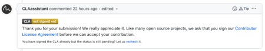
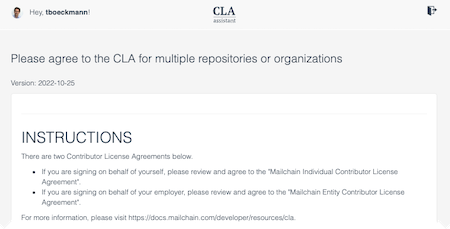
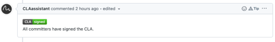

# Mailchain Contributor License Agreements Instructions

Mailchain welcomes and greatly appreciates contributions from the community.

Mailchain uses various agreements to accept contributions of software code and documentation from individuals, corporations and other entities, and to accept larger grants of existing software products.

These agreements help us achieve our goal of providing reliable and long-lived software products through collaborative, open-source software development. In all cases, contributors retain full rights to use their original contributions for any other purpose outside of Mailchain, while providing Mailchain the right to distribute and build upon their work.

### Contributor License Agreements

"ICLA": [Individual Contributor License Agreement](https://github.com/mailchain/CLA/raw/main/CLAs/Individual%20Contributor%20License%20Agreement.pdf)

"ECLA": [Entity Contributor License Agreement](https://github.com/mailchain/CLA/raw/main/CLAs/Entity%20Contributor%20License%20Agreement.pdf)

All contributors of ideas, code, or documentation to Mailchain must complete, agree and sign the agreement via either email or electronic submission.

The purpose of the agreement is to clearly define the terms under which intellectual property has been contributed to Mailchain and thereby allow us to defend the project should there be a legal dispute regarding the software. An individual must have submitted a signed ICLA to Mailchain before we give them commit rights to Mailchain.

For a corporation or other entity that assigns employees to work on Mailchain, an Entity CLA (ECLA) is available to cover contributing intellectual property via the corporation that may have been assigned as part of an employment agreement.

The ECLA legally binds the corporation or other entity, so a person with authority to enter into legal contracts on behalf of the corporation or other entity must sign it.

The ICLA an individual signs is not tied to any employer they may have, so we recommend that individuals use their personal email addresses in the contact details, rather than their @work addresses.

### How-To: Submitting License Agreements

#### Electronic Submission via Github (As Part of a Pull Request)

When you submit a pull request, Mailchain checks that you have signed an ECLA or ICLA.

If you have not yet signed a CLA, the CLA assistant will add a comment with a link to the Contributor License Agreement (see example image below).

Please review and fill in required information, then accept the CLA. (You may need to sign in with Github)

The check in Github should then indicate the CLA has been signed (see example image below).

#### Email Submission

You may sign documents by hand or by electronic signature (e-signature), and submit them by email.

-   _Signing by hand:_ When submitting by email, please fill in the form with a PDF viewer, then print and sign it, scan all pages into a single PDF file, and attach the PDF file to an email addressed to [support@mailchain.co](mailto:support@mailchain.co).  
    If possible, send the attachment from the email address you list in the document. Send only one attached document per email.

-   _E-signature:_ Please contact support@mailchain.co and request an e-sign CLA, specifying ICLA or ECLA.

#### Please Note:

Note that typing your name in the field at the bottom of the document is not signing, regardless of the font that you use.

A valid signature involves one of:
Accepting the CLA via the CLA Assistant (Electronic Submission via Github)
Writing your signature by hand on a printed copy of the document
Digitally signing the document by hand-drawing a signature
Signing the document via DocuSign

We will not accept unsigned documents.

### Questions?

Questions about any of these steps are welcome. Please contact [support](https://docs.mailchain.com/getting-help).
