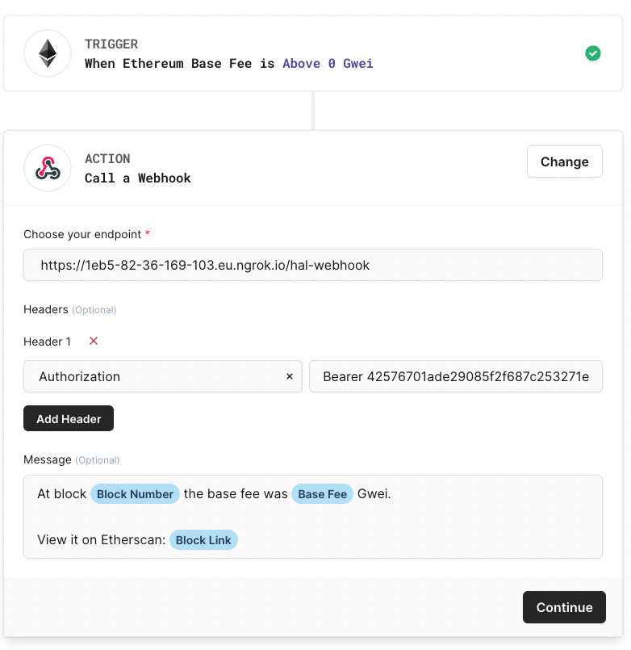
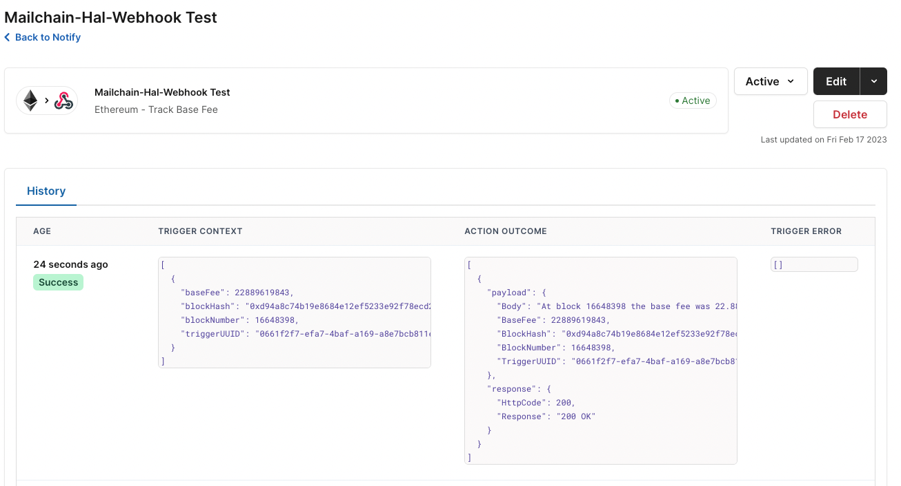
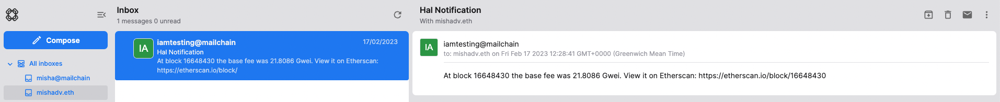

This tutorial shows you how to send HAL notifications via an authenticated Mailchain webhook to any EVM-address, ENS name or Unstoppable domain.

## Solution Overview

At the end of this tutorial, you will have built an Express App, that exposes an API to send HAL notifications via Mailchain to any EVM-address, ENS name or Unstoppable domain. You will create on-chain event notifications in HAL Notify, and configure HAL to use your API as a webhook for sending POST requests to. Your app will use the [Mailchain SDK](https://www.npmjs.com/package/@mailchain/sdk) to send the notifications and Bearer tokens to authenticate incoming requests. In most cases, you would add a route to an existing Express App, but for this tutorial, you'll create a new app.

### Prerequisites

To complete this tutorial, you need to first:

1. Download and install [NodeJS](https://nodejs.org/en/download/).
2. Install [npx](https://www.npmjs.com/package/npx) by running `npm install -g npx`.
3. [Create a new Mailchain account](https://docs.mailchain.com/user/guides/getting-started/create-a-mailchain-account) for development and testing purposes.
4. Sign in or Create a [HAL account](https://www.hal.xyz/)
5. [Ngrok account](https://dashboard.ngrok.com/signup) with [Ngrok installed](https://dashboard.ngrok.com/get-started/setup) on your machine. Ngrok will be used to expose the localhost to the internet in order to be accessible for the webhook, but feel free to use your own solution (e.g. [gitpod.io](https://gitpod.io/)) to expose the localhost for testing purposes.

## Tutorial

## Step 1: Create a new app that sends mail via the Mailchain protocol

### 1.1. New API Server

You'll create a new [Express](https://expressjs.com/) app that exposes an API, the simplest way to do that is with a generator that creates an Express App structure. There are various express generators, for this tutorial you'll use [typescript-express-starter](https://www.npmjs.com/package/typescript-express-starter).

To begin, open a terminal window on your computer and run:

```
npx typescript-express-starter@9.2.0 mailchain-hal-webhook
```

`typescript-express-starter` will ask you for some details:

1. Accept the `default` template, by pressing `enter`.
2. Press `n` when asked to update to the latest packages, this guarantees this tutorial completes successfully.
3. Press `y` when asked to `removed duplicate packages at npm`.

`typescript-express-starter` can take a while to create a new project as it's installing npm packages. Once completed `typescript-express-starter` will confirm it's status:

```jsx
? Please select the template you want default
? Do you want to update all packages in the node_modules directory and dependency ? No
? Do you want to Used to removed duplicate packages at npm ? Yes
[ 1 / 3 ] 🔍  copying project...
[ 2 / 3 ] 🚚  fetching node_modules...
[ 3 / 3 ] 🔗  linking node_modules...
─────────────────────────────────────────
✔ Complete setup project
```

Your Express App is now created.

Check you can start your `mailchain-hal-webhook` app in development mode by running:

```jsx
cd mailchain-hal-webhook && npm run dev
```

The output should look like:

```jsx
[nodemon] 2.0.20
[nodemon] to restart at any time, enter `rs`
[nodemon] watching path(s): src/**/* .env
[nodemon] watching extensions: js,ts,json
[nodemon] starting `ts-node -r tsconfig-paths/register --transpile-only src/server.ts`
info: =================================
info: ======= ENV: development =======
info: 🚀 App listening on the port 3000
info: =================================
```

This confirms that the app started correctly and can be accessed via `http://localhost:3000`.

Press `ctrl+c`, this will stop the Express App.

### 1.2. Mailchain SDK

Mailchain SDK is the easiest way to use Mailchain, it deals with all of the cryptography details for you.

#### Installation

To install the Mailchain SDK you need to run an `npm` command in the base directory of your project `mailchain-hal-webhook`. If you are following Step 1, you should already be in this folder. Otherwise, open up a terminal window and navigate to your `mailchain-hal-webhook` folder.

Install Mailchain SDK using `npm`:

```jsx
npm install --save @mailchain/sdk
```

You have now installed the Mailchain SDK and are ready to configure it.

Open `mailchain-hal-webhook` in your favorite code editor. You'll see it contains example services, controllers, routes, etc. Later you'll extend this functionality.

#### Configuration

The Mailchain SDK needs to be authenticated with your Secret Recovery Phrase to send messages.

<aside>
💡 **Secret Recovery Phrase.** A Mailchain account is a web3 identity. Each account is created via a private key that the user owns and controls. In Mailchain's case, the Secret Recovery Phrase creates the private key. *Whoever has the Secret Recovery Phrase controls the account. You should treat Secret Recovery Phrases as if they are private keys. They MUST be kept safely and only saved in a trusted store.*

</aside>

Get the Secret Recovery Phrase for your test and development Mailchain account.

Open `.env.development.local` in your editor, and add a new line to the bottom `SECRET_RECOVERY_PHRASE=enter your secret phrase here`.

Replace `enter your secret phrase here` with your Secret Recovery Phrase and save the file.

After your `.env.development.local` should look similar to this:

```jsx
# PORT
PORT = 3000

SECRET_RECOVERY_PHRASE=enter your secret phrase here
```

In your terminal window run, `npm run dev` from the root directory of your `mailchain-hal-webhook` app. You should get a response similar to below:

```jsx
info: =================================
info: ======= ENV: development =======
info: 🚀 App listening on the port 3000
info: =================================
```

This means is successfully started and listening on port 3000.

:::info

NOTE: [nodemon](https://www.npmjs.com/package/nodemon) automatically restarts your API when file changes are detected. However, it doesn't pick up changes to `.env.development.local` so you need to restart the server manually by pressing `ctrl` + `c` and running `npm run dev`. You'll only need to restart the app when changing the `SECRET_RECOVERY_PHRASE` setting.

:::

### 1.3. Create a service for sending mail

Express uses services to perform tasks, in this case sending mail using the Mailchain SDK. The service will send messages using the account based on the `SECRET_RECOVERY_PHRASE` environment variable.

`MailService` will perform the following actions:

1. Initialize the Mailchain SDK using the `SECRET_RECOVERY_PHRASE`.
2. Set the `from` address to the currently authenticated user.
3. Send mail using the Mailchain SDK.

Inside `src/services/` create `mail.service.ts` and copy the code below into it.

Change the `to:` to the address or addresses you want to receive the notifications, making sure you use the fully qualified mailchain address, for example:

-   `[ 'mailchain-account-name@mailchain.com' ]`
-   `[ 'ens-name.eth@ens.mailchain.com' ]`
-   `[ 'address@ethereum.mailchain.com' ]`
-   `[ 'unstoppable-domain@unstoppable.mailchain.com' ]`
-   for more examples, see [address formatting](/developer/address-formatting.md)

```tsx
import { Mailchain, SendMailParams } from '@mailchain/sdk';

class MailService {
	async send(params: SendMailParams) {
		// use the environment variable to provide your secret recovery phrase
		const secretRecoveryPhrase = process.env.SECRET_RECOVERY_PHRASE;

		if (secretRecoveryPhrase == null) {
			throw new Error('You must provide a secret recovery phrase');
		}
		const mailchain = Mailchain.fromSecretRecoveryPhrase(secretRecoveryPhrase);

		if (!params.from || params.from === '') {
			// set the from address to current user if not provided
			const currentUser = await mailchain.user();
			params.from = currentUser.address;
		}

		return await mailchain.sendMail(params);
	}
	async halWebhook(params) {
		const msg = {
			to: ['mishadv.eth@ens.mailchain.com'],
			from: params.from,
			subject: 'Hal Notification',
			content: {
				text: params['Body'],
				html: '<div>' + params['Body'] + '</div>',
			},
		};
		return await this.send(msg);
	}
}

export default MailService;
```

Remember to save `mail.service.ts` after pasting the code.

### 1.4. Create mail controller

Controllers manage the incoming HTTP requests and send the necessary data to the correct service.

`MailController` will perform the following actions:

1. Pass the HTTP request body to the send service.
2. Return a response to the request with the `status` field from the Mailchain SDK send result.

In your editor create `mail.controller.ts` in the `src/controllers/` folder. Copy and paste the code below into it.

```tsx
import { NextFunction, Request, Response } from 'express';
import MailService from '@services/mail.service';

class MailController {
	public mailService = new MailService();

	public postMail = async (req: Request, res: Response, next: NextFunction): Promise<void> => {
		try {
			const sendResult = await this.mailService.send(req.body);

			res.status(200).json({ status: sendResult.status });
		} catch (error) {
			next(error);
		}
	};
	public postWebhook = async (req: Request, res: Response, next: NextFunction): Promise<void> => {
		try {
			const sendResult = await this.mailService.halWebhook(req.body);

			res.status(200).json({ status: sendResult.status });
		} catch (error) {
			next(error);
		}
	};
}

export default MailController;
```

Remember to save `mail.controller.ts` after pasting the code.

## Step 2: Setup authentication using Passport and the bearer scheme.

### 2.1. Install passport

[Passport](https://www.passportjs.org/) authenticates API requests. In this case Passport will authenticate whether a POST request has come from HAL.

To install `passport` and `passport-http-bearer` libraries and types, open a terminal window and navigate to the root directory of your code, then run:

```jsx
npm install --save passport passport-http-bearer
npm install --save--dev @types/passport @types/passport-http-bearer
```

[passport](https://www.npmjs.com/package/passport) provides multiple different authentication strategies for APIs and works with Express. [passport-http-bearer](https://www.npmjs.com/package/passport-http-bearer) configures Passport to use the bearer strategy for authentication.

### 2.2. Generate authentication tokens

Your API will use the bearer authentication scheme to authenticate requests. You'll need to create a list of known tokens and provide them to the application. Passport then looks at the request token and searches for it in the known tokens list.

<aside>
💡 Bearer authentication scheme: HTTP requests use the `Authentication` header to send authentication details to the server. `Authentication` headers specify the method or authentication scheme and credentials. Bearer is an authentication scheme commonly used to authenticate HTTP API requests.

</aside>

The format for a `Bearer` authentication header is:

```
"Authorization: Bearer {token}"
```

:::info

NOTE: The value of the token can be anything, usually a random generated string that is meaningless to the client. Random values make for easy authentication but since the request is not signed. Care must be taken to properly protect the token as anyone with the token can make requests.

:::

#### Generate tokens

You need to use a secure random generator to safely generate bearer tokens. The latest version of `openssl` implements a secure random generator that generates and formats random values of any length.

Open a terminal window and execute the following command:

```
openssl rand 32 -hex
```

Try running it again, notice that each time you run it you get a different unique value.

### 2.3. Provide tokens to app

Your app will extract the bearer token from the HTTP request `Authorization` header. It will then look for the supplied bearer token in a list of known tokens. If it finds a match then the server will authenticate the request.

The known tokens are stored in the `BEARER_TOKENS` environment variable. `BEARER_TOKENS` is a comma separated list, meaning you can join multiple outputs from [generate tokens](/developer/tutorials/authenticated-webhook#generate-tokens) with commas to create a list of tokens for you API. Paste the following command in your terminal window to quickly generate 3 random tokens separated by commas:

```jsx
echo BEARER_TOKENS=$(openssl rand 32 -hex),$(openssl rand 32 -hex),$(openssl rand 32 -hex)
```

Open `.env.development.local` in your editor, and copy the output of the above command to the bottom of the file:

After your `.env.development.local` should look similar to this:

```jsx
SECRET_RECOVERY_PHRASE=enter your secret phrase here

BEARER_TOKENS=token-1,token-2,token-3
```

### 2.4. Authenticate application

Your application will use passport to authenticate requests looking for the bearer token.

The new additions to the `app.ts` code:

1. Import `passport` and `passport-http-bearer` dependencies.
2. Calls `initializeAuthentication` from the constructor.
3. `initializeAuthentication` uses the bearer strategy with passport and checks tokens with `BEARER_TOKENS` environment variable.

In your editor open the existing `app.ts` file in the `src/` folder. Replace the existing contents by copying and pasting the code below into it.

```jsx
import cors from 'cors';
import express from 'express';
import helmet from 'helmet';
import hpp from 'hpp';
import morgan from 'morgan';
import passport from 'passport';
import { Strategy } from 'passport-http-bearer';
import { NODE_ENV, PORT, ORIGIN, CREDENTIALS } from '@config';
import { Routes } from '@interfaces/routes.interface';
import errorMiddleware from '@middlewares/error.middleware';

class App {
    public app: express.Application;
    public env: string;
    public port: string | number;

    constructor(routes: Routes[]) {
        this.app = express();
        this.env = NODE_ENV || 'development';
        this.port = PORT || 3000;

        this.initializeAuthentication();
        this.initializeMiddlewares();
        this.initializeRoutes(routes);
        this.initializeErrorHandling();
    }

    public listen() {
        this.app.listen(this.port, () => {
            console.debug(`=================================`);
            console.debug(`======= ENV: ${this.env} =======`);
            console.debug(`🚀 App listening on the port ${this.port}`);
            console.debug(`=================================`);
        });
    }

    public getServer() {
        return this.app;
    }

    private initializeAuthentication() {
        passport.use(
            'bearer',
            new Strategy((token, done) => {
                const { BEARER_TOKENS } = process.env;
                if (!BEARER_TOKENS) {
                    return done(new Error('server has no bearer tokens'));
                }

                const authenticated = BEARER_TOKENS.split(',').some((v) => token === v);
                if (!authenticated) {
                    return done(null, false);
                }

                return done(null, {}, { scope: 'all' });
            }),
        );

        this.app.use(passport.initialize());
    }

    private initializeMiddlewares() {
        this.app.use(
            morgan('dev', {
                stream: {
                    write: (message: string) => {
                        console.debug(message.substring(0, message.lastIndexOf('\n')));
                    },
                },
            }),
        );
        this.app.use(cors({ origin: ORIGIN, credentials: CREDENTIALS }));
        this.app.use(hpp());
        this.app.use(helmet());
        this.app.use(express.json());
        this.app.use(express.urlencoded({ extended: true }));
    }

    private initializeRoutes(routes: Routes[]) {
        routes.forEach((route) => {
            this.app.use('/', route.router);
        });
    }

    private initializeErrorHandling() {
        this.app.use(errorMiddleware);
    }
}

export default App;

```

Remember to save `app.ts` after pasting the code.

## Step 3: Wire up the API

RESTful API's are designed around paths and methods, in Express these are created in the `src/routes` folder.

The API is called by clients using HTTP. The HTTP interface is modeled as a RESTful API making it familiar for developers and easy to discover.

You'll create an additional HAL webhook route that accepts HAL notification parameters. The route will use the `sendMail`function you created above.

### 3.1. Create HAL webhook route

`halWebhookRoute` performs the following actions:

1. Adds the `send` path.
2. Listens for a `POST`.
3. Route request to the mail controller.

In your editor create `halwebhook.route.ts`in the `src/routes/` folder. Copy and paste the code below into it.

```jsx
import { Router } from 'express';
import { Routes } from '@interfaces/routes.interface';
import MailController from '@/controllers/mail.controller';
import passport from 'passport';

class HalWebhookRoute implements Routes {
  public router = Router();
  private readonly _mailController: MailController;

  constructor() {
    this._mailController = new MailController();
    this.initializeRoutes();
  }

  private initializeRoutes() {
    this.router.post('/hal-webhook', passport.authenticate('bearer', { session: false }), this._mailController.postWebhook);
  }
}

export default HalWebhookRoute;
```

Remember to save `halwebhook.route.ts` after pasting the code.

### 3.2. Add route to server

Now `HalWebhookRoute` has been created, the final code change is to add `HalWebhookRoute` to the server.

The server code:

1. Adds routes.
2. Listens to incoming requests.

In your editor open the existing `server.ts` file in the `src/` folder. Replace the existing contents by copying and pasting the code below into it.

```jsx
import App from '@/app';
import IndexRoute from '@routes/index.route';
import HalWebhookRoute from './routes/halwebhook.route';

const app = new App([new IndexRoute(), new HalWebhookRoute()]);

app.listen();
```

Remember to save `server.ts` after pasting the code.

Now your app is ready to start accepting HTTP requests.

## Step 4: Create a public endpoint

Run `ngrok http 3000` in a terminal and copy the `Forwarding` value from the output, it will be something like `https://012a-93-12-152-21.eu.ngrok.io`. Leave it running so the webhook can be reached by HAL notify.

Webhook URL: Copy the `Forwarding` value from ngrok and add the route `/hal-webhook` to the end of it. It should look something like:

```
https://012a-93-12-152-21.eu.ngrok.io/hal-webhook
```

## Step 5: Create your notification path in HAL

HAL provides no-code web3 infrastructure. HAL Notify makes it easy to implement web3 notifications which can be triggered by any EVM state change, smart contract, wallet and more. HAL supports multiple channels for receiving notifications, including sending to webhooks. In this case, HAL will use your API as a webhook and we will get the public endpoint from gitpod.

### 5.1. Configure your notifications in the HAL app

Create an account or login to [https://app.hal.xyz/](https://app.hal.xyz/) and create a new workspace for your Mailchain notification path.

In the workspace, click ‘Create Notification’

Choose notification triggers

HAL provides a number of different triggers you can choose from, including base fee tracking, token purchase tracking and NFT floor price. For this example, we will trigger when Ethereum Base Fee is Above 0 Gwei, as this will give us a near-instant notification.

Connect webhook

Select the Action ‘Webhook: Send a POST request’.

Copy in the endpoint address with route that you created in the previous step.

Select Add Header:

-   Header name: ‘Authorisation’
-   Value: `Bearer token_1` (Bearer followed by one of the tokens you copied into `env.development.local`)

It should look something like this:



### Step 5.2. Testing

Now you can send your first notification.

Start your application:

```jsx
npm run dev
```

Activate your notifications in Hal:



Open the Mailchain inbox you sent the notifications to:



Congratulations you’ve sent your first notification using HAL and Mailchain! 🥳
