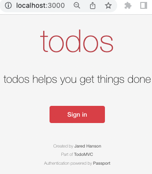
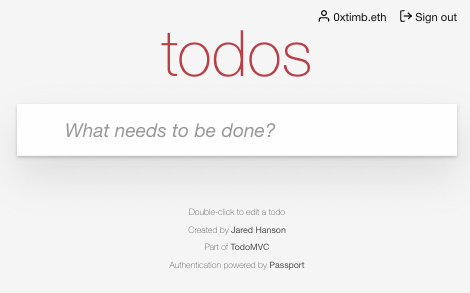

This tutorial shows you how to create and send ‘login’ Magic links to any EVM-compatible blockchain address, ENS name or Unstoppable domain.

## Solution Overview

In this tutorial, you will build a todo list app, complete with functionality that allows users to sign in with Mailchain. By following along with this tutorial, you will learn how to use Passport for passwordless authentication using Mailchain to send magic links.

As you work through the tutorial, you'll be using [Express](https://expressjs.com/) as our web framework, along with [EJS](https://ejs.co/) as our template engine and [CSS](https://developer.mozilla.org/en-US/docs/Web/CSS) for styling. You will use [SQLite](https://github.com/mapbox/node-sqlite3) as our database for storing data. Don't worry if you are not familiar with these technologies -- the necessary code will be provided at each step.

You can find an example of the final result here [https://github.com/mailchain/todos-express-mailchain](https://github.com/mailchain/todos-express-mailchain) on Github.

## Prerequisites

To complete this tutorial, you need:

-   A working development environment with [Node.js](https://nodejs.org/) and [Git](https://git-scm.com/)
-   An editor and terminal of your choosing.
-   A [Mailchain](https://mailchain.com/) account for development and testing purposes.

## Step 1 - Create a Starter App

You will start by creating a starter app, which has all the scaffolding needed to build a todo list.

Open a new terminal window on your computer, and run:

```bash
git clone https://github.com/passport/todos-express-starter.git mailchain-tutorial
```

You now have a directory named `'mailchain-tutorial'`.

In your terminal, navigate into the directory by running:

```bash
cd mailchain-tutorial
```

You are in the folder with the starter app file.

Install the dependencies by running the following command in your terminal:

```bash
npm install
```

Start the server:

```bash
npm start
```

Check to see if it’s working by opening <a href="http://localhost:3000" target="_blank">http://localhost:3000</a> in your browser.

You should be greeted with a todos ‘Sign in’ page similar to the following:



Congratulations! You're ready to add authentication to this very simple app.

---

## Step 2 - Add a Login Page

To let users sign in with any valid wallet address, Web3 identity or Mailchain account. For that, you need to create a login page that prompts the user to enter one of these addresses.

In your terminal, create a file that will contain the authentication-related routes:

```bash
touch routes/auth.js
```

Open the mailchain-tutorial folder in your favorite code editor and navigate to the `auth.js` file you have just created in `routes`

In `routes/auth.js` add the following code, which creates a login route that will render the login page.

```js
var express = require('express');

var router = express.Router();

router.get('/login', (req, res, next) => {
	res.render('login');
});

module.exports = router;
```

Now add the route to the app. To do this, open `'app.js'` and add the newly created auth route by adding the highlighted code below:

```js
var indexRouter = require('./routes/index');
// highlight-next-line
var authRouter = require('./routes/auth'); // require your auth route

var app = express();
```

Now use the `authRouter` in the app. Below `indexRouter`, add the following highlighted line:

```js
app.use('/', indexRouter);
// highlight-next-line
app.use('/', authRouter); // app should 'use' your auth router
```

Now you will update the login page so the user can enter a Mailchain address. Open the existing `login.ejs` file in the `views` folder and add the following highlighted form under the heading:

```html
<section class="prompt">
	<h3>todos</h3>
	<h1>Sign in</h1>
	// highlight-start
	<form action="/login/mailchain" method="post">
		<section>
			<label for="mailchain_address">Mailchain Address or ENS Name</label>
			<input
				id="mailchain_address"
				name="mailchain_address"
				type="text"
				autocomplete="username"
				placeholder="...@mailchain.com or ensname.eth"
				required
				autofocus
			/>
		</section>
		<button type="submit">Sign in with Mailchain</button>
	</form>
	// highlight-end
	<hr />
	<p class="help">Don't have an account? <a href="/signup">Sign up</a></p>
</section>
```

Restart your app in the terminal (`ctrl` + `c` if it's running the run `npm start`). Click sign in.

Excellent! You now have a login page that prompts the user to sign in with a Mailchain address or ENS name.

---

## Step 3 - Setup Mailchain

Now you need a way to send [Mailchain](https://mailchain.com/) messages from the app.

For the purposes of this tutorial, you should create a Mailchain account for testing.

:::info
For a memorable naming scheme, you could append `-test-dev` to your existing account name when you create this test account, i.e. if you already use `alice@mailchain`, create a new account with `alice-test-dev@mailchain`

:::

Go to **Settings > [Secret Recovery Phrase](https://app.mailchain.com/settings/security/)** and retrieve the Secret Recovery Phrase for your Mailchain test account. Save it somewhere safe and private.

Now that you have the Secret Recovery Phrase and a Mailchain address, you should create a file to store it.

In your editor create a new file in mailchain-tutorial and label it `.env`. Open the `.env` file and add the following environment variables, setting your `FROM_ADDRESS` to your test account, with the associated`SECRET_RECOVERY_PHRASE`:

```txt
# Mailchain Environment Variables
FROM_ADDRESS=**user@mailchain.com**
SECRET_RECOVERY_PHRASE=**INSERT_SECRET_RECOVERY_PHRASE**
```

You also need to update your database schema to store an authenticating user's Mailchain address and verification status.

Open `'db.js'`and insert the following highlighted lines to the CREATE user statement:

```js {7-8}
db.run(
	'CREATE TABLE IF NOT EXISTS users ( \
	id INTEGER PRIMARY KEY, \
	username TEXT UNIQUE, \
	hashed_password BLOB, \
	salt BLOB, \
	name TEXT, \
	mailchain_address TEXT UNIQUE, \
	mailchain_address_verified INTEGER, \
	email TEXT UNIQUE, \
	email_verified INTEGER \
)',
);
```

Now you need to delete the database and re-create it because you have already created the database in previous steps when testing the landing page.

:::danger

NOTE: This will delete any data you may have added in this tutorial so far. If you are considering adding this solution to an existing app, you would simply run a DB migration to alter your `users` table.

:::

To delete the database, open a new terminal in your editor and run:

```bash
rm ./var/db/todos.db
```

Nice work! You're now ready to configure the Passport JS login strategy.

---

## Step 4 - Configure the Strategy

Now that you've set up Mailchain, you are ready to configure Passport and the `passport-magic-link`strategy.

In the terminal, install the necessary dependencies:

```bash
npm install passport
npm install passport-magic-link
npm install @mailchain/sdk
```

Open `auth.js` in the routes folder and `require` the newly installed packages or files as highlighted below:

```js
var express = require('express');
// highlight-start
var passport = require('passport');
var MagicLinkStrategy = require('passport-magic-link').Strategy;
var { Mailchain } = require('@mailchain/sdk');
var db = require('../db');
// highlight-end
var router = express.Router();
```

Next, in the same file, add the following highlighted code block:

```js
var router = express.Router();
// highlight-start
var mailchain = Mailchain.fromSecretRecoveryPhrase(process.env.SECRET_RECOVERY_PHRASE);
var fromAddress = process.env['FROM_ADDRESS'] || mailchain.user().address;
const createMailchainAddress = function (address) {
	switch (address) {
		case address.match(/^[\d\w\-\_]*@mailchain\.com$/)?.input: // Mailchain address:
			return address;
		case address.match(/^0x[a-fA-F0-9]{40}$/)?.input: // Ethereum address:
			return address + '@ethereum.mailchain.com';
		case address.match(/^.*\.eth$/)?.input: // ENS address:
			return address + '@ens.mailchain.com';
		case address.match(/^.*\.*@mailchain$/)?.input: // Mailchain address without .com:
			return address + '.com';
		default:
			console.error('Invalid address');
	}
};
passport.use(
	new MagicLinkStrategy(
		{
			secret: 'keyboard cat', // change this to something secret
			userFields: ['mailchain_address'],
			tokenField: 'token',
			verifyUserAfterToken: true,
		},
		async (user, token) => {
			var link = 'http://localhost:3000/login/mailchain/verify?token=' + token;

			var msg = {
				to: [createMailchainAddress(user.mailchain_address)],
				from: fromAddress,
				subject: 'Sign in to Todos',
				content: {
					text: 'Hello! Click the link below to finish signing in to Todos.\r\n\r\n' + link,
					html:
						'<h3>Hello!</h3><p>Click the link below to finish signing in to Todos.</p><p><a href="' +
						link +
						'">Sign in</a></p>',
				},
			};
			const { data, error } = await mailchain.sendMail(msg);
			if (error) {
				throw new Error('Mailchain error', { cause: error });
			}
			console.log('sent mail', data);
			return data;
		},
		(user) => {
			return new Promise((resolve, reject) => {
				db.get('SELECT * FROM users WHERE mailchain_address = ?', [user.mailchain_address], (err, row) => {
					if (err) {
						return reject(err);
					}
					if (!row) {
						db.run(
							'INSERT INTO users (mailchain_address, mailchain_address_verified) VALUES (?, ?)',
							[user.mailchain_address, 1],
							function (err) {
								if (err) {
									return reject(err);
								}
								var id = this.lastID;
								var obj = {
									id,
									mailchain_address: user.mailchain_address,
								};
								return resolve(obj);
							},
						);
					} else {
						return resolve(row);
					}
				});
			});
		},
	),
);

// highlight-end
router.get('/login', (req, res, next) => {
	res.render('login');
});
```

The `MagicLinkStrategy` is now configured. The strategy will sanitize the input address, then send mails containing a magic link using Mailchain. When the user clicks on the magic link, the user record associated with the Mailchain address will be found. If a user record does not exist, one is created the first time someone signs in.

---

## Step 5 - Send Magic Link

Now that you have prompted the user for their Mailchain address, and have the strategy configured, the next step is to send the user a Mailchain message containing the Magic Link when they click "Sign in with Mailchain.”

You should still be working in the `auth.js` file in `routes` but if not, open it now.

Add the following `route` below `login` route:

```js
router.get('/login', (req, res, next) => {
	res.render('login');
});
//highlight-start

router.post(
	'/login/mailchain',
	passport.authenticate('magiclink', {
		action: 'requestToken',
		failureRedirect: '/login',
	}),
	(req, res, next) => {
		res.redirect('/login/mailchain/check');
	},
);
//highlight-end

module.exports = router;
```

This route will process the form data from the login page and call the `'/login/mailchain/check'` route to send a Mailchain message to that user.

Continuing within `auth.js`, add the route for `'/login/mailchain/check'` before `module.exports = router;`:

```js
//highlight-start
router.get('/login/mailchain/check', (req, res, next) => {
	res.render('login/mailchain/check');
});
//highlight-end

module.exports = router;
```

This `route` will render a page instructing the user to check their Mailchain account and to click the link to authenticate login.

---

## Step 6 - Verify Mailchain Address

Now that the application can send the user a Mailchain message with a magic link, the next step is to verify the Mailchain address when they click the link.

Within `auth.js` in your `routes` section, add this `route` in the highlighted section below the `/login/mailchain/check` route:

```js
router.get('/login/mailchain/check', (req, res, next) => {
	res.render('login/mailchain/check');
});
// highlight-start

router.get(
	'/login/mailchain/verify',
	passport.authenticate('magiclink', {
		successReturnToOrRedirect: '/',
		failureRedirect: '/login',
	}),
);
// highlight-end
```

This route will verify the Mailchain address when the link is clicked.

Now in the terminal, create a folder and corresponding view for our route, by running the following commands in the terminal:

```bash
mkdir views/login/mailchain
touch views/login/mailchain/check.ejs
```

In your code editor, navigate to the file you have just created, (`views/login/mailchain/check.ejs`and add the following code:

```html
<!DOCTYPE html>
<html lang="en">
	<head>
		<meta charset="utf-8" />
		<meta name="viewport" content="width=device-width, initial-scale=1" />
		<title>Express • TodoMVC</title>
		<link rel="stylesheet" href="/css/base.css" />
		<link rel="stylesheet" href="/css/index.css" />
		<link rel="stylesheet" href="/css/login.css" />
	</head>
	<body>
		<section class="prompt">
			<h3>todos</h3>
			<h1>Check your Mailchain Inbox</h1>
			<p class="instructions">
				We sent a magic link to your Mailchain address. Click the link in that message to sign in.
			</p>
			<hr />
			<p class="help">Didn't receive the message? <a href="/login">Get another link</a></p>
		</section>
		<footer class="info">
			<p>Created by <a href="https://www.jaredhanson.me">Jared Hanson</a></p>
			<p>Part of <a href="https://todomvc.com">TodoMVC</a></p>
			<p>
				Authentication powered by
				<a href="https://www.passportjs.org">Passport</a>
				<br />
				&amp; <a href="https://mailchain.com">Mailchain</a>
			</p>
		</footer>
	</body>
</html>
```

Now, update `views/index.ejs` to include the `user.mailchain_address` field. Change the highlighted the line to match the snippet below:

```jsx
<nav class="nav">
	<ul>
		// highlight-next-line
		<li class="user"><%= user.name || user.username || user.email || user.mailchain_address %></li>
		<li>
			<form action="/logout" method="post">
				<button class="logout" type="submit">Sign out</button>
			</form>
		</li>
	</ul>
</nav>
```

You have now configured the flow for users to click "Sign in", then enter a Mailchain address or ENS name. When the user clicks "Sign in with Mailchain", the app will send a magic link.

Next you need to be able to establish a login session for an authenticated user.

---

## Step 7 - Establish Session

Once you've verified the user's Mailchain address, you need to establish a login session for the user as they navigate the app. To do that, you can add session support.

Start by running the following code in the terminal to instal the necessary dependencies:

```bash
npm install express-session
npm install connect-sqlite3
```

Open `app.js` and `require` the additional dependencies highlighted in the snippet below:

```js
var logger = require('morgan');
// highlight-start
var passport = require('passport');
var session = require('express-session');
var SQLiteStore = require('connect-sqlite3')(session);
// highlight-end
```

In the same file, add the following highlighted section of code:

```js
app.use(express.static(path.join(__dirname, 'public')));

// highlight-start
app.use(
	session({
		secret: 'keyboard cat',
		resave: false,
		saveUninitialized: false,
		store: new SQLiteStore({ db: 'sessions.db', dir: './var/db' }),
	}),
);
app.use(passport.authenticate('session'));
// highlight-end

app.use('/', indexRouter);
app.use('/', authRouter);
```

Now you can configure Passport to manage the login session. Open `auth.js` before the `routes` section, add the following highlighted code snippet:

```js
//highlight-start
passport.serializeUser((user, cb) => {
	process.nextTick(() => {
		cb(null, { id: user.id, mailchain_address: user.mailchain_address });
	});
});

passport.deserializeUser((user, cb) => {
	process.nextTick(() => {
		return cb(null, user);
	});
});

//highlight-end
router.get('/login', (req, res, next) => {
	res.render('login');
});
```

Now try signing in again. In the terminal, run:

```bash
npm start
```

Open <a href="http://localhost:3000" target="_blank">http://localhost:3000</a>, click "Sign in", enter your Mailchain address or your ENS name and click "Sign in with Mailchain".

Now, check your Mailchain Inbox and click the link.

You are now logged in and should see a screen similar to below! Go ahead and enter some tasks you've been needing to get done.



Now users can sign in with Mailchain! Next, in the last step of this tutorial, you will add the ability to sign out.

---

## Step 8 - Sign Out

Now that users can sign in, they'll need a way to sign out.

Open 'routes/auth.js' and a new route for `logout` below the '/login/mailchain/verify' route:

```js
router.get(
	'/login/mailchain/verify',
	passport.authenticate('magiclink', {
		successReturnToOrRedirect: '/',
		failureRedirect: '/login',
	}),
);

//highlight-start
router.post('/logout', (req, res, next) => {
	req.logout((err) => {
		if (err) {
			return next(err);
		}
		res.redirect('/');
	});
});
//highlight-end
```

Restart your app in the terminal (`ctrl` + `c`), then go back to your browser window. You should already be signed in, and can now click "Sign out."

Congratulations! You've now got a working app where users can sign in and sign out using Mailchain!
