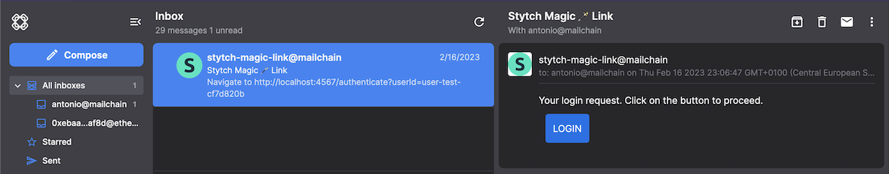
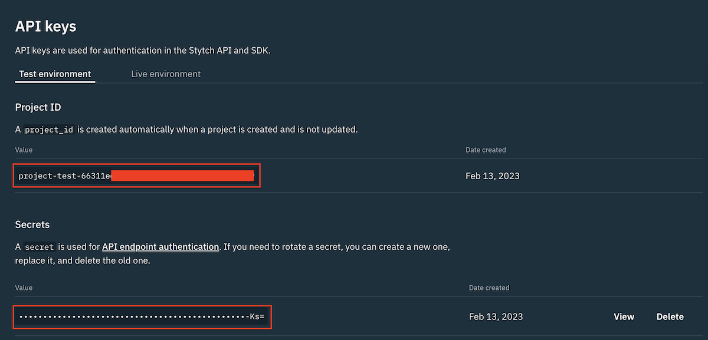
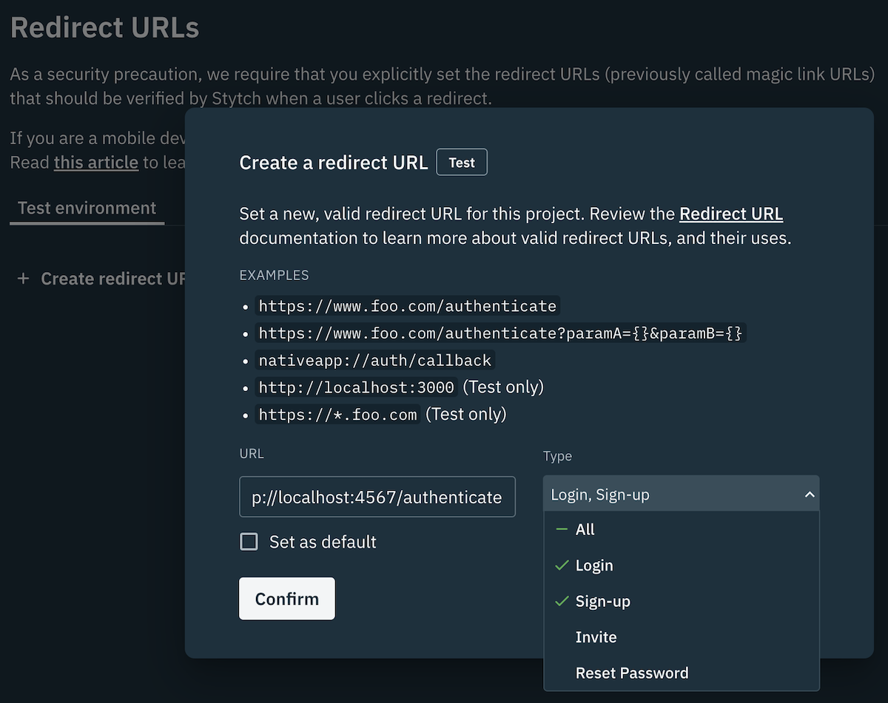
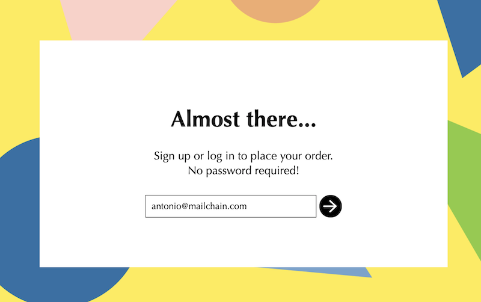

At the end of this tutorial, you will have built an Express JS app that sends a passwordless magic link from the [Stytch auth platform](https://stytch.com/) to the user's wallet address using [Mailchain's SDK](https://www.npmjs.com/package/@mailchain/sdk) and protocol.



Stytch supports multiple authentication methods, including the so-called [magic link](https://stytch.com/docs/magic-links). Magic links work by generating and sending a link with an unique authentication token to an address. 

The recipient can prove they own the address by clicking on the link within the message. The link contains an unique and single use authentication token, When a user clicks the Magic Link, the application's authentication service processes and validates the authentication token and creates a user session. For more details and visual representation of the flow, check out Stytch's [Email Magic Link overview](https://stytch.com/docs/magic-links#email-magic-links).

To send messages via Mailchain you need to use Stytch's [Embeddable Magic Link](https://stytch.com/docs/magic-links#embeddable-magic-links). This lets you send magic links via a custom channel. 

Since Mailchain requires any registered wallet address to have sign a proof to verify ownership. Applications can build upon that proof, and Mailchain's built-in sender and recipient verification to reliably prove address ownership.
.

## Prerequisites

1. Download and install [NodeJS](https://nodejs.org/en/download/).
1. [Create new Mailchain account](../../../user/guides/getting-started/1-create-a-mailchain-account.md) for development and testing purposes.
1. Sign for or use your existing [Stytch auth account](https://stytch.com/start-now).

:::info

At the time of writing this tutorial, Stytch offers its Embeddable Magic Link feature on-demand to maintain good security practices.

You can find out more about this here: [Create embeddable magic link](https://stytch.com/docs/api/create-magic-link), but in summary you need to send a message to `support@stytch.com` briefly explaining your use case (you can mention this tutorial and send a link). They will provide you with additional security and usage information then enable the feature for you. Requirements around this may change in future.
:::

## Step 1 - Clone Stytch Node Magic Link example

Along with great documentation and quick getting started guides, Stytch offers quick bare-bones examples for multiple platforms with magic link endpoints pre-configured, including an example for Node running an Express JS. Lets start by cloning the repository so we will build on top of it:

```bash
git clone https://github.com/stytchauth/stytch-node-magic-links
cd stytch-node-magic-links
```

Once the repository has been cloned, install the dependencies by running:

```bash
npm install
```

Stytch is under active development so the Stytch SDK used in the example could be outdated. Install the latest version by running:

```bash
npm install stytch@latest
```


## Step 2 - Configure Stytch

Navigate to [Stytch Dashboard > API Keys](https://stytch.com/dashboard/api-keys). Copy the values for `'Project ID'` and `'Secret'` and paste them into their corresponding fields in the `.env` file in the repository you cloned in the previous step.



The `.env` should be similar to this:

```txt
PORT='4567'
STYTCH_PROJECT_ID='project-test-66311e...'
STYTCH_SECRET='secret-test-SMmIhy...'
```

Now that we have added some secrets to our `'.env'` file, we should make sure we do not commit this to our git repository. To stop tracking `'.env'` in git, run the following command:

```bash
git rm --cached .env
```

Add the following line to `'.gitignore'`, then save and close the file:

```txt
node_modules

//highlight-next-line
.env

```

Now we need to configure a redirect URL in Stytch. This is used once a user is authenticated, so a user can be redirected back to your application. To configure the redirect URL, go to [Stytch Dashboard > Redirect URLs](https://stytch.com/dashboard/redirect-urls) and add `http://localhost:4567/authenticate` then select the type of Login and Sign Up.



To make sure that everything is working at this point, we can test our app using a traditional email magic link.

To start the app, run:

```bash
npm start
```

In a browser navigate to <a href="http://localhost:4567" target="_blank">http://localhost:4567</a>, which should show a page containing a form with an email address field.

To verify that email magic link is working, input your traditional (non-Web3) email address. For free tier Stytch accounts without payment card info, it must be on the same domain as the one used for the account. You should be redirected to `http://localhost:4567/login_or_create_user`, while also receiving email message containing a magic link in your traditional email inbox.

Clicking on the magic link should open the application in the browser with a welcome message. This means Stytch is setup correctly and you can proceed with the rest of the tutorial.

If you have any issues, please trace back through the steps or drop us a line on our [Discord](https://discord.gg/2gqGpagbhe) server.

## Step 3 - Configure the Mailchain SDK

Configuring the Mailchain SDK is simple. Once the package is installed and configured, it can send Web3 mails via the Mailchain protocol to wallet addresses or other Web3 identities.

To install the Mailchain SDK, stop the application if it is running (hint: `CTRL/Control+C` on most machines) and run:

```bash
npm install @mailchain/sdk
```

Next, open the `.env` file and insert your Mailchain Secret Recovery Phrase into it. If you don't know your secret recovery phrase, head over to [Secret Recovery Phrase Introduction](https://docs.mailchain.com/user/guides/settings/secret-recovery-phrase) and to learn how to get it from your Mailchain account.

```txt
PORT='4567'
STYTCH_PROJECT_ID='project-test-66311e...'
STYTCH_SECRET='secret-test-SMmIhy...'
// highlight-next-line
SECRET_RECOVERY_PHRASE='your secret ... recovery phrase'
```

## Step 4 - Identity Mailchain address

At this point, you need to open `stytch-node-magic-links` folder in your favorite code editor so you can make changes to the code.

In the `'server.js'` there is pre-configured Express JS application with the routes that we will need for our authentication solution. In summary, we will work mainly on `/login_or_create_user` route where we will add the Mailchain mail sending logic. All the other routes will remain the same, this includes the `/authenticate` route that will be responsible for verifying the token from the magic link.

As mentioned before, our application will work seamlessly with both regular Web2 email addresses and also with the Web3 Mailchain addresses. Lets implement a naive (emphasis on **naive**) to demonstrate this. All Mailchain addresses, both for Mailchain Accounts and for other Web3 identities such as Ethereum, ENS addresses, will end with `mailchain.com`, for example `alice@mailchain.com` or `epistola.eth@ens.mailchain.com`.

:::info

If you plan on implementing this in your production environment, further validation of Web3 identities and Mailchain addresses is recommended.
:::

```ts
app.post('/login_or_create_user', async function (req, res) {
	const params = {
		email: req.body.email,
		login_magic_link_url: magicLinkUrl,
		signup_magic_link_url: magicLinkUrl,
	};

	// highlight-start
	const isMailchain = params.email.endsWith('mailchain.com');

	if (isMailchain) {
		// TODO: Send magic link with Mailchain SDK
		return;
	}
	// highlight-end
	/* Rest of the code **/
});
```

## Step 5 - Find or create a user by their Mailchain Address

In `'server.js'`, locate the line that invokes the following method:

```ts
client.magicLinks.email.loginOrCreate(params);
// ...
```

This Stytch method is used to send out magic links via traditional emails. When the user inputs an email address that doesn't exist, it will create a new Stytch user and send out a corresponding magic link to that user. Otherwise, when the email is already registered to a user, it will reference the existing user in the magic link. This is useful for providing better context to users. Read more here: [Log in or create user by email](https://stytch.com/docs/api/log-in-or-create-user-by-email).

We will implement the same behavior for Mailchain addresses. Among other properties, the Stytch User object stores the user email address, which we will use this to store the user's Mailchain address. To make this easier, Stytch offers useful methods for [searching existing users](https://stytch.com/docs/api/search-users) and methods for [creating new user](https://stytch.com/docs/api/create-user). We will use these methods and define the field `userToAuth` that will reference the user that we are going to authenticate.

Add the highlighted code immediately after `if (isMailchain) {`:

```ts
if (isMailchain) {
	// highlight-start
	const userSearchResult = await client.users.search({
		query: {
			operator: 'AND',
			operands: [{ filter_name: 'email_address', filter_value: [params.email] }],
		},
	});

	const existingUser = userSearchResult.results[0];
	const userToAuth =
		existingUser ?? (await client.users.create({ create_user_as_pending: true, email: req.body.email }));
	// highlight-end
	// TODO: Send magic link with Mailchain SDK
	return;
}
```

Our code now uses `await` to handle asynchronous requests where it needs to wait for a response. We will add `async` to our route so it can handle these requests. Replace the route definition with:

```diff
-app.post('/login_or_create_user', function (req, res) {
+app.post('/login_or_create_user', async function (req, res) {
```

## Step 6 - Create the magic link and Mailchain message contents

Now that there is a user object that can support Mailchain addresses for authentication with a magic link, we can now compose the message the user will receive.

```ts
const userToAuth = existingUser ?? (await client.users.create({ create_user_as_pending: true, email: req.body.email }));
// highlight-start
const magicLinkParams = await client.magicLinks.create({ user_id: userToAuth.user_id });
const subject = 'Stytch Magic 🪄 Link';
const magicLinkUrlWithToken = `${magicLinkUrl}?userId=${magicLinkParams.user_id}&token=${magicLinkParams.token}`;
const content = {
	text: `Navigate to ${magicLinkUrlWithToken} to authenticate`,
	html: `
    <div>
      <h1>Your ${existingUser ? 'login' : 'sign up'} request. Click on the button to proceed.</h1>
      <div style="text-decoration: none; margin:10px; padding:10px; display:inline-block; background-color: rgb(16, 110, 233); border: 1px solid rgb(16, 110, 233); border-radius: 4px;">
        <a style="color: white" href=${magicLinkUrlWithToken}>${existingUser ? 'LOGIN' : 'SIGN UP'}</a>
      </div>
    </div>`,
};
// highlight-end
// TODO: Send magic link with Mailchain SDK
return;
```

As you can see from the snippet, we have defined the `subject` of the mail we will send out via Mailchain. There is also a `magicLinkUrlWithToken` that contains the magic link. It will contain value similar to this: `http://localhost:4567/authenticate?userId=user-test-60b91433-c79f-41e5-89c8-b8069ba838ef&token=Gy0YNVp22gbPS8icf8tgQ0yxX77IRNyjzJmrdYLbhBv0`.

For the mail content, which contains the magic link itself, we will compose a `text` variant of the content, i.e. a simple plain text message containing just the link, and an `html` variant of the content with rich text containing a clickable button-style element that navigates to the magic link.

## Step 7 - Mailchain SDK setup and sending mail

With most of the pieces now in place to send the message, we now need to import the Mailchain SDK. Near the beginning of the `server.js` file, add the following line:

```ts
const stytch = require('stytch');
// highlight-next-line
const { Mailchain } = require('@mailchain/sdk');
```

We also need to configure the Mailchain SDK to use the Secret Recovery Phrase we previously set in our environment variables. The following line should be added immediately after where the client for Stytch is created:

```ts
const client = new stytch.Client({
	project_id: process.env.STYTCH_PROJECT_ID,
	secret: process.env.STYTCH_SECRET,
	env: stytch.envs.test,
});

// highlight-next-line
const mailchain = Mailchain.fromSecretRecoveryPhrase(process.env.SECRET_RECOVERY_PHRASE);
```

And finally, let's configure the Mailchain SDK to send the mail. Scroll down to the route for `/login_or_create_user` and right below `subject` and `content`, replace the following 2 highlighted lines:

```ts
// highlight-start
// TODO: Send Magic Link with Mailchain SDK
return;
// highlight-end
```

with

```ts
return mailchain
	.sendMail({
		from: (await mailchain.user()).address,
		to: [params.email],
		subject,
		content,
	})
	.then((r) => res.render('emailSent'))
	.catch((e) => {
		console.error('Failed sending message', e);
		return res.status(500).render('loginOrSignUp');
	});
```

## Step 8 - Give it a spin!

Now lets repeat same test as we did in Step 2 to verify that it is working correctly, but this time we will use a fully qualified Mailchain address. Mailchain supports many types of Web3 addresses and identities. You can read more about this in [address formatting](../../address-formatting).

Start the application by running:

```bash
npm start
```

In your browser, navigate to `http://localhost:4567`. Try by sending magic link to your own Mailchain address (mine is `antonio@mailchain.com`... feel free to drop me a message 💌⛓️).



After a few seconds, you should receive the magic link in your [Mailchain Inbox](https://app.mailchain.com) 🎉!

Note: if you receive an error in your terminal `StytchError: {"status_code":401, ... "error_type":"enterprise_endpoint","error_message":"Thanks for trying Stytch! We're glad you're excited to try our new products, but this one requires approval before using...`

Check out [prerequisites](#prerequisites) for instructions on how to request access to the Embeddable Magic Links feature.

Click on the link to successfully authenticate in your application using Stytch Auth.

The same can be done with an Ethereum address allowing for authentication without requiring the user to directly interact using their wallet (sign any data or send transactions).


## Conclusion

Congratulations 🎉, you have now created a passwordless login for Web3 identities, which can work adjacently to your existing authentication flow!

For full working example head over to the forked repository of the original example, [stytch-node-magic-links + Mailchain SDK](https://github.com/mailchain/stytch-node-magic-links).
