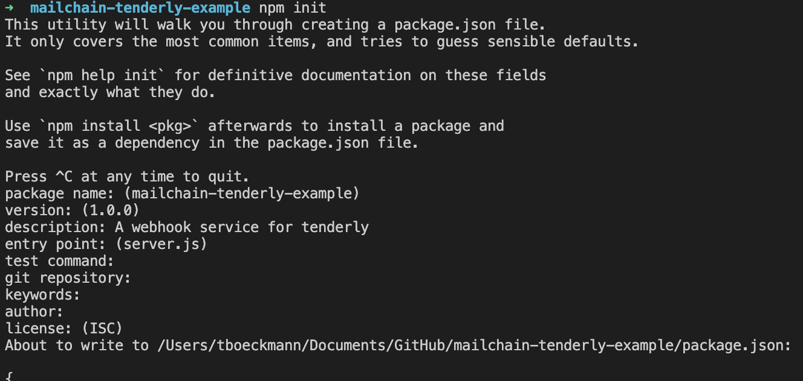
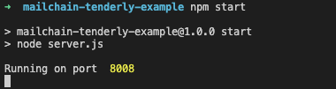
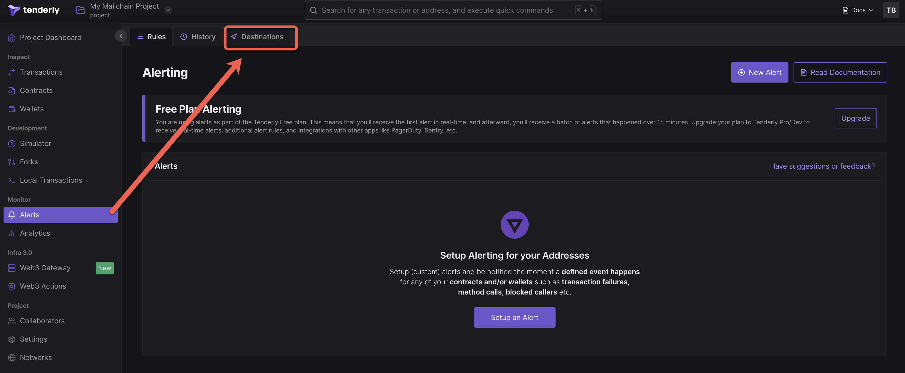
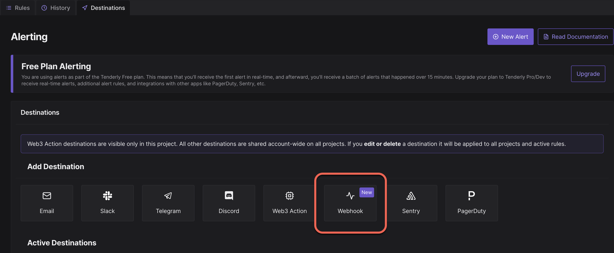
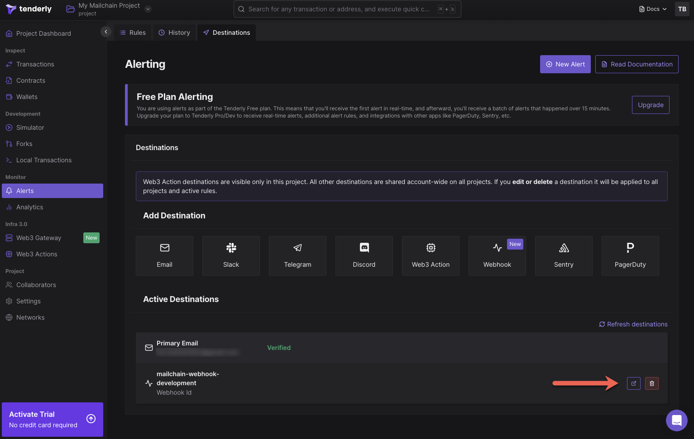
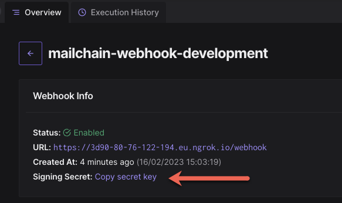
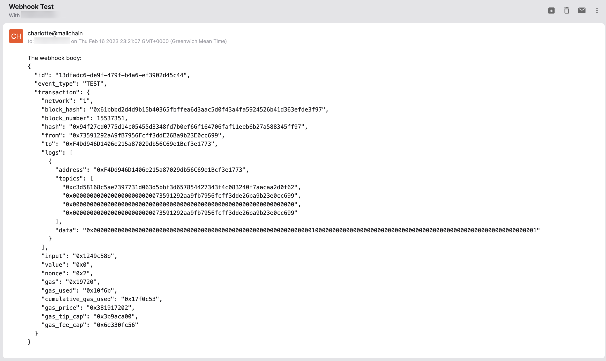

This tutorial shows you how to integrate Tenderly Alerts which can trigger notifications for on-chain events and send them directly to an EVM address, ENS name or Unstoppable domain via Mailchain.

### Why might you want to do this?

-   Notify users about new transfers to their address, e.g. creating a blockexplorer.
-   Notify about a volume of trades over a threshold, e.g. defi platform
-   Notify users about changes to their address for security purposes.

### Background

[Tenderly Alerting](https://docs.tenderly.co/alerts/intro-to-alerts) listens for events on the blockchain and sends real-time notifications to your desired destination when the event occurs. With Tenderly Alerting, you can stay informed about desired or undesired events related to transitions, wallets, smart contracts, or any other activity on the network.

[Mailchain](https://docs.mailchain.com/developer) is the communication layer for Web3. With Mailchain, people can communicate using their Web3 identities through a private, end-to-end encrypted mail experience. The open source Mailchain SDK provides a way for developers to integrate using patterns that easily recompose, adapt, and extend.

# Tutorial: Create a Tenderly Webhook

## Solution Overview

In this tutorial we’ll use a simple Express App that exposes an API webhook that can be called based on on-chain events. We will be using Tenderly, which can deliver alerts based on simple or advanced triggers from transactions and events.

This demonstrates how to setup the webhook that can deliver alerts for use cases including: balance changes, user receipts for NFT purchases, welcome messages, alerting your team of failed transactions and more.

# Prerequisites

To complete this tutorial, you need to first:

1. Download and install [NodeJS](https://nodejs.org/en/download/).
2. [Create a new Mailchain account](https://docs.mailchain.com/user/guides/getting-started/create-a-mailchain-account) for development and testing purposes.
3. Sign in or create a [Tenderly account](https://tenderly.co/).
4. [Ngrok account](https://dashboard.ngrok.com/signup) with [Ngrok installed](https://dashboard.ngrok.com/get-started/setup) on your machine. Ngrok will be used to expose the localhost to the internet in order to be accessible for the webhook. If you prefer to use your own solution to expose localhost to the internet for testing purposes, feel free.

# Step 1 - Set up the Express JS API service

Start by creating and navigating to a new directory, then initialize the app with npm:

```bash
mkdir mailchain-tenderly-example
cd mailchain-tenderly-example
```

Create a file called `'server.js'`:

```bash
touch server.js
```

Paste in the following code into `'server.js'`. This code is based on code provided in Tenderly's webhook configuration page under Advanced Options:

```jsx
// server.js
//
// Use this sample code to handle webhook events
// 1) Paste this code into a new file (server.js)
//
// 2) npm init
//
// 3) Install dependencies
//   npm install --save express
//   npm install --save crypto
//
// 4) Run the server on http://localhost:8008
//   npm start (start script in package.json must point to server.js)

const express = require('express');
const crypto = require('crypto');
const app = express();

// replace this with key taken from dashboard for specific webhook
// if you are testing webhook before creation set it on empty string
const signingKey = '';

app.get('/webhook', (req, res) => {
	res.send('ok');
});

app.post('/webhook', express.raw({ type: 'application/json' }), (request, response) => {
	const signature = request.headers['x-tenderly-signature'];
	const timestamp = request.headers['date'];

	if (!isValidSignature(signature, request.body, timestamp)) {
		response.status(400).send('Webhook signature not valid');
		return;
	}

	let body;
	try {
		body = JSON.parse(request.body.toString());
	} catch (e) {
		response.status(400).send('Webhook error: ', e);
		return;
	}
	const eventType = body.event_type;

	switch (eventType) {
		case 'TEST':
			// Then define and call a function to handle the test event
			break;
		case 'ALERT':
			// Then define and call a function to handle the alert event
			break;
		// ... handle other event types
		default:
			console.log('Unhandled event type ', eventType);
	}

	// Return a 200 response
	response.send();
});

const port = 8008;
app.listen(port, () => console.log('Running on port ', port));

function isValidSignature(signature, body, timestamp) {
	const hmac = crypto.createHmac('sha256', signingKey); // Create a HMAC SHA256 hash using the signing key
	hmac.update(body.toString(), 'utf8'); // Update the hash with the request body using utf8
	hmac.update(timestamp); // Update the hash with the request timestamp
	const digest = hmac.digest('hex');
	return crypto.timingSafeEqual(Buffer.from(signature), Buffer.from(digest));
}
```

Initialize npm by running this command

```bash
npm init
```

You can accept all the defaults similar to the picture below, but make sure the `entry point` is `server.js`:



Now install some dependencies:

```bash
npm install --save express
npm install --save crypto
```

Then start the application, which calls the `'server.js'` file as defined in the `'package.json'` file that npm generated for us.

```bash
npm start
```

The terminal should output that the express server is running on port 8008



# Step 2 - Make our local webhook publicly accessible

We are running this tutorial in a local environment. Tenderly will need to access our endpoint but because it is on our local network, it cannot be accessed from the Internet.

Ngrok can be used to expose the localhost to the internet in order for it to be accessible to the webhook. You may prefer to use your own solution to expose localhost to the internet for testing purposes. Alternatively, there are browser-based development environments that can also publicly expose a running service (e.g. [Gitpod](https://www.gitpod.io/docs/configure/workspaces/ports)).

To start Ngrok, run the following command in a new terminal window:

```bash
ngrok http 8008
```

Copy the `Forwarding` value from the output, it will be something like `https://012a-93-12-152-21.eu.ngrok.io` and leave the service running so the webhook can be reached by Tenderly.

:::warning

If you stop Ngrok at any time, you may need to reconfigure the forwarding value in your Tenderly webhook when you restart it.

:::

# Step 3 - Configure Tenderly webhook destination and alert

Now that we have a destination endpoint that can be reached publicly, we can configure Tenderly to reach the destination:

1. Go to your Tenderly Dashboard
2. Choose Alerts > Destinations (note: you will need to add a wallet address to monitor if this is your first time using Tenderly)

    

3. Next, select Webhook from the Add Destination section:

    

4. Enter your webhook details, including the Ngrok URL with the correct endpoint (e.g. `[https://012a-93-12-152-21.eu.ngrok.io/webhook](https://91f2-80-76-122-194.eu.ngrok.io)`) as the Webhook URL

    

5. Test the webhook by clicking ‘Send test webhook’. Assuming it is successful, click ‘Add webhook’.
6. Under the Active Destinations section, choose the destination you just created, and click the button for more details

    

7. Copy the Signing Secret and store this somewhere private and safe. We will use it in the next section.

    

# Step 4 - Configure environment variables and start the application

We now need to add some secrets and settings to our application. Environment variables let you set values that are passed to your server-side code. For development and testing, we can use [dotenv](https://www.npmjs.com/package/dotenv) and configure environment files in the root directory of the app, named according to the environment, e.g. `'.env.development.local'`.

:::danger

Care must be taken to avoid storing environment variables in source control.

Create or edit `.gitignore` in the root folder of your application and add the snippet below. This tells git to ignore each of the existing environment files. It also prevents changes to the existing environment files from being stored in git. Make sure you add new environments to `.gitignore`.

:::

As mentioned in the warning above, add the following lines to `'.gitignore'`:.

```
# ENV
.env
.env.local
.env.development.local
.env.test.local
.env.production.local

```

If `'.env.development.local'` does not exist in your root directory, create it. Otherwise, open it in your code editor and include the following values:

It should look like this:

```
#Your environment
ENVIRONMENT="development"

#Tenderly
TENDERLY_SIGNING_KEY="xxxxx"
WEBHOOK_SENDER_ADDRESS="username@mailchain.com"
WEBHOOK_RECIPIENT_ADDRESS="username@mailchain.com"

#Mailchain
SECRET_RECOVERY_PHRASE= "your secret ... recovery phrase"
```

**Environment Variables**

`ENVIRONMENT`: the environment you are working in which tells dotenv which file to use, e.g. `development`, `test`.

`WEBHOOK_SENDER_ADDRESS`: a fully qualified address to send notifications from. NOTE: the address must be registered by your Mailchain account. Examples include:

-   your mailchain account (`username@mailchain.com`),
-   an Ethereum address registered in your inbox (`0x1234567890123456789012345678901234567890@ethereum.mailchain.com`),
-   an ENS address that resolves to an Ethereum address that is registered to your account (e.g. `username.eth@ens.mailchain.com`).

`WEBHOOK_RECIPIENT_ADDRESS`: the mailchain recipient of messages from the webhook alerts.

`TENDERLY_SIGNING_KEY`: the signing key generated by the webhook in Tenderly.

`SECRET_RECOVERY_PHRASE`: your Mailchain secret recovery phrase for your development account. The same account the WEBHOOK_SENDER_ADDRESS is registered to.

Install the `'dotenv'` package by running the following command in your terminal:

```bash
npm install --save dotenv
```

Insert the following lines at the beginning of `'server.js'`, above the line `const express = require('express');`

```jsx
require('dotenv').config({ path: `.env.${process.env.ENVIRONMENT || 'development'}.local` });
```

Now replace the following line which will configure the signing key from Tenderly using environment variables in `'.env.development.local'`:

```jsx
// const signingKey = '';
const signingKey = process.env.TENDERLY_SIGNING_KEY;
```

# Step 5 - Configure Mailchain

Install the Mailchain SDK by running the following in your terminal:

```bash
npm install --save @mailchain/sdk
```

Under the line `const app = express();` add the following code snippet to configure the Mailchain SDK:

```jsx
const { Mailchain } = require('@mailchain/sdk');
const mailchain = Mailchain.fromSecretRecoveryPhrase(process.env.SECRET_RECOVERY_PHRASE);
```

Now we will configure our webhook to call the Mailchain SDK `sendMail()` function when Tenderly sends `TEST` webhook calls. (In production, you would want to adjust the message body based on the information expected from contract events or transactions.)

Add the following to the switch statement:

```jsx
switch (eventType) {
	case 'TEST':
		// highlight-start
		try {
			await mailchain.sendMail({
				from: process.env.WEBHOOK_SENDER_ADDRESS,
				to: [process.env.WEBHOOK_RECIPIENT_ADDRESS],
				subject: 'Webhook Test',
				content: {
					text: `The webhook body:\n${JSON.stringify(body, null, 2)}`,
					html: `<p>The webhook body:</p><pre>${JSON.stringify(body, null, 2)}</pre>`,
				},
			});
		} catch (error) {
			throw new Error(error);
		}
		// highlight-end
		break;
	case 'ALERT':
		// Then define and call a function to handle the alert event
		break;
	// ... handle other event types
	default:
		console.log('Unhandled event type ', eventType);
}
```

We need the function handling `sendMail()` to be asynchrous. Update this line: `app.post('/webhook', express.raw...`, adding `async` to:

```jsx
app.post('/webhook', express.raw({type: 'application/json'}), async (request, response) => {
```

Now we can test our webhook works end-to-end from Tenderly to Mailchain.

# Step 6 - Testing the webhook

Make sure:

1. Restart your application and make sure your webhook is running locally
2. Ngrok is making the webhook available on a public endpoint
3. Tenderly is expecting to send alerts to the Ngrok URL (and in turn to your endpoint)

Go to the [Tenderly Dashboard > Alerts > Destinations](https://dashboard.tenderly.co/tote/project/alerts/destinations)

Select the webhook we created, then click ‘Test Webhook’

Select:

Network: Mainnet

Tx hash: 0x94f27cd0775d14c05455d3348fd7b0ef66f164706faf11eeb6b27a588345ff97

Then click Test Webhook

Now check your Mailchain Inbox and you should see the message!



## Conclusion

What can you do now (alerts, use cases etc)?

# Conclusion

Congratulations 🎉 you've built a webhook that can alert you or your users whenever certain events occur on-chain or in transaction logs. There are many use cases, including balance changes, user receipts for NFT purchases, welcome messages, alerting your team of failed transactions, upcoming expiry or liquidation notices and more.

The final code for this repository can be found here:

:::warning

Don't forget to disable the webhook in your Tenderly account when you are finished!

:::

# What's next?

Tenderly provides an important set of tools for Ethereum developers. The ability to simulate, monitor and query transactions and state gives access to a sophisticated set of triggers and alerts. Combining this with web3 communication helps developers provide notifications and updates to users or application developers.

Let us know of any interesting variations of this tutorial that you have implemented or if you need any support via our [Discord](https://discord.gg/2gqGpagbhe) channel.
