# How To Connect & Register A Wallet

If you have an existing blockchain wallet, you can register the wallet to receive messages sent to that address. Visit [connecting and registering wallets](/user/concepts/understanding-connecting-wallets) to learn more about connecting wallets.

<video controls width="100%" poster="https://github.com/mailchain/video-tutorials/blob/main/posters/registering_a_wallet.png?raw=true">
    <source src="https://github.com/mailchain/video-tutorials/blob/main/videos/registering_a_wallet.mp4?raw=true" />
</video>

:::note
This guide goes through the steps of connecting and registering an Ethereum (or EVM) wallet address with Mailchain.

Guides for all supported protocols, web domain name services and identities can be found under [Registering Wallets & Identities](/user/guides/wallets-and-identities).

:::

Follow these steps to connect and register an existing blockchain wallet address:

1.  Click a button to open the connect wallet modal:

    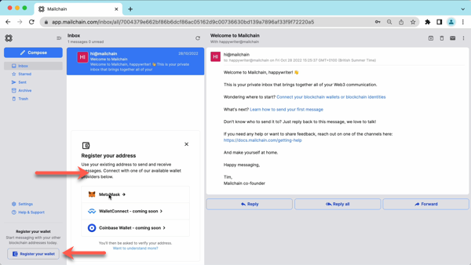

1.  Select a wallet provider (e.g. Metamask), then click 'Connect'

    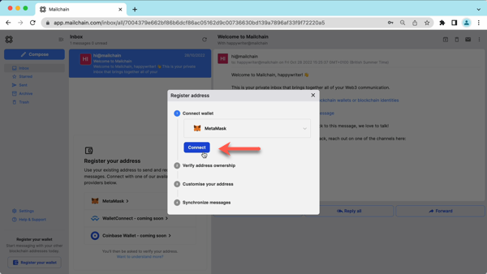

1.  Choose the address to connect, then click Next.

    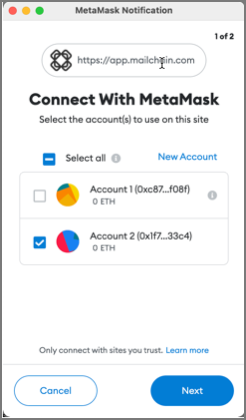

1.  Click 'Connect' to confirm Mailchain should be able to read your address.

    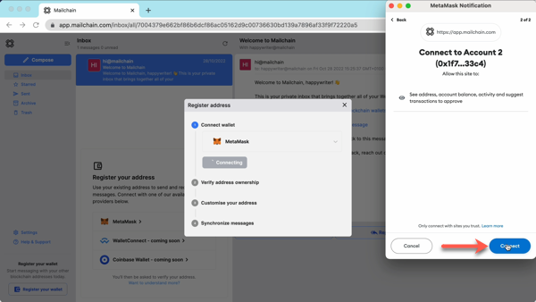

    The address is now connected, but we need to register it in Mailchain. To do this:

1.  Click 'Verify Address'

    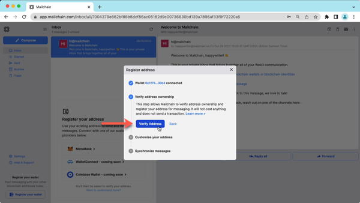

1.  A 'Signature Request' will appear in your wallet. It contains the following text:

    > Message:  
    > Welcome to Mailchain!  
    >
    > Please sign to start using this address with Mailchain. This will not trigger a blockchain transaction or cost any gas fees.  
    >
    > What's happening?  
    > A messaging key will be registered with this address and used only for messaging. It will replace any existing registered messaging keys.  
    >
    > Technical Details:  
    > Address: `your_address`  
    > Messaging key: `a_generated_messaging_key`  
    > Nonce: `a_number`

    Review the request and click 'Sign'.

    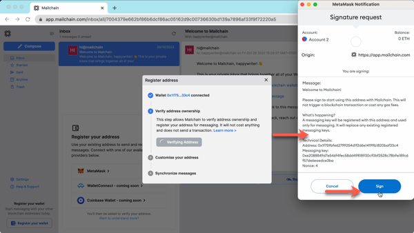

    Your wallet is now verified.

1.  Mailchain will check if you have any Web3 domain name services (e.g. ENS or Unstoppable Domains). For more information on configuring domain name services, please see [Web3 Domain Name Guides](/user/guides/wallets-and-identities/).

    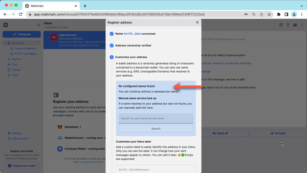

1.  You can optionally label your address to give it a friendly name and make your Inbox folders easier to manage.

    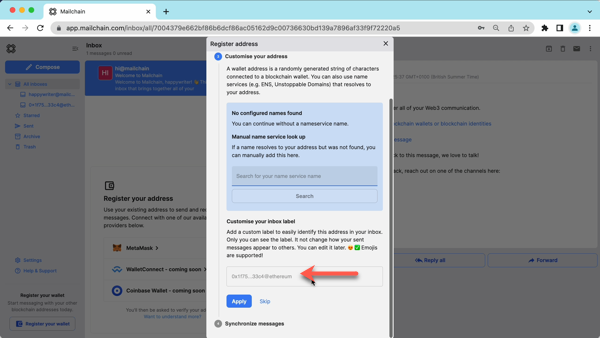

1.  Click 'Apply' to save your changes.

    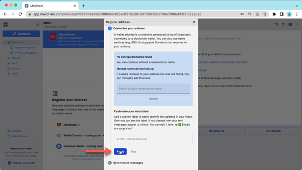

1.  By default, Mailchain is able to receive messages for your existing blockchain wallet address before you sign up. Click 'Synchronize' to get these messages, or click 'Skip' to synchronize later.

    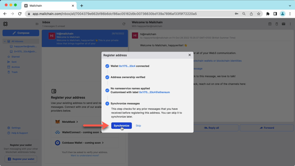

1.  You can now click 'Done' to disconnect your wallet and close the modal, or choose to register another address.

    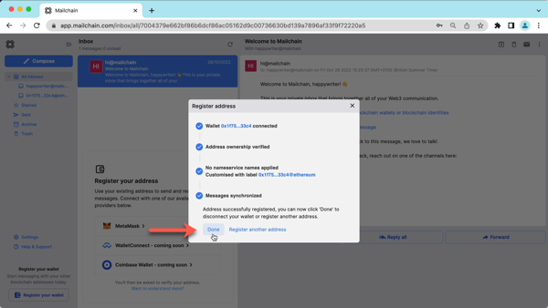

### Tips

You will be able to see a folder in the sidebar for your registered address. To manage the address, click on 'Settings'.

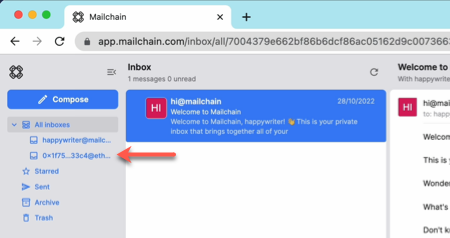

When you compose a message, you can select the address to send from in the message dropdown.

