Mailchain users can use their .aurora domain name to send and receive messages. It’s simple to get started…

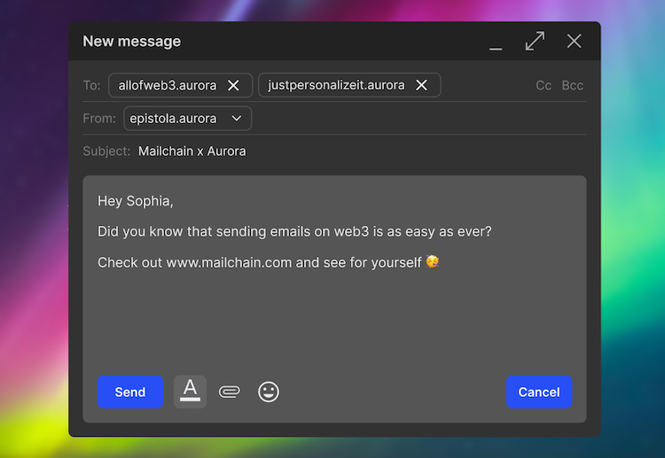

# Introduction

Aurora is an Ethereum Virtual Machine (EVM) based on the layer 1 proof-of-stake blockchain NEAR Protocol. Aurora provides a solution for developers to deploy their apps on an Ethereum-compatible platform, with low transaction costs for their users.

You can register .aurora NFT names at [Freename.io](http://Freename.io), then ‘_mint’ them on the Aurora blockchain. These domains give people full ownership and control of their digital identity, with no renewal fees._

---

## How to add your .aurora name to Mailchain

### Prerequisites:

-   [ ] Your wallet contains your .aurora name (i.e. it contains an NFT of a name you either minted or had transferred to your wallet).
-   [ ] You have a Mailchain account (see [here](/user/guides/getting-started/create-a-mailchain-account))

### Add Your .aurora Name to Mailchain

1. Log in to your Mailchain Account.
2. Click “Register Your Wallet”.

    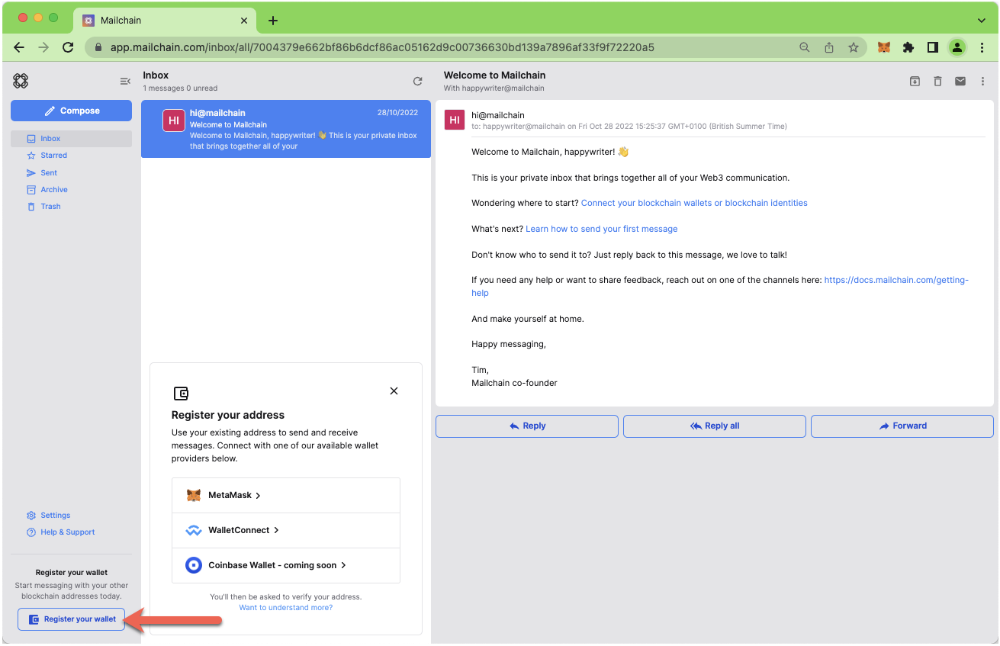

3. A modal will open. Select a wallet provider (e.g. Metamask), then click 'Connect'

    

4. Choose the address to connect, then click Next.

    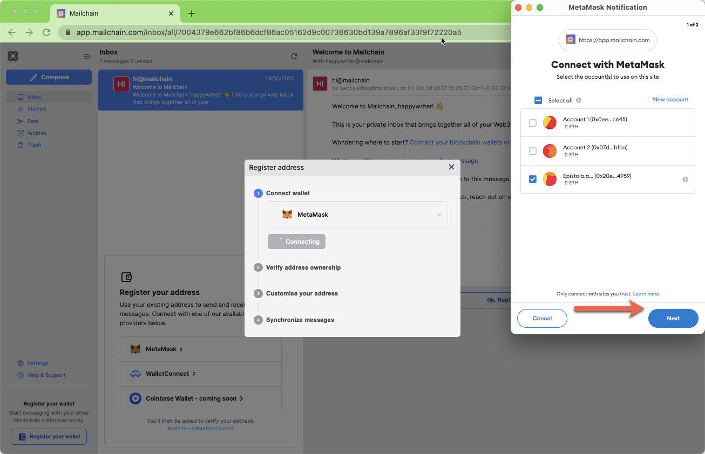

5. Click 'Connect' to confirm Mailchain should be able to read your address.

    

6. The address is now connected, but we need to register it in Mailchain. To do this, click 'Verify Address'

    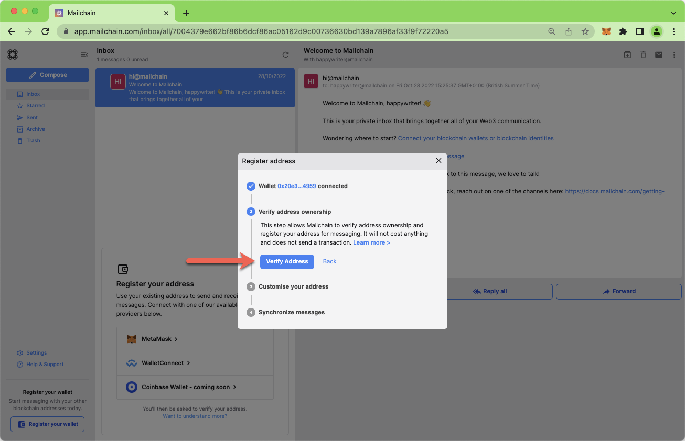

7. A 'Signature Request' will appear in your wallet. It contains the following text:

    ```
    Message:
    Welcome to Mailchain!

    Please sign to start using this address with Mailchain. This will not trigger a blockchain transaction or cost any gas fees.

    What's happening?
    A messaging key will be registered with this address and used only for messaging. It will replace any existing registered messaging keys.

    Technical Details:
    Address: `your_address`
    Messaging key: `a_generated_messaging_key`
    Nonce: `a_number`

    ```

    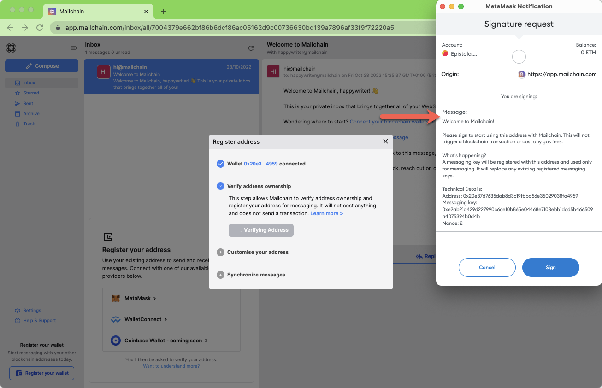

8. Review the request and click 'Sign' to complete verification.

    

9. The next step checks for connected name services, including .aurora names. This example found `epistola.aurora`. If you do not see your name here, you can manually search for it using the search box. If it still cannot be found, please see [Aurora FAQs](/user/guides/name-services/aurora/aurora-faqs)).

    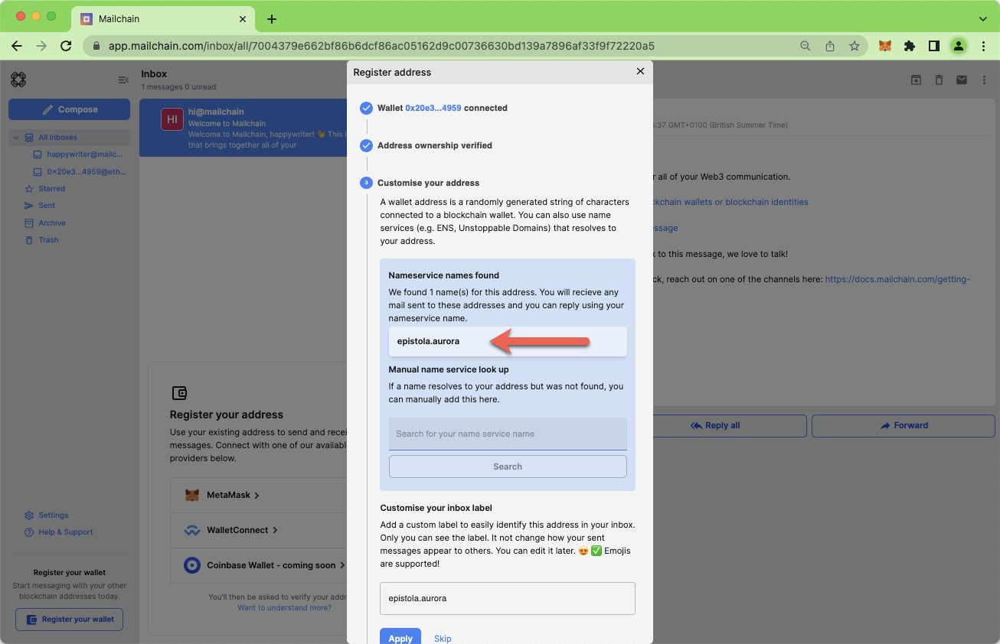

10. You can add a custom label for your address. By default, Mailchain will populate your .aurora name. Click Apply to save and continue.

    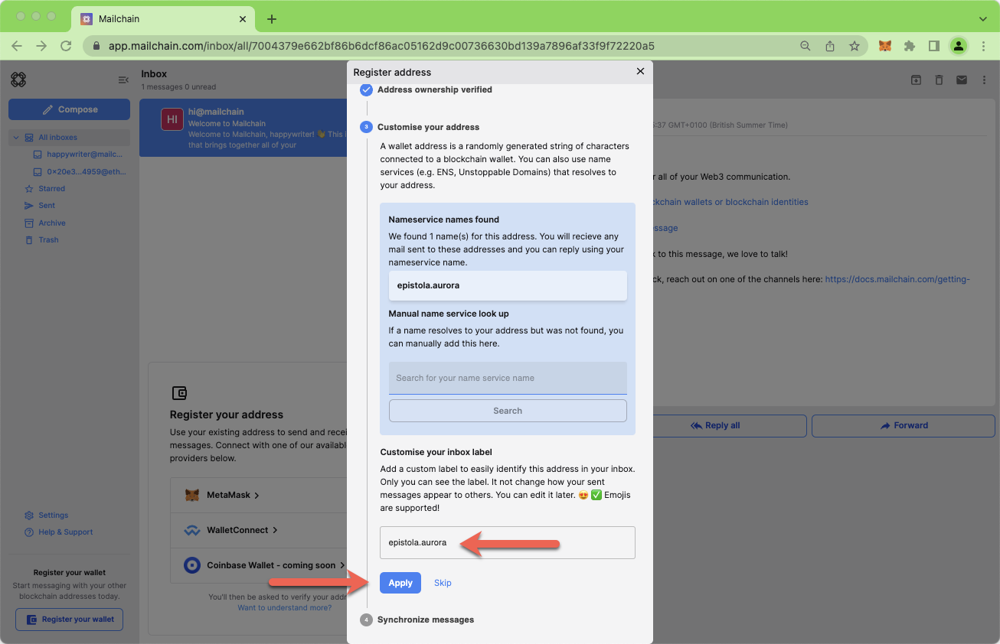

11. Mailchain is able to receive messages for your wallet address before you sign up. Click 'Synchronize' to retrieve these messages, or click 'Skip' to synchronize later. Any synchronized messages will appear in your inbox.

    

12. You can now click 'Done' to disconnect your wallet and close the modal, or choose to register another address.

    

13. You will now see the newly added inbox on the left. This will be labelled with the label you provided when registering the address. Any messages sent to that address or the .aurora name will appear in this inbox.

    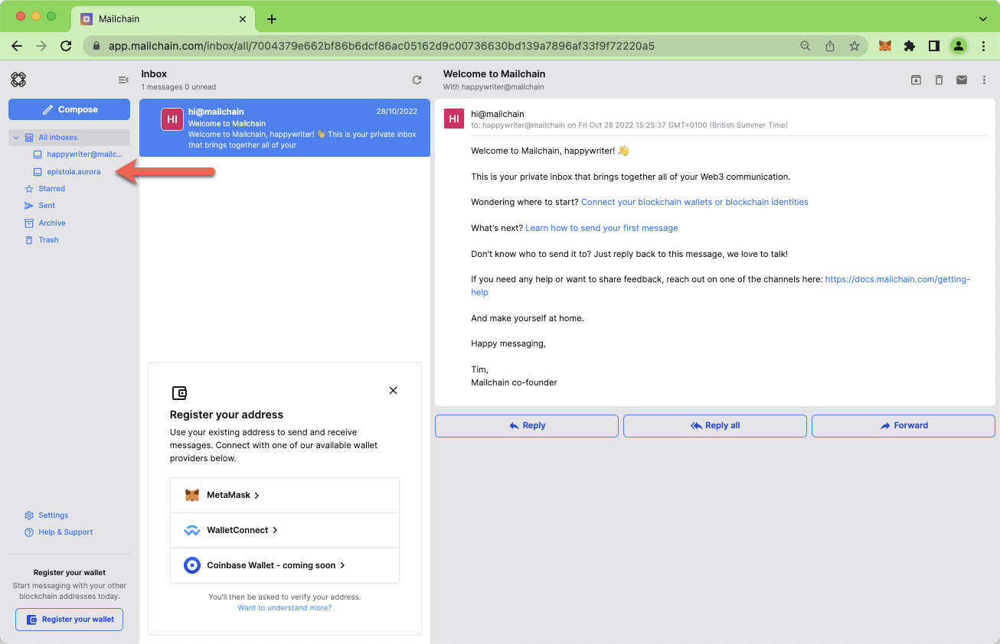

# How To Send A Message Using Your .aurora Name

With Mailchain you can send Mailchain message from your .aurora name to other Mailchain users.

### Prerequisites

-   [ ] Your wallet contains your .aurora name (i.e. it contains an NFT of a name you either minted or had transferred to your wallet).
-   [ ] You have a Mailchain account (see [here](/user/guides/getting-started/create-a-mailchain-account))
-   [ ] You have added your .aurora name to Mailchain (see above)

### Compose And Send A Message From Your .aurora Name

1. Log into your Mailchain account.
2. Click 'Compose' in the sidebar.

    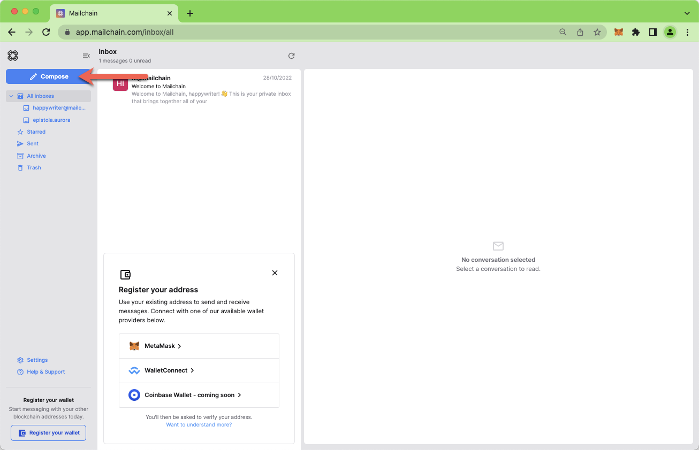

3. In the New Message window, click the “From” dropdown menu.

    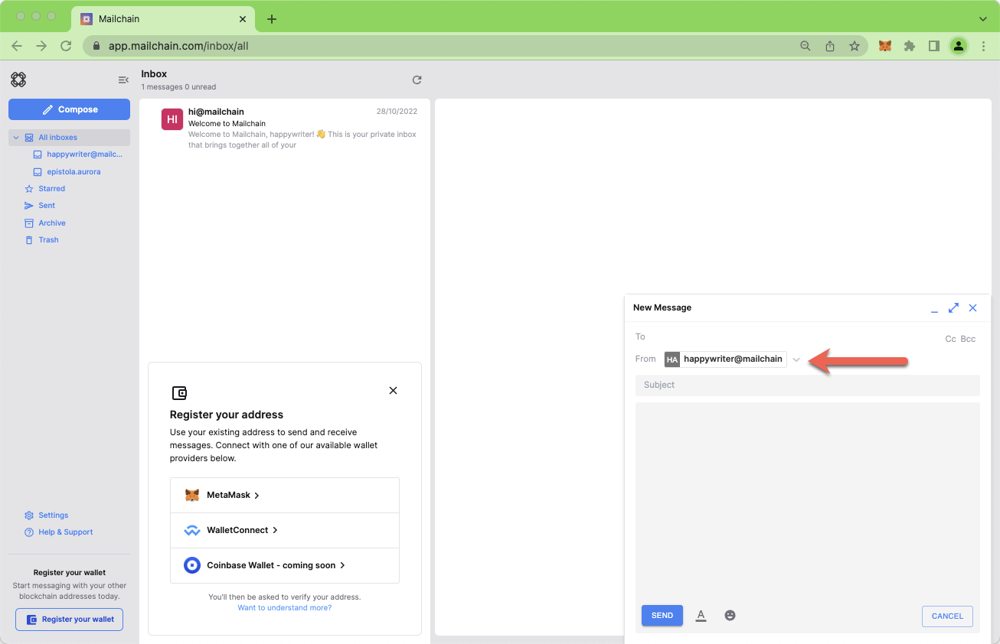

4. Select your .aurora name.

    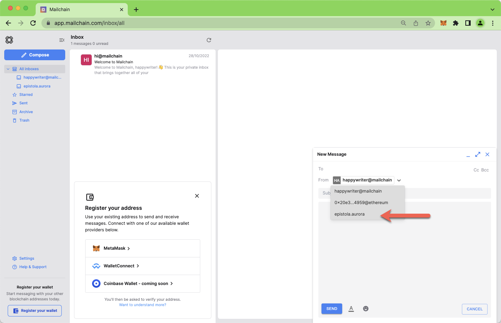

5. Fill out the rest of the message, then click Send

    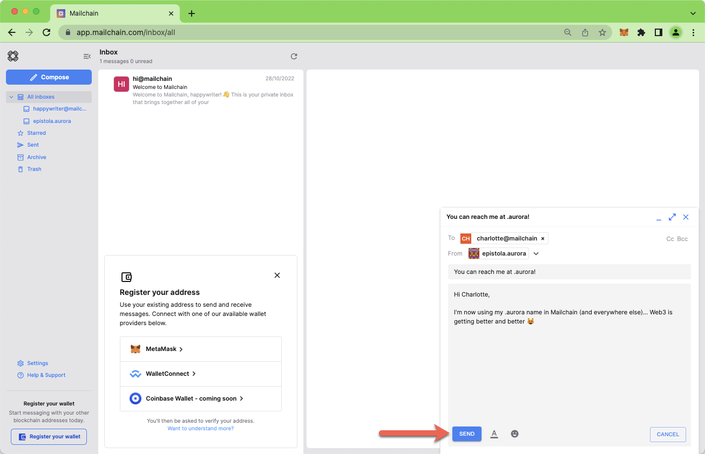

6. Your message should be successfully sent.

    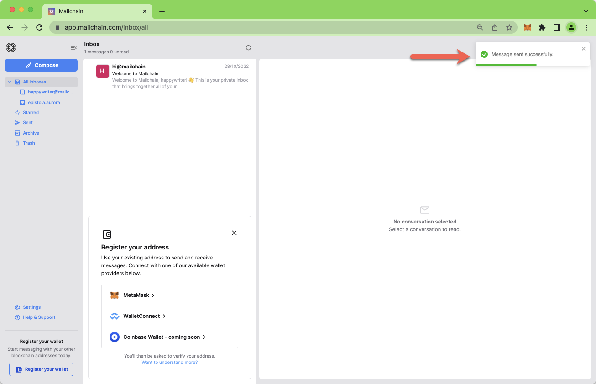

Done! Your recipient will receive your message from your .aurora name.
