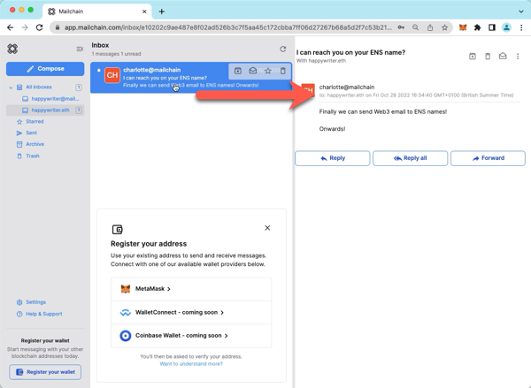
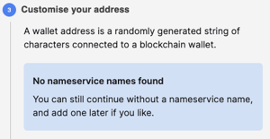

# ENS FAQs

Frequently asked questions for working with ENS and Mailchain.

### Can someone send me a Mailchain message to my ENS address?

You can ask anyone to send messages to your ENS name… it’s a Web3 identity afterall!

### What happens when someone sends a message to my ENS name in Mailchain?

When someone sends a Mailchain message to an ENS name, Mailchain resolves the ENS name and delivers the message to the ENS Resolved Address (the registered ETH address).

If you have already registered the wallet address, then the message will arrive in your inbox.

### What if I have not yet registered my wallet address with Mailchain?

If you have not yet registered the wallet address with Mailchain, the protocol will still accept the encrypted message and store it for up to 90 days. You can synchronise messages for this address when you register the wallet address. (See [How to add your ENS name to Mailchain](/user/guides/name-services/ens/ens-getting-started#how-to-add-your-ens-name-to-mailchain))

### What happens when my ENS name expires?

When your ENS names expires, Mailchain messages will no longer be sent to the address. If someone else registers the name, they will be able to receive messages to this address.

### My ENS name was not found, what should I check?

1. Check you are registering the intended wallet address
2. Check your ENS Primary Resolver is configured to resolve your address in https://app.ens.domains

### What happens if I make a change where my ENS address resolves?

Mailchain will always resolve the underlying name from the ENS contracts so it will reflect the latest changes returned by the resolver.

### How Do I Register An ENS Domain?

Follow these steps to register an ENS name:

_NOTE: You will need some ETH to purchase an ENS name. At the time of writing, >0.01ETH was required to complete this section._

1. Go to [https://app.ens.domains/](https://app.ens.domains/), then connect your wallet.

    

2. Search for an available name, then click search. (We used happywriter.eth in this guide)

    

3. The app will show you if the name is available.

    

4. Choose the length of the registration period you would like, then click “Request to Register”.

    

5. Check the transaction details, then confirm it to complete step 1.

    

6. Once the transaction is confirmed, you will need to wait for a period of 1 minute (step 2), before proceeding to step 3.
7. Click “Register” to proceed with the registration.

    

8. Check the transaction details, then confirm it to complete the registration.

    

9. Once successful, the app will confirm.

    If you would like to use the ENS name to send messages from Mailchain, then click on “Set As Primary ENS Name” and follow the guide: _Set an ENS Primary Resolver._

    

### How Do I Set An ENS Primary Resolver?

An ENS Primary Resolver designates one of your ENS names to represent your Ethereum account and act as your cross-platform Web3 username and profile.

Follow these steps to set up the ENS Primary Resolver for your ENS name:

1.  Go to [https://app.ens.domains/](https://app.ens.domains/), then connect your wallet.

    

2.  Go to My Account.

    

3.  If you do not have a Primary Resolver set, your screen will display the message `Primary ENS Name (reverse record): not set`.

    

4.  To set the Primary ENS Name record, click on the drop-down and select the ENS name you want to be your Primary ENS Name.
    (The example below shows happywriter.eth, and ENS subdomain has been configure to resolve to 0xc1db...89d7)
    
5.  Click "Save".

    

6.  Check the transaction details, then confirm it to set the record.

    

7.  Once the transaction is successful, you will see the ENS name as the “Primary ENS Name (reverse record)”

    

You have now set your Primary ENS Name. This will start to appear in Web3 applications you connect to. You can now register the name with Mailchain to start communicating messages

