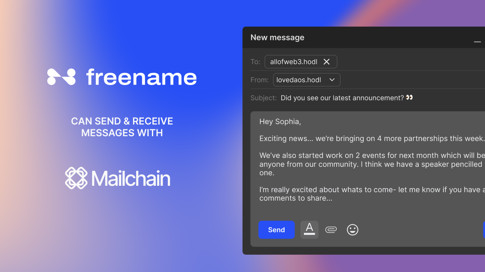
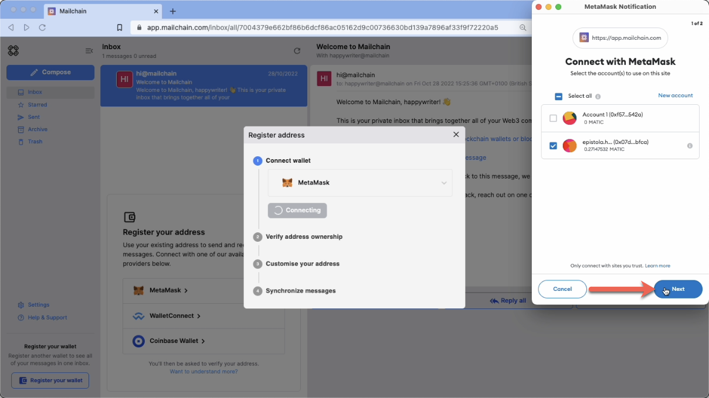
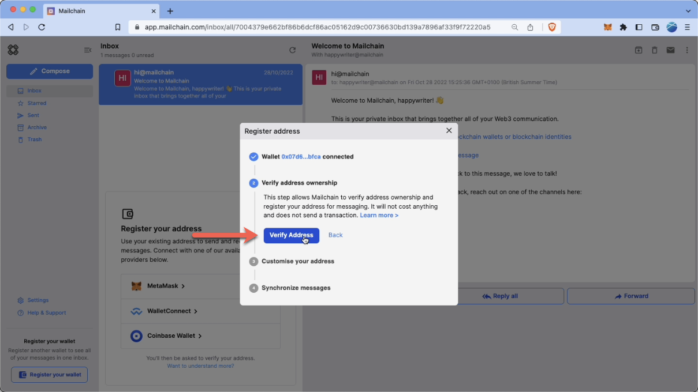
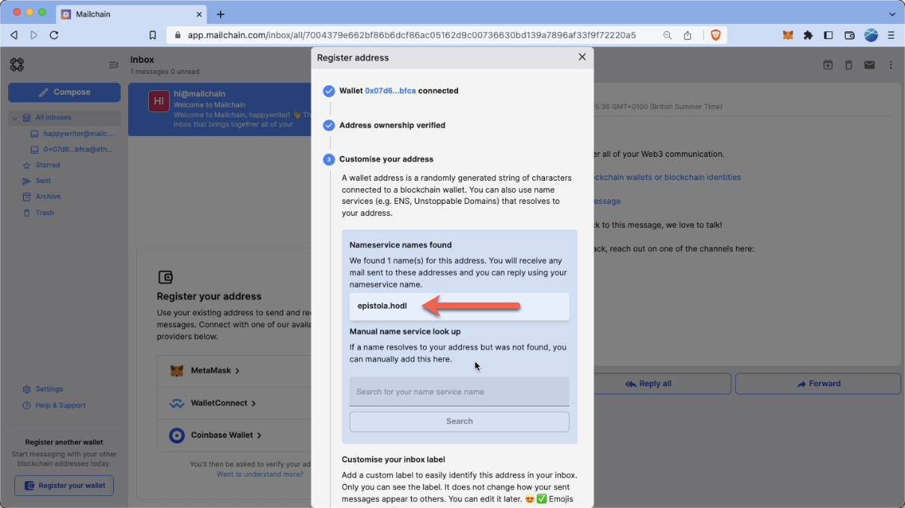
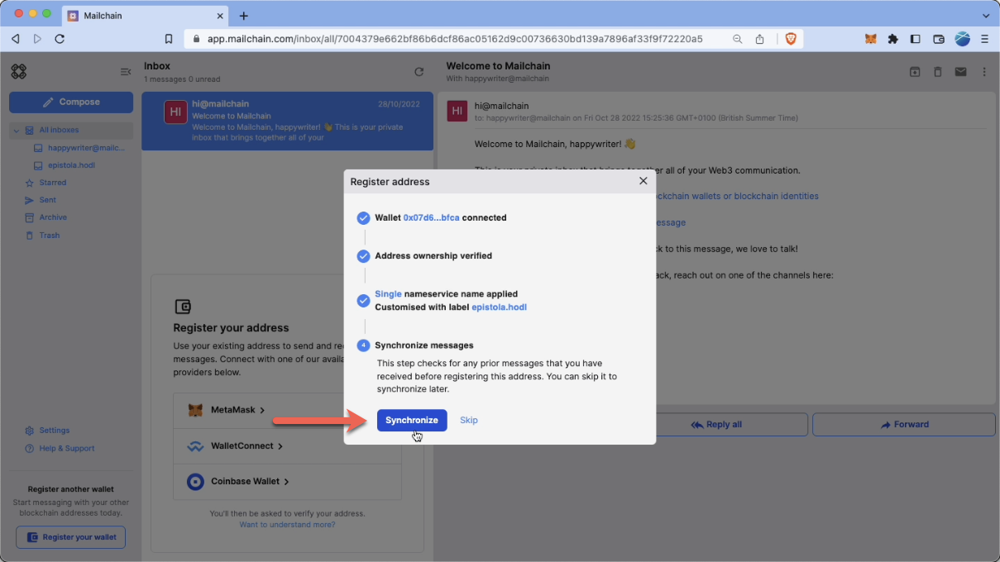
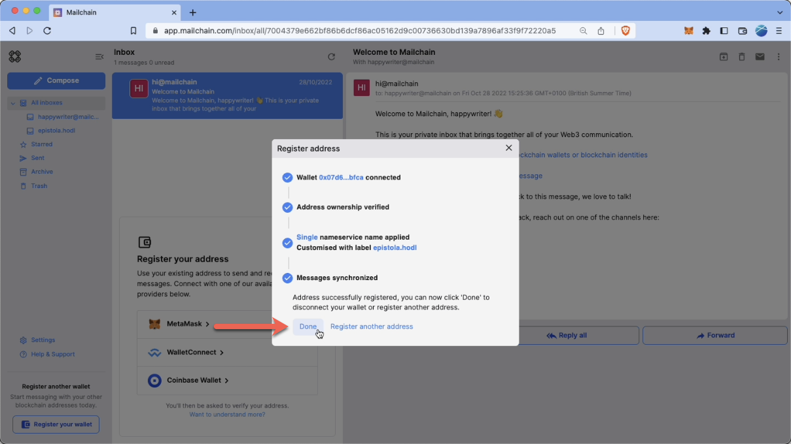
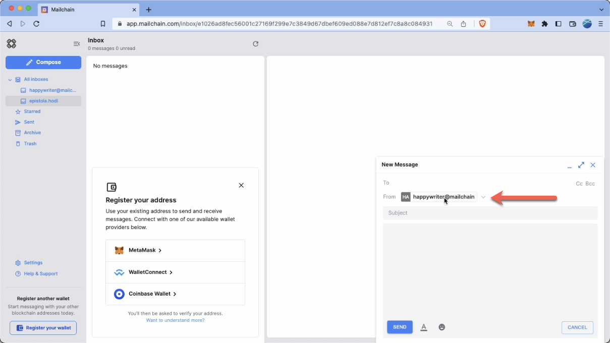
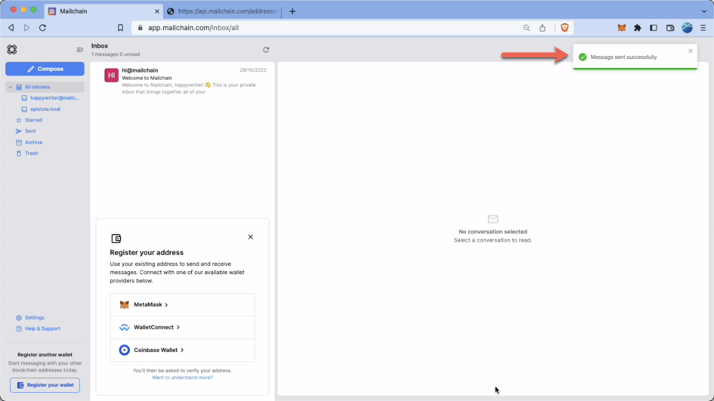

Mailchain users can use their Freename Web3 domain names to send and receive messages. It’s simple to get started…



# Introduction

Freename ([https://freename.io](https://freename.io)) is a web3 domain registrar for top-level domains (TLD) and second-level domains (SLD). Users can register and mint their own web3 TLDs and SLDs. These domains give people full ownership and control of their digital identity, with no renewal fees.

---

# How To Add Your Freename Domain Name To Mailchain

### Prerequisites:

-   [ ] You have a Mailchain account (see [here](https://docs.mailchain.com/user/guides/getting-started/create-a-mailchain-account)).
-   [ ] Your wallet contains your Freename name (i.e. it contains an NFT of a name you either minted or had transferred to your wallet).
-   [ ] The domain name should resolve to your wallet address. You can check this using [https://whois.freename.io/](https://whois.freename.io/) to check your address and name resolve correctly.
        The example below uses `epistola.hodl@freename.mailchain` which can be shortened to `epistola.hodl`.

### Add Your Freename Name to Mailchain

1. Log in to your Mailchain Account.
2. Click “Register Your Wallet”.

    

3. A modal will open. Select a wallet provider (e.g. Metamask), then click 'Connect'

    

4. Choose the address to connect, then click Next.

    

5. Click 'Connect' to confirm Mailchain should be able to read your address.

    

6. The address is now connected, but we need to register it in Mailchain. To do this, click 'Verify Address'

    

7. A 'Signature Request' will appear in your wallet. It contains the following text:

    ```
    Message:
    Welcome to Mailchain!

    Please sign to start using this address with Mailchain. This will not trigger a blockchain transaction or cost any gas fees.

    What's happening?
    A messaging key will be registered with this address and used only for messaging. It will replace any existing registered messaging keys.

    Technical Details:
    Address: `your_address`
    Messaging key: `a_generated_messaging_key`
    Nonce: `a_number`

    ```

    

8. Review the request and click 'Sign' to complete verification.

    

9. The next step checks for connected name services, including all any Freename names. This example found `epistola.hodl`. If you do not see your name here, you can manually search for it using the search box. If it still cannot be found, please see Freename FAQs >>LINK<<.

    

10. You can add a custom label for your address. By default, Mailchain will populate your Freename domain. Click Apply to save and continue.

    

11. Mailchain is able to receive messages for your wallet address before you sign up. Click 'Synchronize' to retrieve these messages, or click 'Skip' to synchronize later. Any synchronized messages will appear in your inbox.

    

12. You can now click 'Done' to disconnect your wallet and close the modal, or choose to register another address.

    

13. You will now see the newly added inbox on the left. This will be labelled with the label you provided when registering the address. Any messages sent to that address or the Freename name will appear in this inbox.

    

# How To Send A Message Using Your Freename Domain Name

With Mailchain you can send a Mailchain message from your Freename domain name to other Mailchain users.

### Prerequisites

-   [ ] You have a Mailchain account (see [here](https://docs.mailchain.com/user/guides/getting-started/create-a-mailchain-account)).
-   [ ] Your wallet contains your Freename name (i.e. it contains an NFT of a name you either minted or had transferred to your wallet).
-   [ ] The domain name should resolve to your wallet address. You can check this using [https://whois.freename.io/](https://whois.freename.io/) to check your address and name resolve correctly.
        The example below uses `epistola.hodl@freename.mailchain` which can be shortened to `epistola.hodl`.
-   [ ] You have added your Freename web3 domain to Mailchain (see above)

### Compose And Send A Message From Your Freename Domain Name

1.  Log into your Mailchain account.
2.  Click 'Compose' in the sidebar.

    

3.  In the New Message window, click the “From” dropdown menu.

    

4.  Select your Freename name.

    

5.  Fill out the rest of the message, then click Send.
    Below, the recipients are:
    allofweb3.hodl and sendto.moon@freename. To learn more about naming conventions, see >>LINK<<.
    
6.  Your message should be successfully sent.

    

Done! Your recipient will receive your message from your Freename domain.
