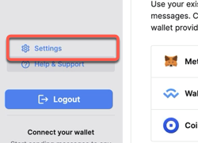
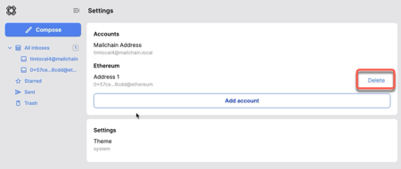

# How To Remove A Registered Wallet

1. To remove a registered wallet address from your inbox, go to 'Settings'

    

1. Click on 'Delete' for the address you wish to remove.

    

1. Confirm deletion by entering in the full address, then click 'Confirm'.

    

Your inbox will no longer check for new messages for this address.

:::tip

You can re-register a blockchain wallet at any time. See [how to register a wallet](/user/guides/getting-started/register-a-wallet) for more information.

:::
