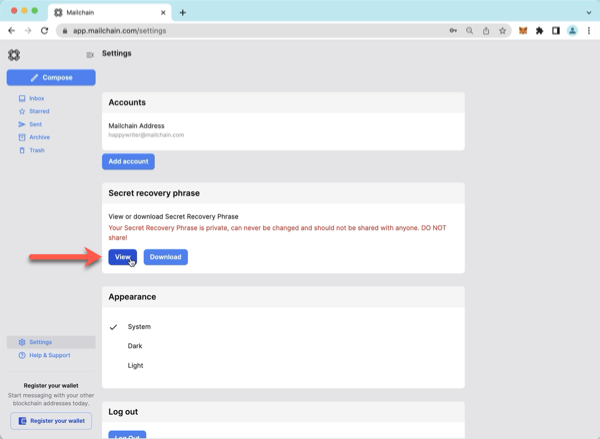
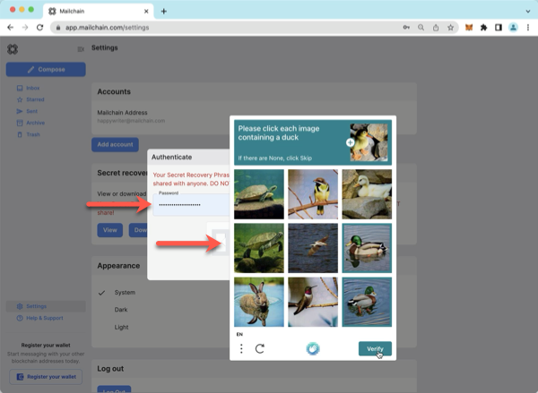
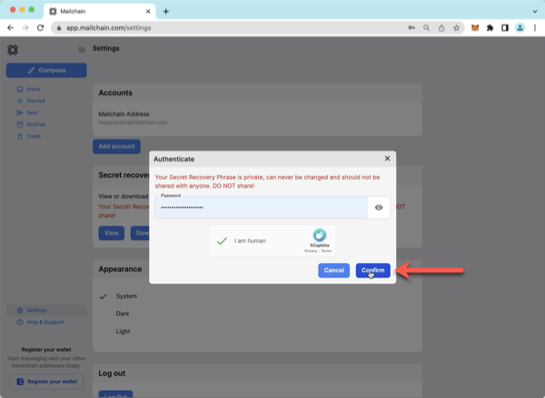
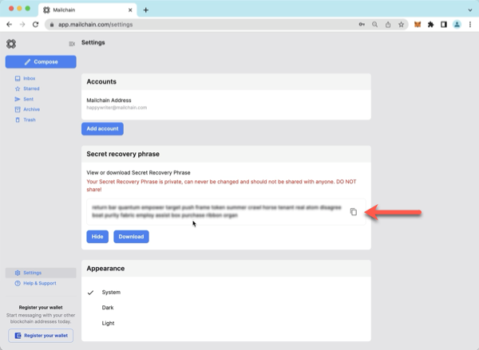
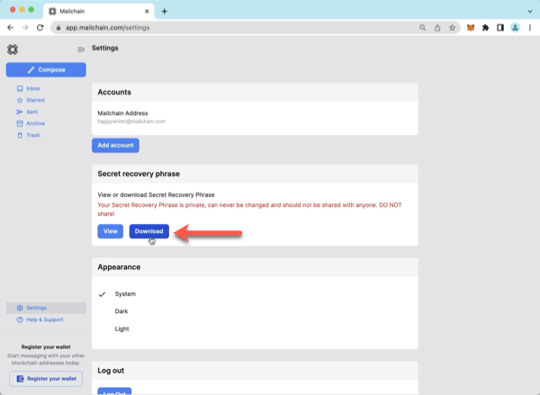
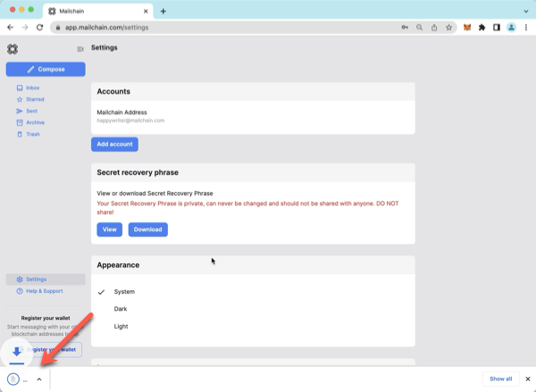
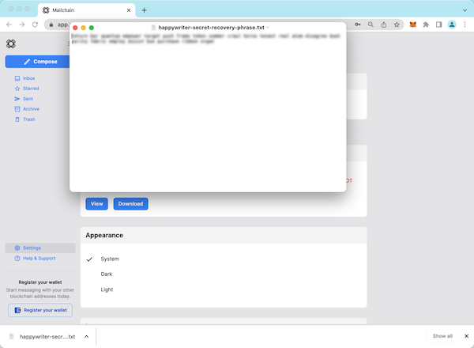

# Secret Recovery Phrase Introduction

:::danger

Your Secret Recovery Phrase, otherwise known as a mnemonic "Secret Recovery Phrase" is used to mathematically derive all the messaging keys, private keys, signatures and other secrets for your account.

It should never be shared with anyone because doing so would give full, irrevocable access to your account. A Secret Recovery Phrase cannot be changed or recovered.

For more information, please see [Mailchain Account Security](/user/faqs#mailchain-account-security)

:::

## How To View Your Secret Recovery Phrase

### Prerequisites

-   [ ] You have a Mailchain account (see [here](/user/guides/getting-started/create-a-mailchain-account))

### Instructions

1. Log in to your Mailchain Account.
2. Click ‘Settings’.

    

3. Go to the ‘Secret recovery phrase‘ section and click ‘View’.

    

4. Fill in your password and prove you are not a robot.

    

5. Click ‘Confirm’

    

6. Your Secret Recovery Phrase will be displayed in the interface.

    

---

## How to download your Secret Recovery Phrase

### Prerequisites

-   [ ] You have a Mailchain account (see [here](/user/guides/getting-started/create-a-mailchain-account))

### Instructions

1. Log in to your Mailchain Account.
2. Click ‘Settings’.

    

3. Go to the ‘Secret recovery phrase‘ section and click ‘Download’.

    

4. Fill in your password and prove you are not a robot.

    

5. Click ‘Confirm’

    

6. Your Secret Recovery Phrase will be downloaded to your device as a text file (.txt).

    

7. When you open the file, you will see your secret recovery phrase.

    

:::danger

Store your Secret Recovery Phrase securely. It should never be shared with anyone because doing so would give full, irrevocable access to your account.

:::
