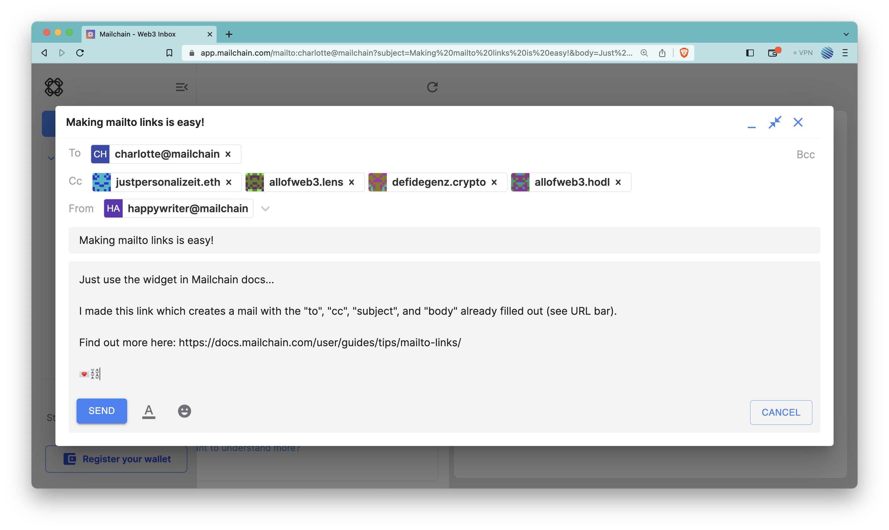

import MailtoLinkCreator from '@site/src/components/MailtoFeatures';

## Mailchain Mailto Links

Mailto links are a convenient way to generate an email with pre-filled information, such as recipients, subject, and body, using a standard HTML hyperlink.

Clicking on a Mailchain mailto link opens the user's Mailchain Inbox with the pre-filled information included in the new email. This is particularly useful when you want to guide a user to send a specific type of email or provide a quick way to contact someone.

Use this widget to create mailto links for Mailchain:

<MailtoLinkCreator />

### Form Instructions

Fill out each of the relevant fields to create your Mailchain mailto link.

**To: (required)** Enter the recipient's Mailchain address in the "To" field. Ensure it's a valid, fully qualified, mailchain address (e.g. ‘local-part’@’domain-part’). If the address is invalid, an error message will be displayed in Mailchain. For more information on addresses in Mailchain, please see [address formatting](/developer/address-formatting.md). Multiple addresses can be separated by commas.

**Cc:** (optional) If you want to add other recipients in the carbon copy (Cc) field, enter their Mailchain addresses separated by commas.

**Bcc:** (optional) If you want to add recipients in the blind carbon copy (Bcc) field, enter their Mailchain addresses separated by commas. These recipients will receive the message, but other recipients will not see their addresses.

**Subject:** (optional) Enter the subject of the message in the "Subject" field.

**Body:** (optional) Type the content of your message in the "Body" field.

Once you've filled out the form, there are two actions you can take:

**1. Copy Mailto Link to Clipboard:** Click on this link to copy the generated mailto link to your clipboard. You can then paste it into other applications or share it with others.

**2. Click to Create Email:** Click on this link to open the Mailchain web app with the pre-filled message. If you're already logged in to Mailchain, a new message will be created with the entered information. If you're not logged in, you'll be prompted to log in first.

By using the mailto link form with Mailchain, you can create pre-filled messages easily, making it more convenient for users to send web3 emails.
