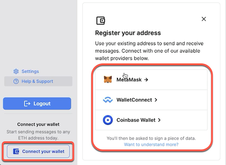
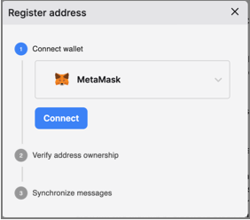
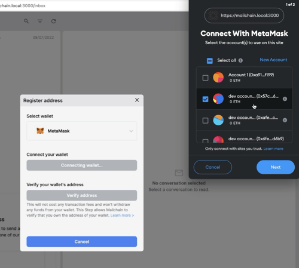
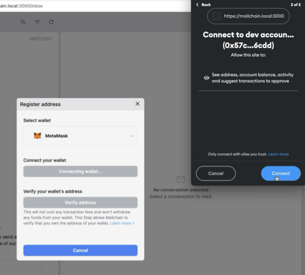
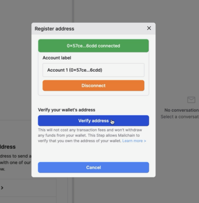
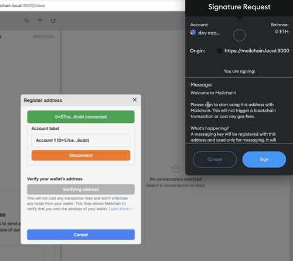
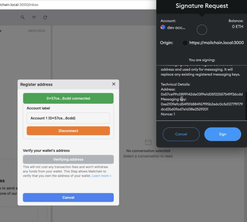
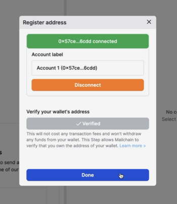
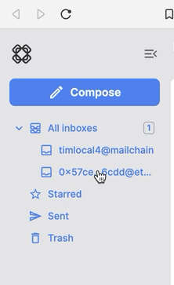
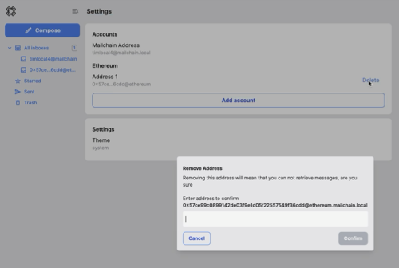

# Introduction

Mailchain gives you the ability to check for messages sent to any of your blockchain addresses through your unified inbox. Once you register your blockchain address, you can start sending and receiving messages via that address.

Use cases include receiving notifications and communications based on your on-chain activities. You can also send messages from that address, and recipients can verify that the message originated from that address.

## How it works

Your Mailchain account has an identity key, which is used to generate messaging keys. When you register an address, you prove that you own it. It can then be associated with a messaging key. When someone sends a message to your address, the application looks up your address at the registry lookup and receives a response containing the corresponding messaging key for your address.

## Bob and Alice Use Case Example

Bob wants to send a message to Alice to let her know he has a new art collection coming out. He only knows the ethereum address she used when she bought his last piece. Alice has registered her address in Mailchain by signing a an approval message with her wallet. Bob sends a message to Alice's address. In the background, the Mailchain application looks up Alice's address and gets the corresponding messaging key. The message is encrypted and routed using the messaging key details.

When Alice opens her inbox, she can see a message from Bob sent to her ethereum address. Alice's identity and message key details are used by the application to obtain and decrypt the message body, but the private key information is never revealed.

Bob has no way of knowing any other address Alice has linked to her Mailchain unified inbox.
When Bob receives a reply from Alice, he can check that the message key details are valid.
Alice never had to enter any sensitive information to Mailchain, and she retains full control and ownership of her private keys for encryption and decryption.

## How to connect and register your wallet address

Follow these steps to connect and register an existing blockchain wallet address:

1. Click a button to open the connect wallet modal:

    

1. Select a wallet provider (e.g. Metamask, WalletConnect, etc.), then click 'Connect wallet'

    

1. Choose the address to connect, then click Next.

    

1. Confirm to permit the Mailchain app to read your address.

    

The address is now connected, but we need to register it in Mailchain. To do this:

1. Click 'Verify Address'

    

1. A 'Signature Request' will pop up in your wallet. It contains the following text:

    > Message:  
    > Welcome to Mailchain!  
    >
    > Please sign to start using this address with Mailchain. This will not trigger a blockchain transaction or cost any gas fees.  
    >
    > What's happening?  
    > A messaging key will be registered with this address and used only for messaging. It will replace any existing registered messaging keys.  
    >
    > Technical Details:  
    > Address: `your_address`  
    > Messaging key: `a_generated_messaging_key`  
    > Nonce: `a_number`

    Review the request and click sign.

    
    &nbsp;
    

1. Your wallet will now be verified. You can click 'Done' to close the modal.

    

### Tips

You will be able to see a folder in the sidebar for your registered address. To manage the address, click on 'Settings'.

When you compose a message, you can select the address to send from in the message dropdown.

## How to remove a wallet

1. To remove a registered wallet address from your inbox, go to 'Settings'

    

1. Click on 'Delete' for the account you wish to remove.

    

1. Confirm deletion by entering in the full address, then Confirm.

    

Your inbox will no longer check for new messages for this address.
