Mailchain users can use their Avalanche C-Chain wallet addresses and .avax names to send and receive messages. It’s simple to get started…

# Introduction

_**Avalanche®** is an open-source platform for launching decentralized finance applications and enterprise blockchain deployments in one interoperable, highly scalable ecosystem. Everything on Avalanche is a Subnet, and every chain is part of a Subnet. Validators are required to be a member of the Primary Network; all other Subnets are optional. The Primary Network contains three blockchains: Platform Chain (P-Chain), Contract Chain (C-Chain), Exchange Chain (X-Chain)._ Source: [https://support.avax.network/](https://support.avax.network/en/articles/4135427-avalanche-platform-overview)

_**.avax domain names** are provided by [Avvy Domains](https://avvy.domains/), a naming service designed to support the Avalanche ecosystem and its various subnets._ — Source: [Avvy Domains](https://avvy.domains/)

---

## How To Add Your Avalanche Address or .avax Domain Name To Mailchain

### Prerequisites:

-   [ ] You have a Mailchain account (see [here](/user/guides/getting-started/create-a-mailchain-account))
-   [ ] (Optional) You have an .avax name, registered through Avvy Domains, configured to resolve to your address (see [here](/user/guides/wallets-and-identities/avalanche/avalanche-faqs/#how-do-i-configure-my-avax-domain))

### Add Your .avax Domain Name to Mailchain

1. Log in to your Mailchain Account.

1. Click “Register Your Wallet”.

    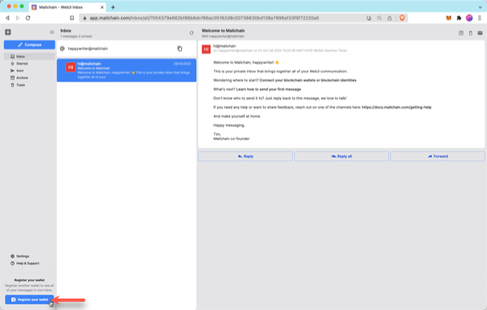

1. A modal will open. Select a wallet provider (e.g. Metamask), then click 'Connect'

    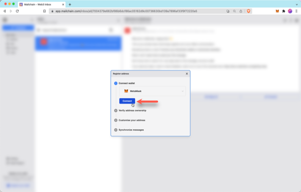

1. Choose the address to connect, then click Next.

    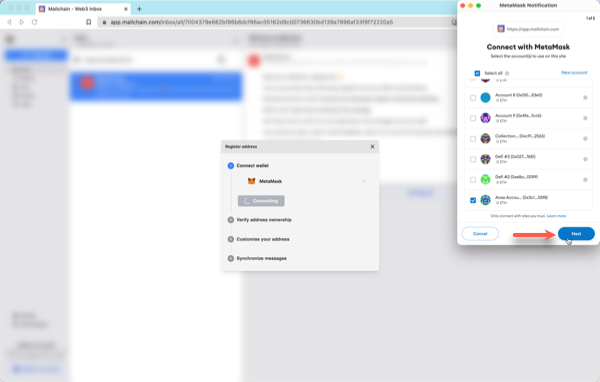

1. Click 'Connect' to confirm Mailchain should be able to read your address.

    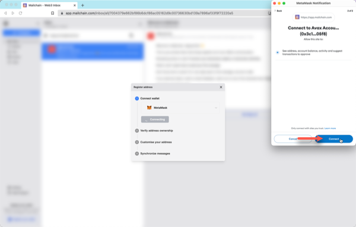

1. The address is now connected, but we need to register it in Mailchain. To do this, click 'Verify Address'

    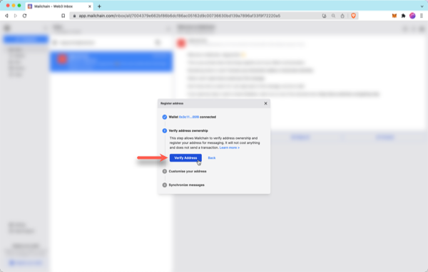

1. A 'Signature Request' will appear in your wallet. It contains the following text:

    ```bash
    Message:
    Welcome to Mailchain!

    Please sign to start using this address with Mailchain. This will not trigger a blockchain transaction or cost any gas fees.

    What's happening?
    A messaging key will be registered with this address and used only for messaging. It will replace any existing registered messaging keys.

    Technical Details:
    Address: `your_address`
    Messaging key: `a_generated_messaging_key`
    Nonce: `a_number`
    ```

    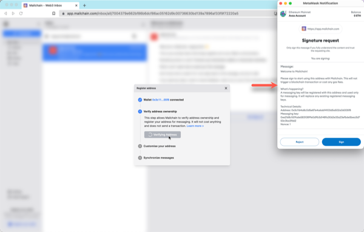

1. Review the request and click 'Sign' to complete verification.

    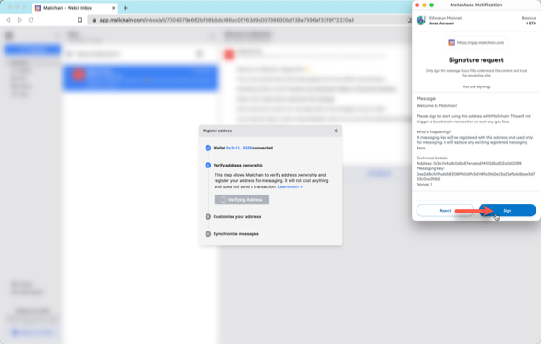

1. The next step checks for connected name services, including .avax names. If you do not see your .avax name here, you can manually search for it using the search box. Note: Enhanced Privacy domains will not appear automatically and need to be manually searched for.

    If it still cannot be found, please see Avalanche FAQs [here](/user/guides/wallets-and-identities/spaceid/spaceid-faqs/#my-space-id-domain-was-not-found-what-should-i-check) and ensure your .avax name is configured to resolve correctly.

    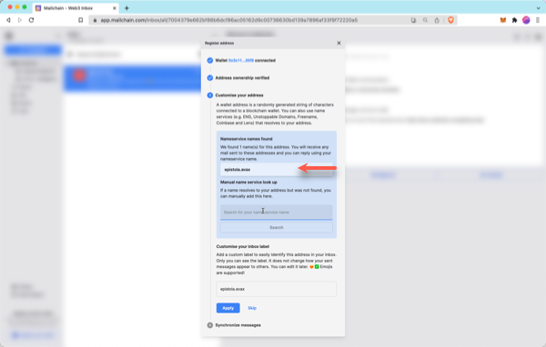

1. You can add a custom label for your address. By default, Mailchain will populate the label with the first name it finds. Click Apply to save and continue.

    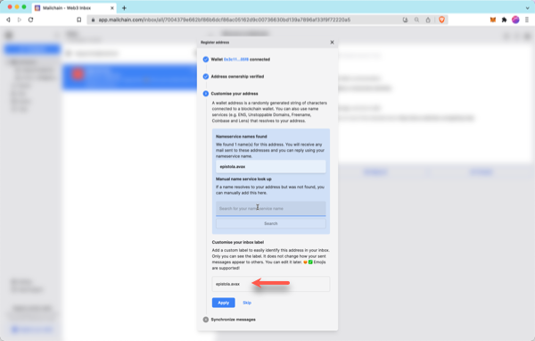

1. Mailchain is able to receive messages for your wallet address before you sign up. Click 'Synchronize' to retrieve these messages, or click 'Skip' to synchronize later. Any synchronized messages will appear in your inbox.

    

1. You can now click 'Done' to disconnect your wallet and close the modal, or choose to register another address.

    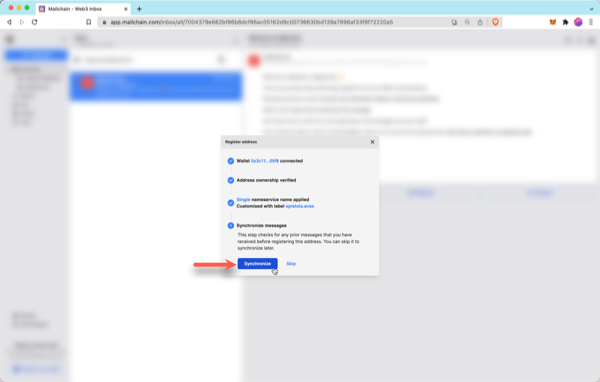

1. You will now see the newly added inbox on the left. This will be labelled with the label you provided when registering the address. Any messages sent to that address or your .avax name will appear in this inbox.

    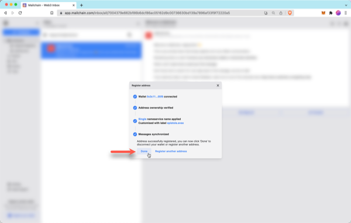

## How To Send A Message From Your Avalanche Address or .avax Name

With Mailchain you can send Mailchain messages from your .avax name or C-Chain address to other Mailchain users.

### Prerequisites

-   [ ] You have a Mailchain account (see [here](/user/guides/getting-started/create-a-mailchain-account))
-   [ ] (Optional) You have an .avax name, registered through Avvy Domains, configured to resolve to your address (see [here](/user/guides/wallets-and-identities/avalanche/avalanche-faqs/#how-do-i-configure-my-avax-domain))
-   [ ] (optional) You have added your .avax domain to Mailchain (see [above](/user/guides/wallets-and-identities/avalanche/ valanche-getting-started/#add-your-avax-domain-name-to-mailchain))

### Compose And Send A Message From Your .avax Name or Avalanche Address

1. Log into your Mailchain account.

1. Click 'Compose' in the sidebar.

 <!--  -->

1. In the New Message window, click the “From” dropdown menu and select your C-Chain address or .avax name.

 <!--  -->

1. Fill out the rest of the message, then click Send.

 <!--  -->

1. Your message should be successfully sent.

 <!--  -->

Done! Your recipient will receive your message from your address or .avax name.
