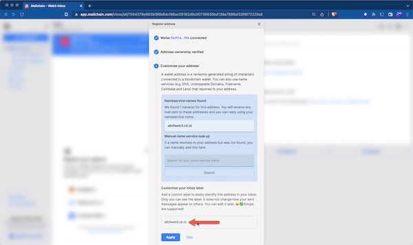
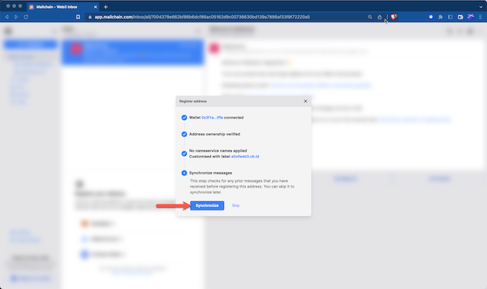
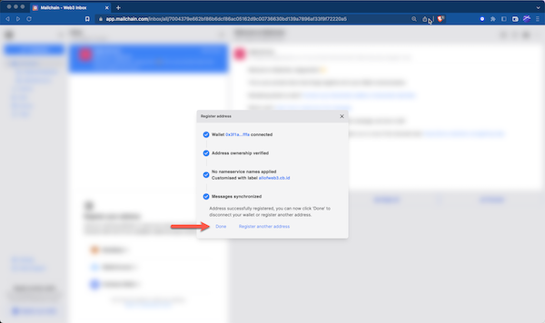
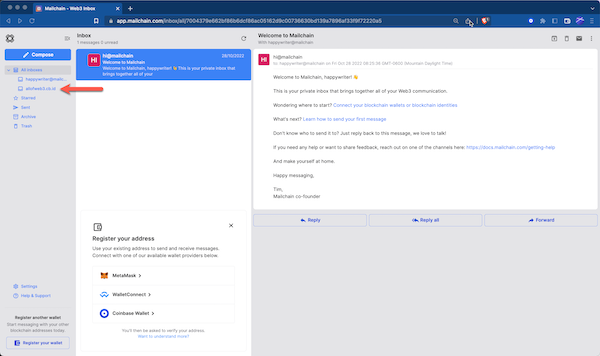
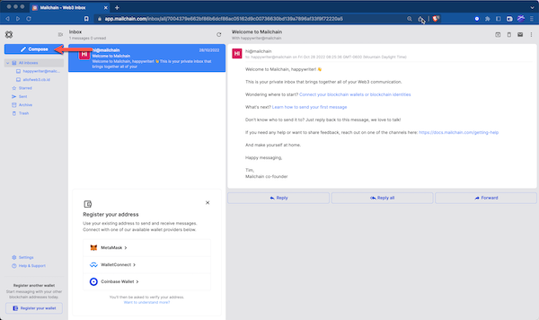
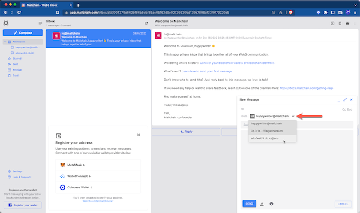
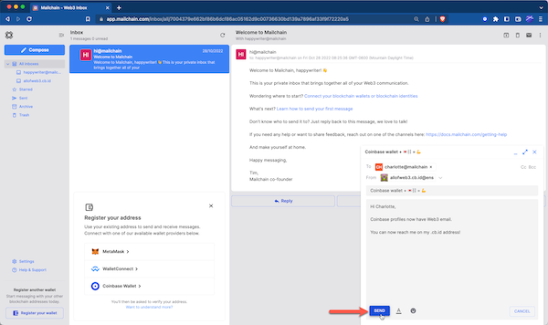

Mailchain users can use their Coinbase Decentralized IDs (.cb.id) to send and receive web3 mail. It’s simple to get started…

# Introduction

Coinbase is working with the Ethereum Name Service (ENS), a decentralized identity infrastructure provider, to offer Coinbase-managed web3 usernames free to users.

A Coinbase username is a decentralized form of ID that allows you to personalize your wallet address, making it easier to access web3 and for others to locate, remember and send funds to your wallet through your Coinbase username (for example, using username.cb.id instead of 0x7ec…).

Your Coinbase username (username.cb.id) is a “subdomain” tied to Coinbase’s Domain Name System (DNS) domain (cb.id), which is also registered under the ENS protocol. _Source: [Coinbase Help](https://help.coinbase.com/en/wallet/managing-account/coinbase-ens-support)_

---

## How To Add Your Coinbase Username To Mailchain

### Prerequisites:

-   [ ] You own a .cb.id username (see [here](https://help.coinbase.com/en/wallet/managing-account/coinbase-ens-support))
-   [ ] You have a Mailchain account (see [here](/user/guides/getting-started/create-a-mailchain-account))

### Add Your Coinbase Decentralized ID To Mailchain

1. Log into your Mailchain Account.

1. Click “Register Your Wallet”:

    

1. A modal will open. Select a wallet provider (e.g. Coinbase), then click 'Connect':

    

1. Click 'Connect' to confirm Mailchain should be able to read your address:

    

1. The address is now connected. To register it in Mailchain, click 'Verify Address':

    

1. A 'Signature Request' will appear in your wallet. It contains the following text:

    ```bash
    Message:
    Welcome to Mailchain!

    Please sign to start using this address with Mailchain. This will not trigger a blockchain transaction or cost any gas fees.

    What's happening?
    A messaging key will be registered with this address and used only for messaging. It will replace any existing registered messaging keys.

    Technical Details:
    Address: `your_address`
    Messaging key: `a_generated_messaging_key`
    Nonce: `a_number`
    ```

    

1. Review the request and click 'Sign' to complete verification:

    

1. In next step, enter your .cb.id in the 'Manual name service lookup' field and click 'Search'. If it cannot be found, please see Coinbase Profiles FAQs [here](/user/guides/wallets-and-identities/coinbase-decentralized-id/coinbase-decentralized-id-faqs#my-coinbase-decentralized-id-was-not-found-what-should-i-check):

    

1. You can add a custom label for your address. By default, Mailchain will populate your .cb.id username. Click Apply to save and continue:

    

1. Mailchain is able to receive messages for your wallet address before you sign up. Click 'Synchronize' to retrieve these messages, or click 'Skip' to synchronize later. Any synchronized messages will appear in your inbox:

    

1. You can now click 'Done' to disconnect your wallet and close the modal, or choose to register another address:

    

1. You will now see the newly added inbox on the left. This will be labelled with the label you provided when registering the address. Any messages sent to that address or the .cb.id username will appear in this inbox:

    

## How To Send A Message Using Your .cb.id Username

With Mailchain you can send Mailchain message from your .cb.id username to other Mailchain users.

### Prerequisites

-   [ ] You own a .cb.id username (see [here](https://help.coinbase.com/en/wallet/managing-account/coinbase-ens-support))
-   [ ] You have a Mailchain account (see [here](/user/guides/getting-started/create-a-mailchain-account))
-   [ ] You have added your .cb.id username to Mailchain (see [above](#how-to-add-your-coinbase-username-to-mailchain))

### Compose And Send A Message From Your .cb.id Username

1. Log into your Mailchain account.

1. Click 'Compose' in the sidebar.

    

1. In the New Message window, click the “From” dropdown menu and select your .cb.id username.

    

1. Fill out the rest of the message, then click Send

    

1. Your message should be successfully sent.

    

Done! Your recipient will receive your message from your .cb.id username.
