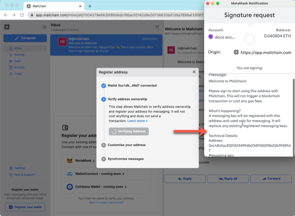
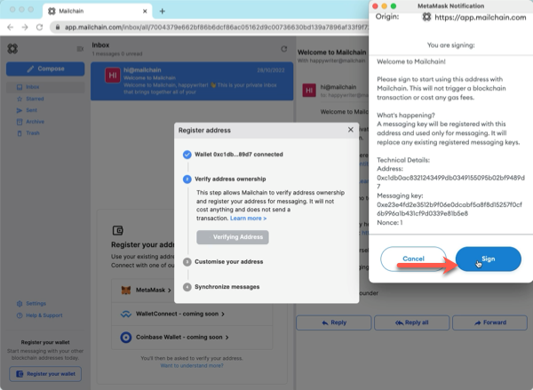
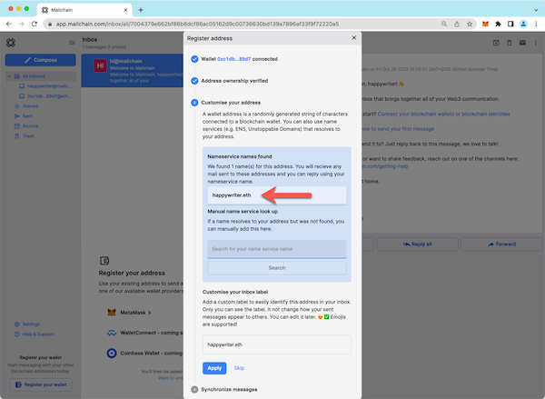
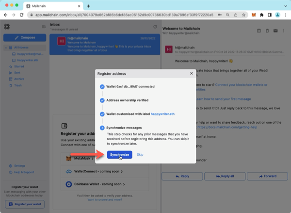
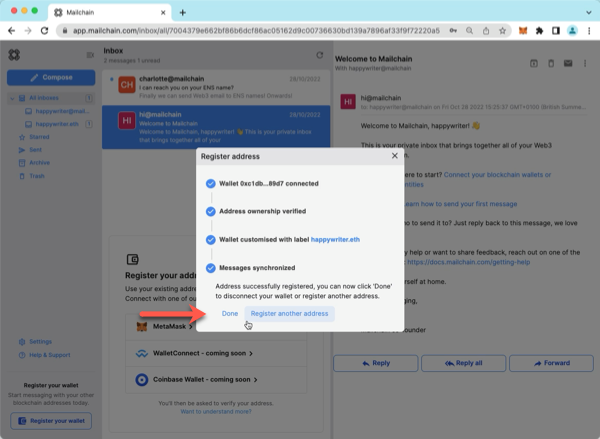
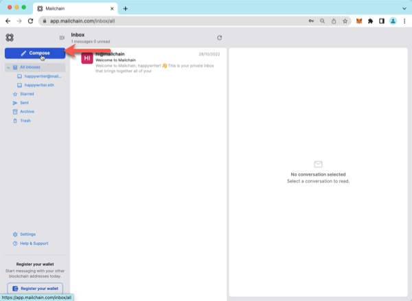
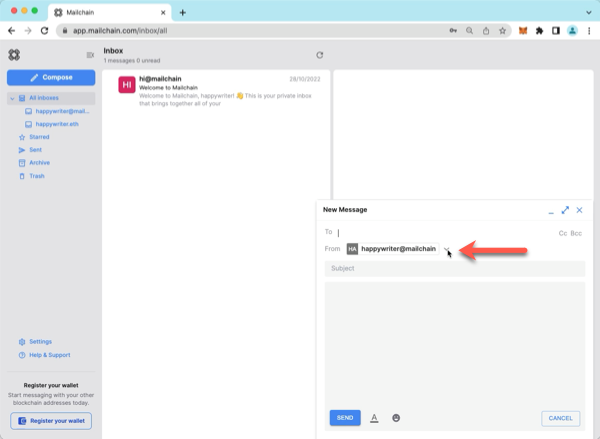
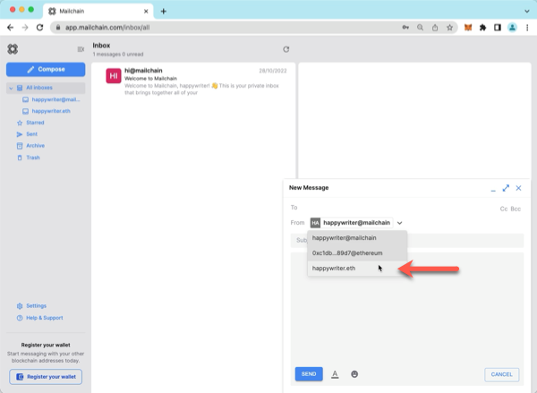
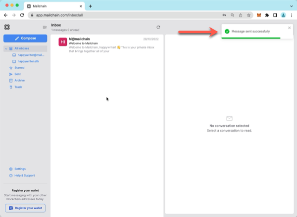

Mailchain users can use their ENS domain to send and receive messages. It’s simple to get started…


# Introduction

_The [Ethereum Name Service (ENS)](https://ens.domains) is a distributed, open, and extensible naming system based on the Ethereum blockchain.
ENS’s job is to map human-readable names like ‘alice.eth’ to machine-readable identifiers such as Ethereum addresses, other cryptocurrency addresses, content hashes, and metadata. ENS also supports ‘reverse resolution’, making it possible to associate metadata such as canonical names or interface descriptions with Ethereum addresses. —_ Source: [ENS Documentation](https://docs.ens.domains/)

---

## How To Add Your ENS Name To Mailchain

### Prerequisites:

-   [ ] You have an ENS name registered to your address (see [here](/user/guides/wallets-and-identities/ens/ens-faqs#how-do-i-register-an-ens-domain))
-   [ ] You have configured the ENS Primary Resolver (see [here](/user/guides/wallets-and-identities/ens/ens-faqs#how-do-i-set-an-ens-primary-resolver))
-   [ ] You have a Mailchain account (see [here](/user/guides/getting-started/create-a-mailchain-account))

### Add Your ENS Name to Mailchain

1. Log in to your Mailchain Account.

1. Click “Register Your Wallet”.

    

1. A modal will open. Select a wallet provider (e.g. Metamask), then click 'Connect'

    

1. Choose the address to connect, then click Next.

    

1. Click 'Connect' to confirm Mailchain should be able to read your address.

    

1. The address is now connected, but we need to register it in Mailchain. To do this, click 'Verify Address'

    

1. A 'Signature Request' will appear in your wallet. It contains the following text:

    ```bash
    Message:
    Welcome to Mailchain!

    Please sign to start using this address with Mailchain. This will not trigger a blockchain transaction or cost any gas fees.

    What's happening?
    A messaging key will be registered with this address and used only for messaging. It will replace any existing registered messaging keys.

    Technical Details:
    Address: `your_address`
    Messaging key: `a_generated_messaging_key`
    Nonce: `a_number`
    ```

    

1. Review the request and click 'Sign' to complete verification.

    

1. The next step checks for connected name services, including ENS names. This example found `happywriter.eth`. If you do not see your ENS name here, you can manually search for it using the search box. If it still cannot be found, please see ENS FAQs [here](/user/guides/wallets-and-identities/ens/ens-faqs#my-ens-name-was-not-found-what-should-i-check).

    

1. You can add a custom label for your address. By default, Mailchain will populate your ENS name. Click Apply to save and continue.

    

1. Mailchain is able to receive messages for your wallet address before you sign up. Click 'Synchronize' to retrieve these messages, or click 'Skip' to synchronize later. Any synchronized messages will appear in your inbox.

    

1. You can now click 'Done' to disconnect your wallet and close the modal, or choose to register another address.

    

1. You will now see the newly added inbox on the left. This will be labelled with the label you provided when registering the address. Any messages sent to that address or the ENS name will appear in this inbox.

    

## How To Send A Message Using Your ENS Name

With Mailchain you can send Mailchain message from your ENS name to other Mailchain users.

### Prerequisites

-   [ ] You have an ENS name registered to your address (see [here](/user/guides/wallets-and-identities/ens/ens-faqs#how-do-i-register-an-ens-domain))
-   [ ] You have configured the ENS Primary Resolver (see [here](/user/guides/wallets-and-identities/ens/ens-faqs#how-do-i-set-an-ens-primary-resolver))
-   [ ] You have a Mailchain account (see [here](/user/guides/getting-started/create-a-mailchain-account))
-   [ ] You have added your ENS name to Mailchain (see [above](/user/guides/wallets-and-identities/ens/ens-getting-started#how-to-add-your-ens-name-to-mailchain))

### Compose And Send A Message From Your ENS Name

1. Log into your Mailchain account.

1. Click 'Compose' in the sidebar.

    

1. In the New Message window, click the “From” dropdown menu.

    

1. Select your ENS name.

    

1. Fill out the rest of the message, then click Send

    

1. Your message should be successfully sent.

    

Done! Your recipient will receive your message from your ENS name.
