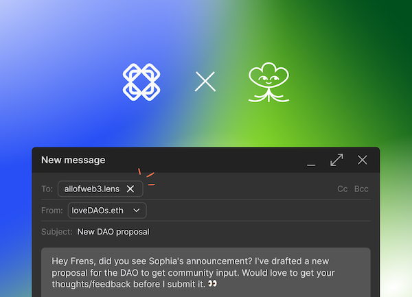
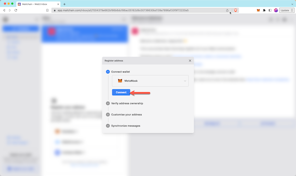
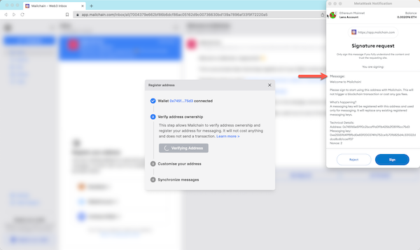
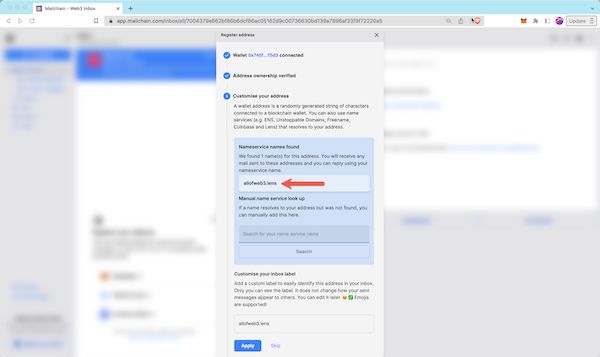
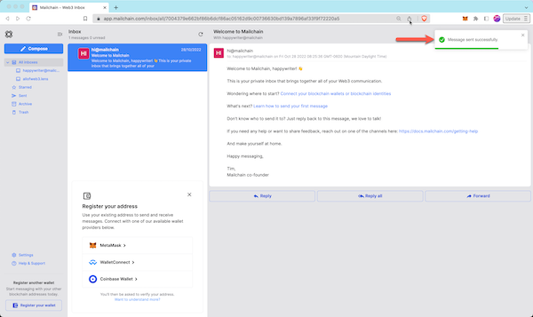

Send and receive web3 email with a .lens handle. It’s simple to get started…



# Introduction

Lens Protocol is a Web3 social graph on the Polygon Proof-of-Stake blockchain. It offers a user-owned, open social graph (including profiles) that any application can plug into. Since users own their data, they can bring it to any application built on top of Lens Protocol. As the true owners of their content, creators no longer need to worry about losing their content, audience, and livelihood based on the whims of an individual platform's algorithms and policies -- _source [https://docs.lens.xyz/](https://docs.lens.xyz/)_.

---

## How To Add Your Lens Handle To Mailchain

### Prerequisites:

-   [ ] You own a .lens handle (claim [here](https://www.lens.xyz/))
-   [ ] You have a Mailchain account (see [here](/user/guides/getting-started/create-a-mailchain-account))

### Add your .lens handle to Mailchain

1. Log into your Mailchain Account.

1. Click “Register Your Wallet”:

    

1. A modal will open. Select a wallet provider (e.g. Metamask), then click 'Connect':

    

1. Choose the address to connect, then click Next:

    

1. Click 'Connect' to confirm Mailchain should be able to read your address:

    

1. The address is now connected, so you can now register it in Mailchain. To do this, click 'Verify Address':

    

1. A 'Signature Request' will appear in your wallet. It contains the following text:

    ```bash
    Message:
    Welcome to Mailchain!

    Please sign to start using this address with Mailchain. This will not trigger a blockchain transaction or cost any gas fees.

    What's happening?
    A messaging key will be registered with this address and used only for messaging. It will replace any existing registered messaging keys.

    Technical Details:
    Address: `your_address`
    Messaging key: `a_generated_messaging_key`
    Nonce: `a_number`
    ```

    

1. Review the request and click 'Sign' to complete verification:

    

1. The next step checks for connected name services, including .lens handles. This example found `allofweb3.lens`. If you do not see your .lens handle here, you can manually search for it using the search box. If it still cannot be found, please see Lens FAQs [here](/user/guides/wallets-and-identities/lens/lens-faqs#my-lens-handle-was-not-found-what-should-i-check).

    

1. You can add a custom label for your address. By default, Mailchain will populate your .lens handle. Click Apply to save and continue.

    

1. Mailchain is able to receive messages for your wallet address before you sign up. Click 'Synchronize' to retrieve these messages, or click 'Skip' to synchronize later. Any synchronized messages will appear in your inbox:

    

1. You can now click 'Done' to disconnect your wallet and close the modal, or choose to register another address:

    

1. You will now see the newly added inbox on the left. This will be labelled with the label you provided when registering the address. Any messages sent to that address or the .lens handle will appear in this inbox:

    

## How to send a message using your .lens handle

With Mailchain you can send Mailchain message from your .lens handle to other Mailchain users, including ENS, Unstoppable Domains, Freename, Coinbase IDs, and Ethereum addresses.

### Prerequisites

-   [ ] You have an .lens handle registered to your address (visit [lens.xyz](https://lens.xyz))
-   [ ] You have a Mailchain account (see [here](/user/guides/getting-started/create-a-mailchain-account))
-   [ ] You have added your .lens handle to Mailchain (see [above](/user/guides/wallets-and-identities/lens/lens-getting-started#how-to-add-your-lens-handle-to-mailchain))

### Compose and send a message from your .lens handle

1. Log into your Mailchain account.

1. Click 'Compose' in the sidebar:

    

1. In the New Message window, click the “From” dropdown menu and select your .lens handle:

    

1. Fill out the rest of the message, then click Send:

    

1. Your message should be successfully sent:

    

Done! Your recipient will receive your message from your .lens handle.
