Send and receive web3 email with your .near account ID. It’s simple to get started…

<!--  -->

# Introduction

The NEAR protocol serves as a secure, scalable foundation for a new kind of decentralized application (dApps). It is also built to be especially easy for developers to use (e.g. by coding in JavaScript). Hundreds of projects are already building exciting dApps on NEAR. It is designed to be simple, with a flexible account model and human readable accounts — any name a user wants instead of a string of letters and numbers.

Near is building up the Blockchain Operating System Web3 stack to integrate experiences from across the open web and streamline the discovery and onboarding experience for users and developers alike. -- _source [https://near.org/blog/near-announces-the-blockchain-operating-system/](https://near.org/blog/near-announces-the-blockchain-operating-system/)_

---

## How To Use Your Near Account ID With Mailchain

### Prerequisites:

-   [ ] You have a .near account ID (see [https://near.org/learn/tools/](https://near.org/learn/tools/))
-   [ ] Your .near account has a balance of at least 0.0006Ⓝ to send the transaction that registers your account ID
-   [ ] You have a Mailchain account (see [here](/user/guides/getting-started/create-a-mailchain-account))

### Add your .near account ID to Mailchain

1. Log into your Mailchain Account.

1. Click “Register Your Wallet”:

    

1. A modal will open. Select NEAR wallet, then click 'Connect':

    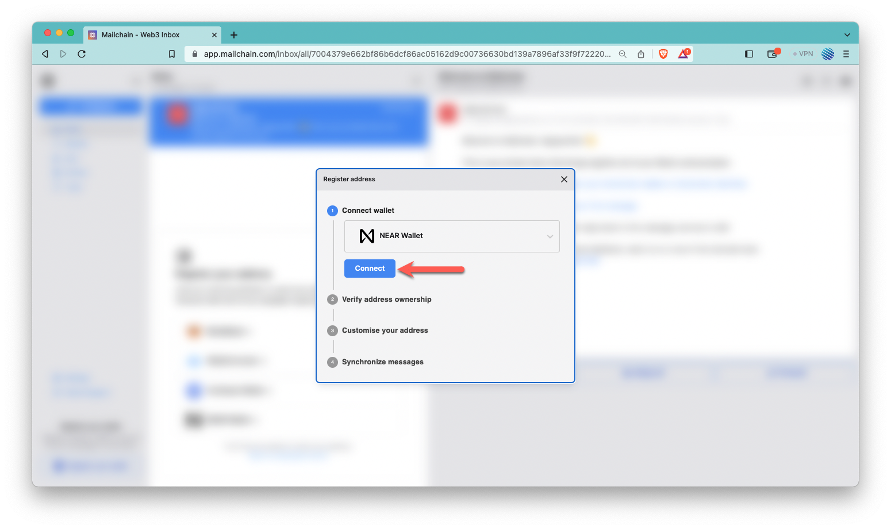

1. From the modal, click your preferred wallet provider. MyNearWallet is used in this guide, but the steps should be similar for other wallets.

    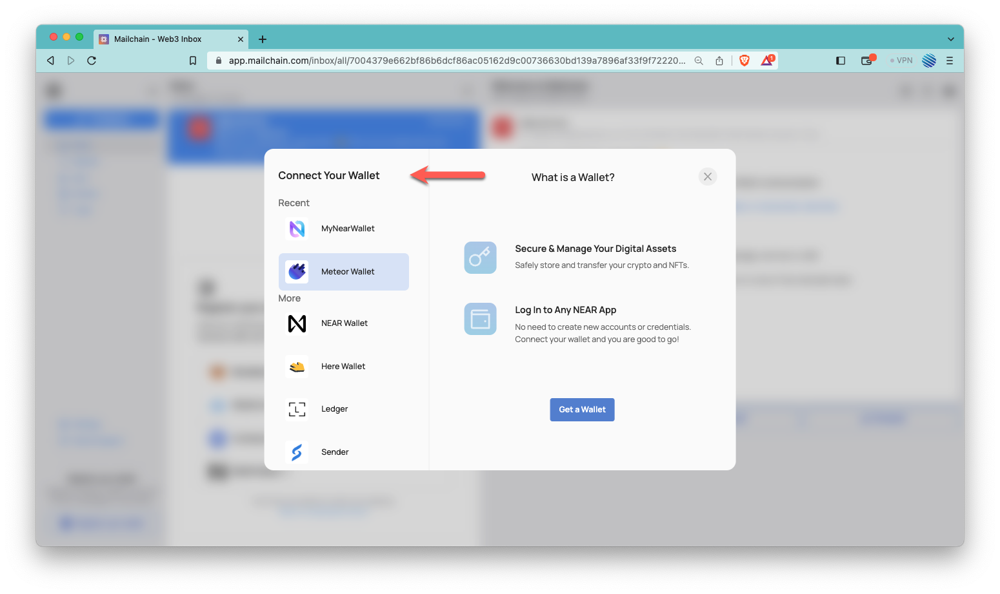

1. The wallet provider should open so you can select which account to connect. Click 'Next':

    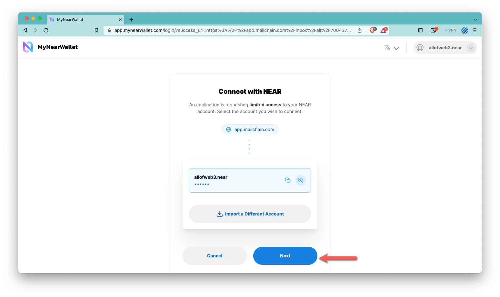

1. Click 'Connect' to confirm Mailchain should be able to read your address:

    

1. The address is now connected, so you can now register it in Mailchain. To do this, click 'Verify Address':

    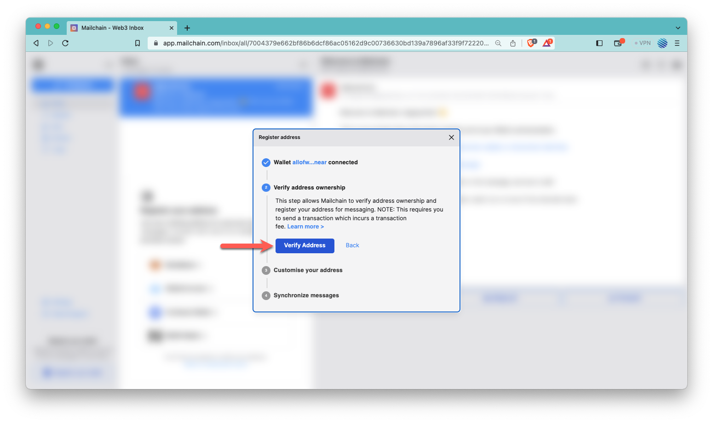

1. A transaction request will appear in your wallet. Click 'More Information' to verify the contract information and transaction details.

    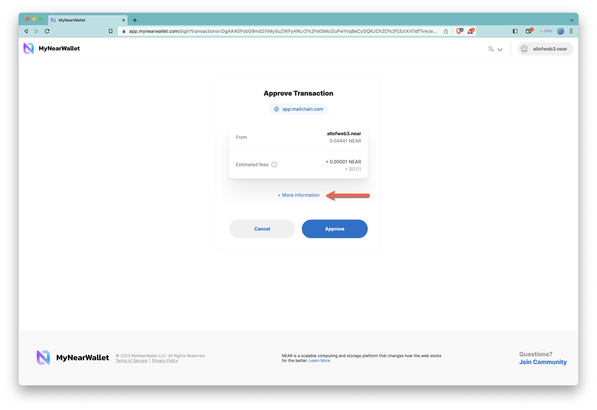

1. Verify the following Contract Details:

    **For Contract:** `messaging-keys.mailchain.near`  
    **Function:** `set_messaging_key`

    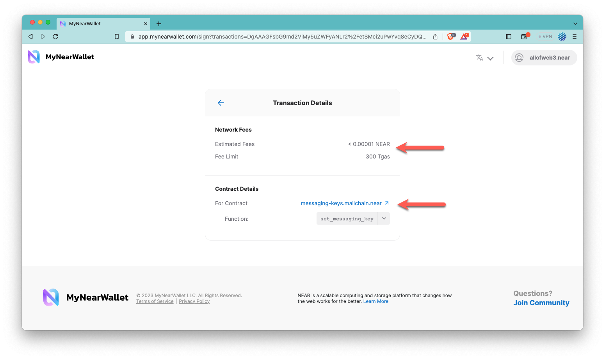

    Review the fees and the request then click '←' to go back to the transaction approval.

1. Review the transaction details and fees once again and if acceptable, click 'Approve':

    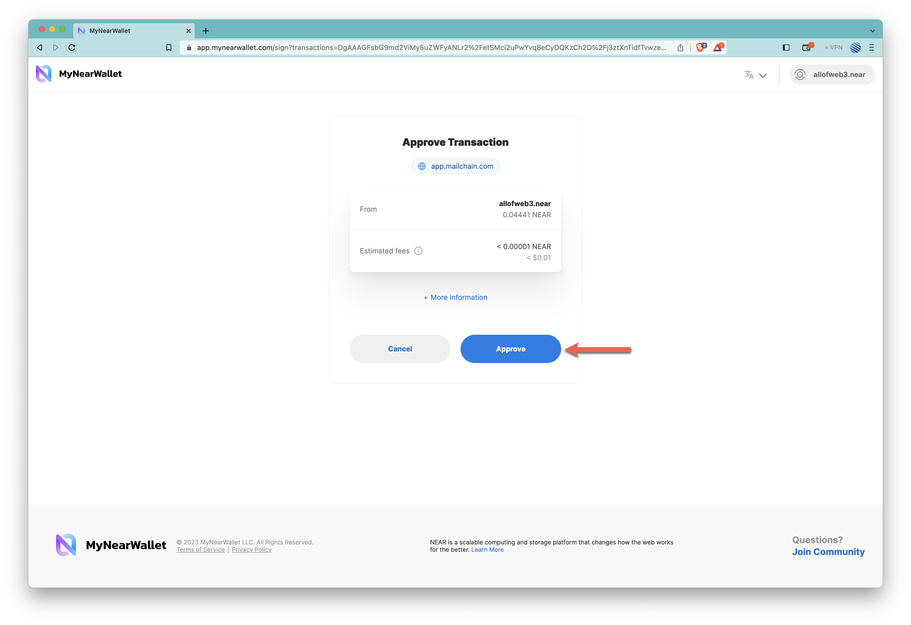

1. You can add a custom label for your address. By default, Mailchain will populate your .near account ID. Click Apply to save and continue.

    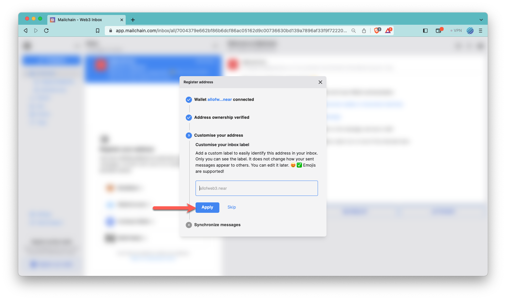

1. Mailchain is able to receive messages for your wallet address before you sign up. Click 'Synchronize' to retrieve these messages, or click 'Skip' to synchronize later. Any synchronized messages will appear in your inbox:

    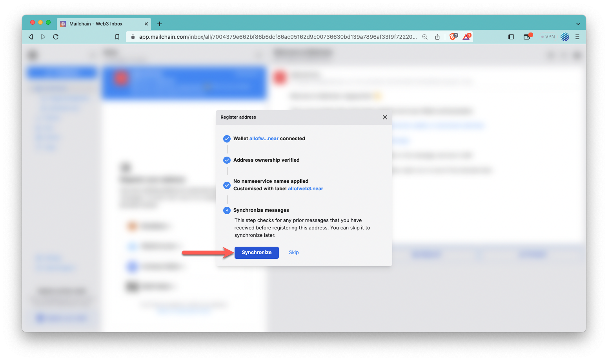

1. You can now click 'Done' to disconnect your wallet and close the modal, or choose to register another address:

    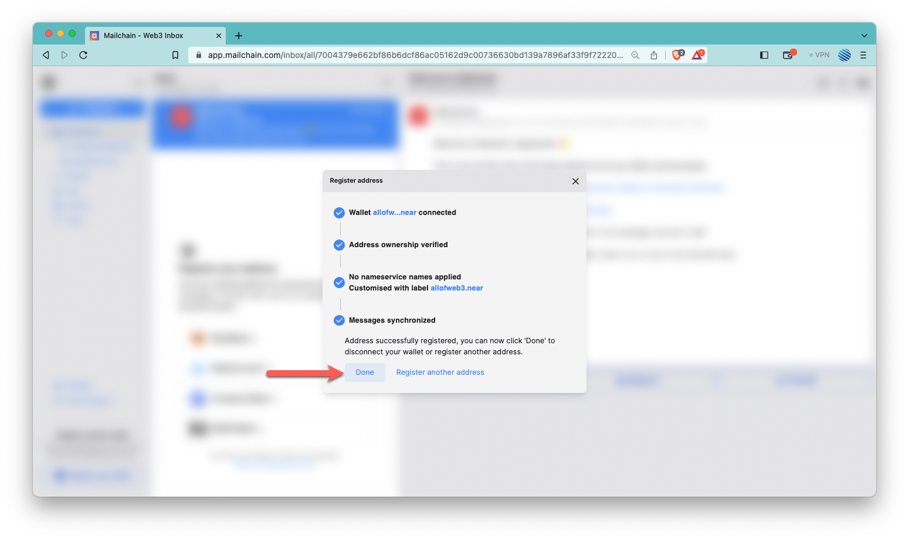

1. You will now see the newly added inbox on the left. This will be labelled with the label you provided when registering the address. Any messages sent to that address or the .near account will appear in this inbox:

    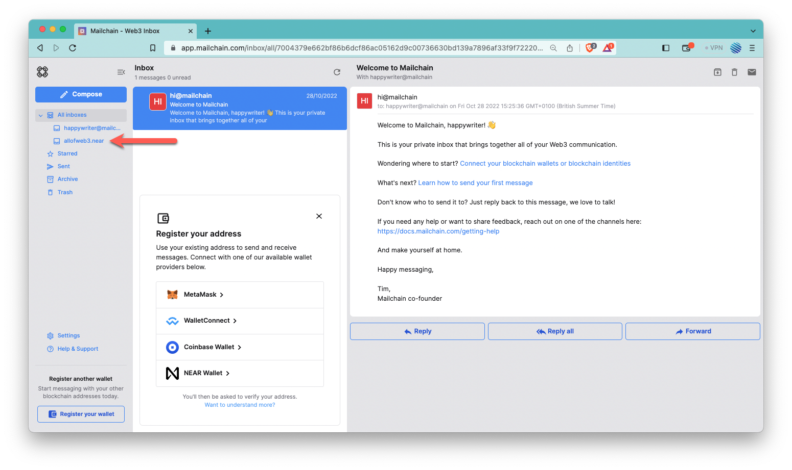

## How to send a message using your .near account

With Mailchain you can send Mailchain message from your .near account to other Mailchain users, including ENS, Unstoppable Domains, Freename, Lens.xyz, Coinbase IDs, and Ethereum addresses.

### Prerequisites

-   [ ] You have a .near account ID (see [https://near.org/learn/tools/](https://near.org/learn/tools/))
-   [ ] You have added your .near account to Mailchain (see [above](/user/guides/wallets-and-identities/near/near-getting-started#how-to-add-your-near-handle-to-mailchain))
-   [ ] You have a Mailchain account (see [here](/user/guides/getting-started/create-a-mailchain-account))

### Compose and send a message from your .near account

1. Log into your Mailchain account.

1. Click 'Compose' in the sidebar:

    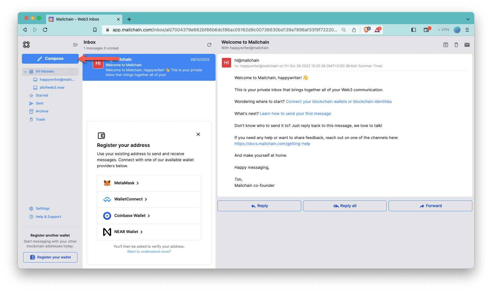

1. In the New Message window, click the “From” dropdown menu and select your .near account ID:

    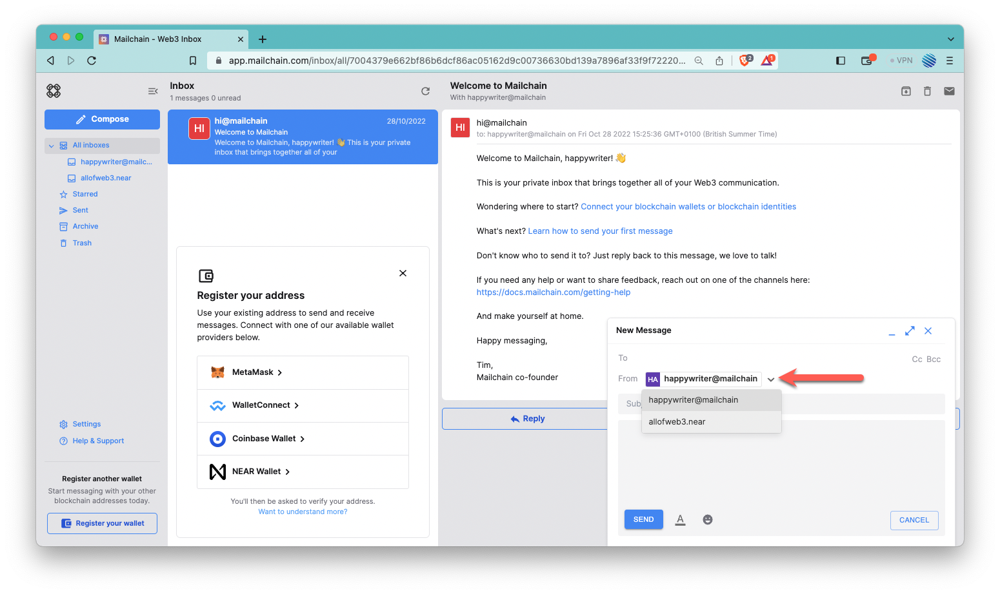

1. Fill out the rest of the message, then click Send:

    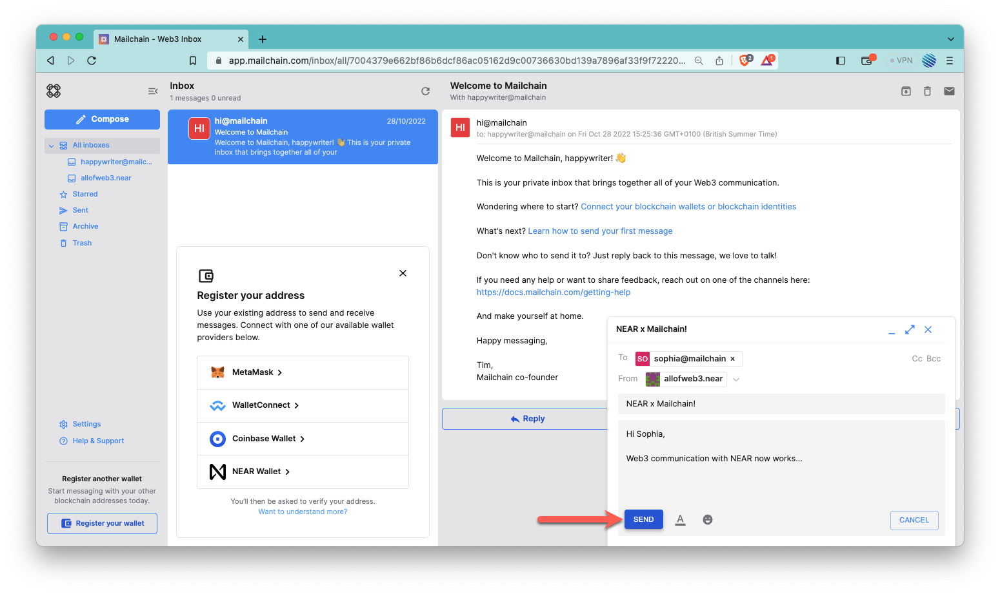

1. Your message should be successfully sent:

    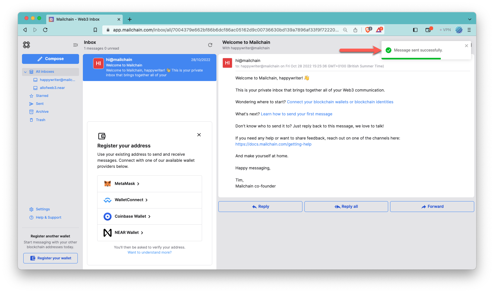

Done! Your recipient will receive your message from your .near account ID.
