Mailchain users can use their SPACE ID domains (`.bnb` & `.arb`) to send and receive messages. It’s simple to get started…

# Introduction

[SPACE ID](https://space.id/) is building a universal name service network with a one-stop identity platform to discover, register, trade, manage web3 domains. It also provides a multi-chain name service for everyone to easily build and create a web3 identity. —_Source: [SPACE ID Documentation](https://docs.space.id/)_

---

## How To Add Your SPACE ID Domain To Mailchain

### Prerequisites:

-   [ ] You have a SPACE ID domain registered to your address (see [here](/user/guides/wallets-and-identities/spaceid/spaceid-faqs#how-do-i-register-a-space-id-domain))
-   [ ] You have a Mailchain account (see [here](/user/guides/getting-started/create-a-mailchain-account))

### Add Your SPACE ID Domain to Mailchain

1. Log in to your Mailchain Account.

1. Click “Register Your Wallet”.

    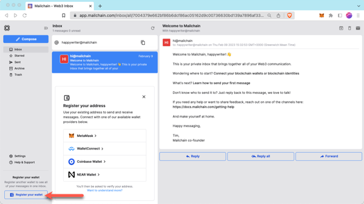

1. A modal will open. Select a wallet provider (e.g. Metamask), then click 'Connect'

    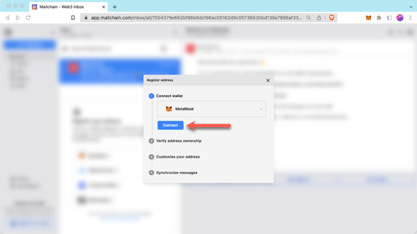

1. Choose the address to connect, then click Next.

    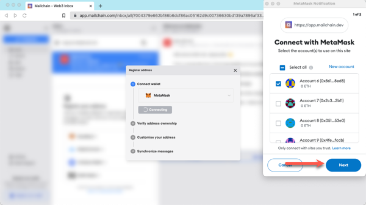

1. Click 'Connect' to confirm Mailchain should be able to read your address.

    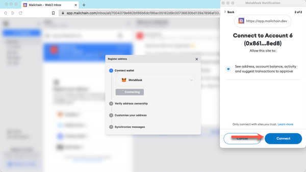

1. The address is now connected, but we need to register it in Mailchain. To do this, click 'Verify Address'

    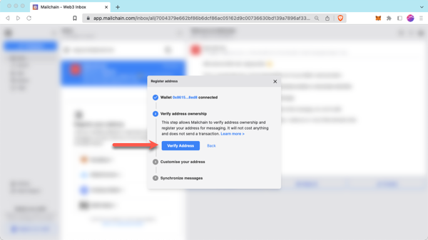

1. A 'Signature Request' will appear in your wallet. It contains the following text:

    ```bash
    Message:
    Welcome to Mailchain!

    Please sign to start using this address with Mailchain. This will not trigger a blockchain transaction or cost any gas fees.

    What's happening?
    A messaging key will be registered with this address and used only for messaging. It will replace any existing registered messaging keys.

    Technical Details:
    Address: `your_address`
    Messaging key: `a_generated_messaging_key`
    Nonce: `a_number`
    ```

    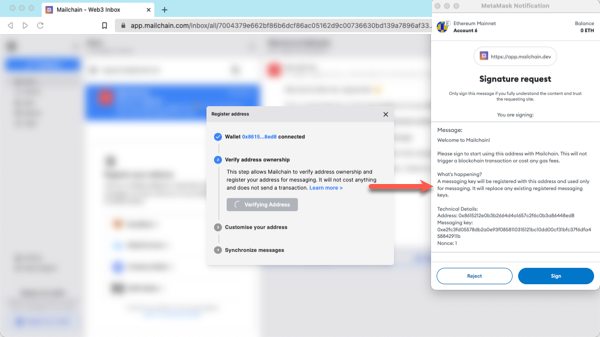

1. Review the request and click 'Sign' to complete verification.

    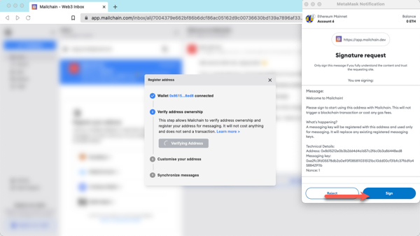

1. The next step checks for connected name services, including SPACE ID domains. This example found `allofweb3.bnb` & `epistola.arb`. If you do not see your SPACE ID domain here, you can manually search for it using the search box. If it still cannot be found, please see SPACE ID FAQs [here](/user/guides/wallets-and-identities/spaceid/spaceid-faqs/#my-space-id-domain-was-not-found-what-should-i-check).

    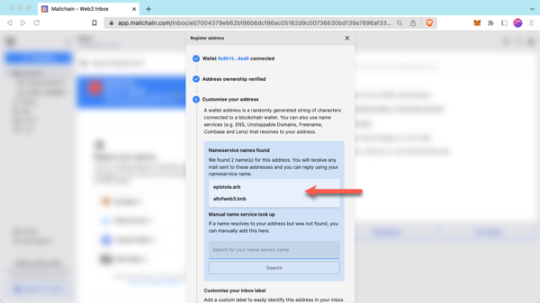

1. You can add a custom label for your address. By default, Mailchain will populate your primary SPACE ID domain or the first one it finds. In this example, the name has been manually changed. Click Apply to save and continue.

    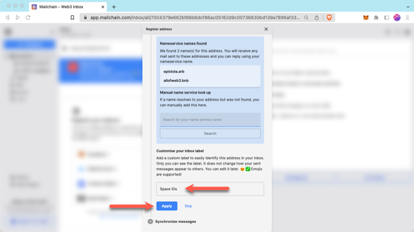

1. Mailchain is able to receive messages for your wallet address before you sign up. Click 'Synchronize' to retrieve these messages, or click 'Skip' to synchronize later. Any synchronized messages will appear in your inbox.

    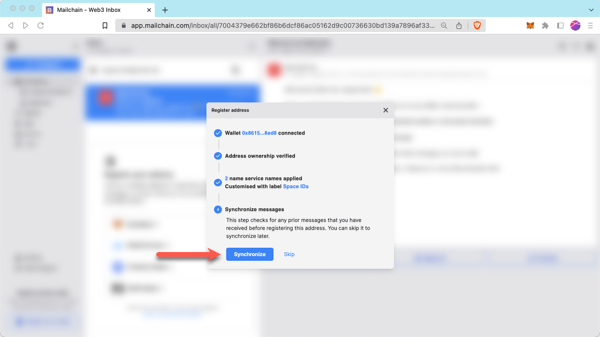

1. You can now click 'Done' to disconnect your wallet and close the modal, or choose to register another address.

    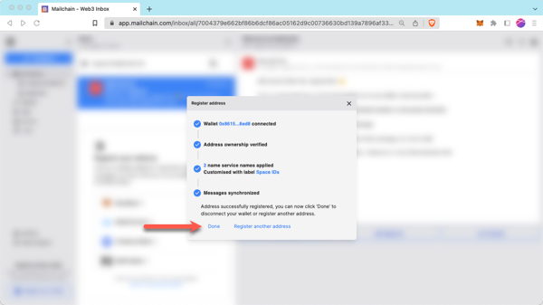

1. You will now see the newly added inbox on the left. This will be labelled with the label you provided when registering the address. Any messages sent to that address or the SPACE ID domain will appear in this inbox.

    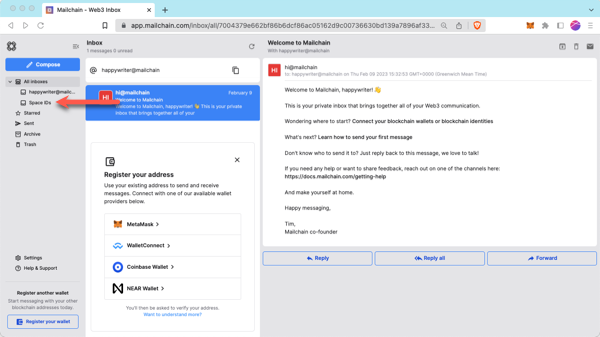

## How To Send A Message Using Your SPACE ID Domain

With Mailchain you can send Mailchain message from your SPACE ID domain to other Mailchain users.

### Prerequisites

-   [ ] You have a SPACE ID domain registered to your address (see [here](/user/guides/wallets-and-identities/spaceid/spaceid-faqs/#how-do-i-register-a-space-id-domain))
-   [ ] You have a Mailchain account (see [here](/user/guides/getting-started/create-a-mailchain-account))
-   [ ] You have added your SPACE ID domain to Mailchain (see [above](/user/guides/wallets-and-identities/spaceid/spaceid-getting-started#how-to-add-your-space-id-domain-to-mailchain))

### Compose And Send A Message From Your SPACE ID Domain

1. Log into your Mailchain account.

1. Click 'Compose' in the sidebar.

    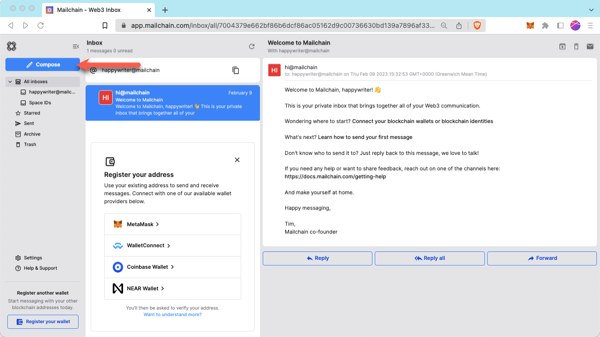

1. In the New Message window, click the “From” dropdown menu and select your SPACE ID domain. The example below will send from `allofweb3.bnb`.

    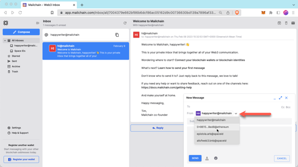

1. Fill out the rest of the message, then click Send.

    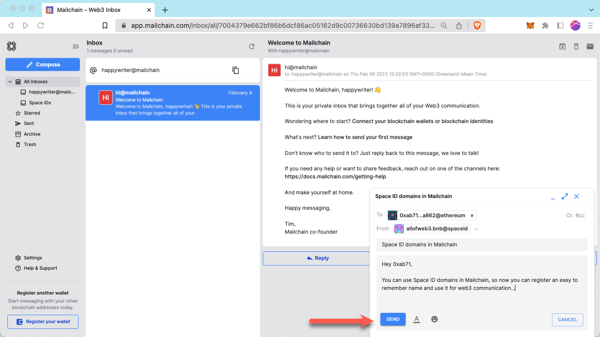

1. Your message should be successfully sent.

    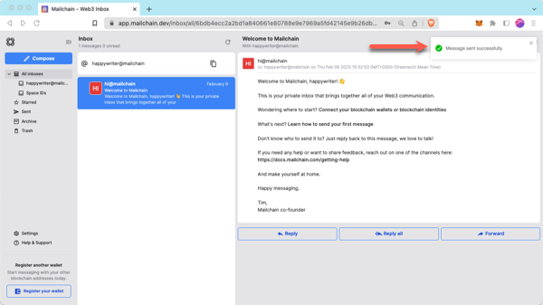

Done! Your recipient will receive your message from your SPACE ID domain.
