Mailchain users can use their Tezos wallet address or Tezos domain to send and receive messages. It’s simple to get started…


# Introduction

_**Tezos** is a public, open-source blockchain protocol relying on a low power consumption and energy-efficient consensus.
The protocol also incorporates a self-amending governance system, which allows continuous improvements while preserving the integrity of this consensus. This is a rare feature that eliminates hard forks troubles.
Tezos is also fundamentally designed to provide code safety through Formal Verification. -_ Source: [Tezos Documentation](https://opentezos.com/tezos-basics)

_**Tezos Domains** is a distributed, open, and extensible naming system using the Tezos blockchain.
The main function is to translate a meaningful and user-friendly alias to its corresponding Tezos address and vice versa. This translation is globally consistent so that all users see the same address for a given alias. -_ Source: [Tezos Domains](https://tezos.domains/en/about/faq)

---

## How To Add Your Tezos Address or .tez Domain To Mailchain

### Prerequisites:

-   [ ] You have a Mailchain account (see [here](/user/guides/getting-started/create-a-mailchain-account))
-   [ ] (Optional) You have a Tezos Domains name registered to your address (see [here](/user/guides/wallets-and-identities/tezos/tezos-faqs#how-do-i-register-a-tezos-domain))
-   [ ] (Optional) You have configured the Tezos Domains reverse record (see [here](/user/guides/wallets-and-identities/tezos/tezos-faqs#how-do-i-set-a-tezos-domains-reverse-record))

### Add Your Tezos Address or .tez Domain to Mailchain

1. Log in to your Mailchain Account.

1. Click “Register Your Wallet”.

    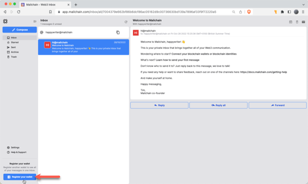

1. A modal will open. Choose 'Tezos', then click 'Connect'

    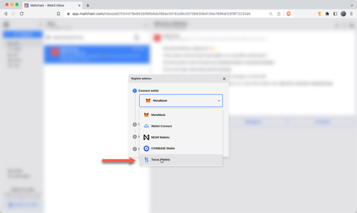

1. Choose your preferred wallet (e.g. in this article we'll use "Temple Browser Extension").

    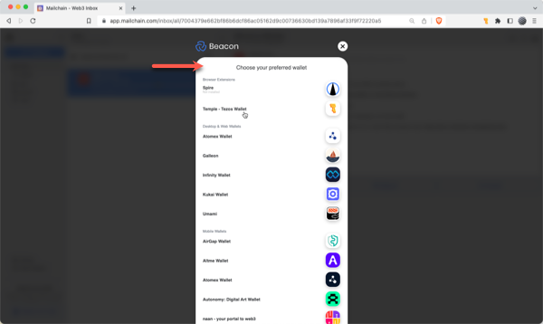

1. Choose the account or address to connect, then click Connect.

    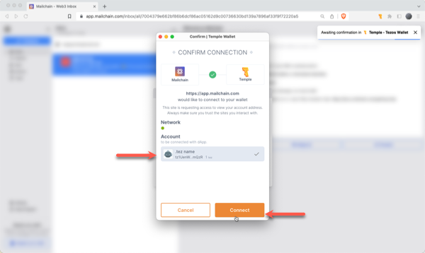

1. The address is now connected, but we need to register it in Mailchain. To do this, click 'Verify Address'

    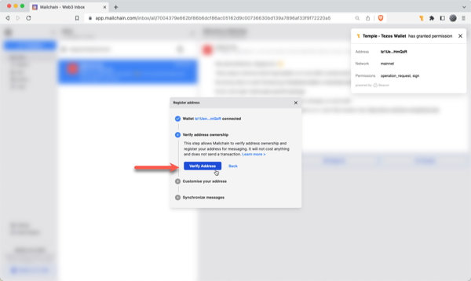

1. A 'Signature Request' will appear in your wallet. It contains the following text:

    ```bash
    Message:
    Tezos Signed Message: Welcome to Mailchain!

    Please sign to start using this address with Mailchain. This will not trigger a blockchain transaction or cost any gas fees.

    What's happening?
    A messaging key will be registered with this address and used only for messaging. It will replace any existing registered messaging keys.

    Technical Details:
    Address: `your_address`
    Messaging key: `a_generated_messaging_key`
    Nonce: `a_number`
    ```

    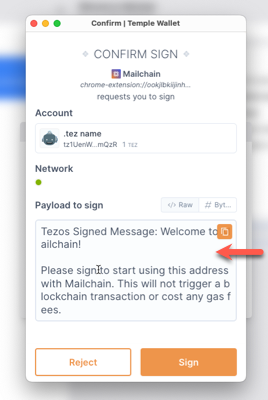

1. Review the request and click 'Sign' to complete verification.

    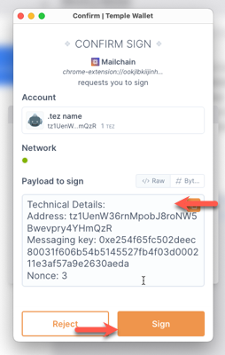

1. The next step checks for connected name services, including Tezos Domains. This example found `creativeminds.tez`. If you do not see your Tezos Domains name here, you can manually search for it using the search box. If it still cannot be found, please see Tezos FAQs [here](/user/guides/wallets-and-identities/tezos/tezos-faqs/#my-tezos-name-was-not-found-what-should-i-check).

    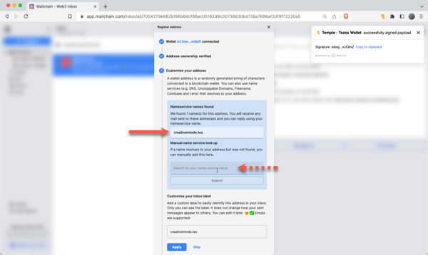

1. You can add an optional custom label for your address. By default, Mailchain will populate your Tezos Domain name or abbreviated address (in that order). Click Apply to save and continue.

    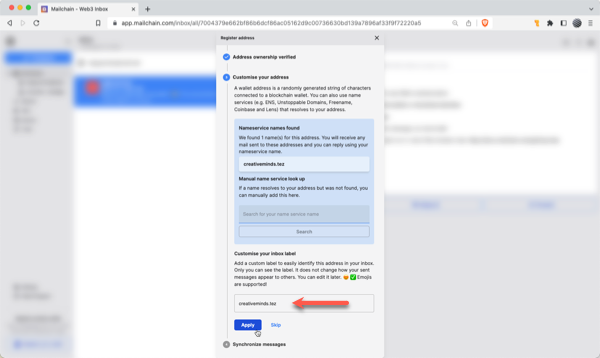

1. Mailchain is able to receive messages for your wallet address before you register it. Click 'Synchronize' to retrieve these messages, or click 'Skip' to synchronize later. Any synchronized messages will appear in your inbox.

    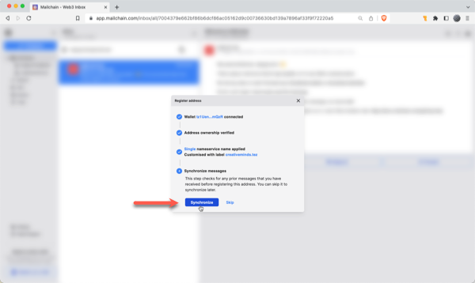

1. You can now click 'Done' to disconnect your wallet and close the modal, or choose to register another address.

    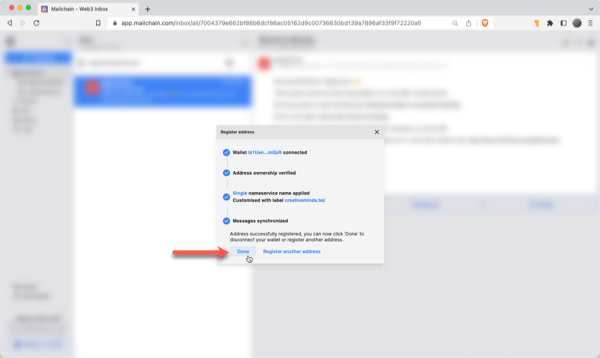

1. You will now see the newly added inbox on the left. This will be labelled with the label you provided when registering the address. Any messages sent to that address or the Tezos Domains name will appear in this inbox.

    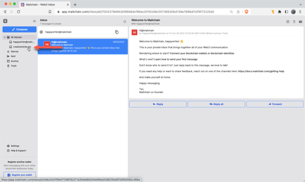

## How To Send A Message Using Your .tez Name

With Mailchain you can send Mailchain message from your .tez name to other Mailchain users.

### Prerequisites

-   [ ] You have a Mailchain account (see [here](/user/guides/getting-started/create-a-mailchain-account))
-   [ ] (optional) You have a Tezos Domains name registered to your address (see [here](/user/guides/wallets-and-identities/tezos/tezos-faqs/#how-do-i-register-a-tezos-domain))
-   [ ] (optional) You have added your Tezos Domains name to Mailchain (see [above](/user/guides/wallets-and-identities/tezos/tezos-getting-started/#how-to-add-your-tezos-address-or-tez-domain-to-mailchain))

### Compose And Send A Message From Your Tezos Address or .tez Name

1. Log into your Mailchain account.

1. Click 'Compose' in the sidebar.

    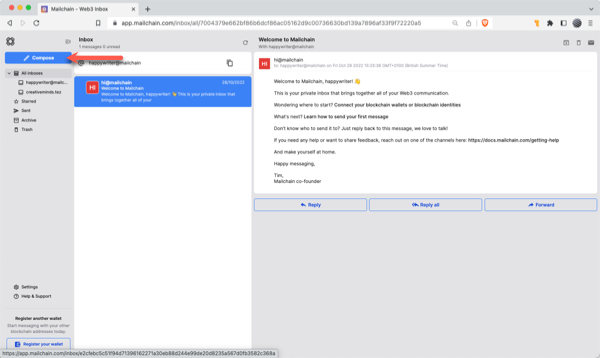

1. In the New Message window, click the “From” dropdown menu and select your Tezos address or .tez name.

    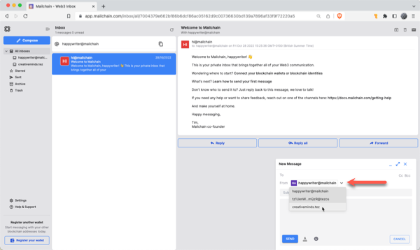

1. Fill out the rest of the message, then click Send

    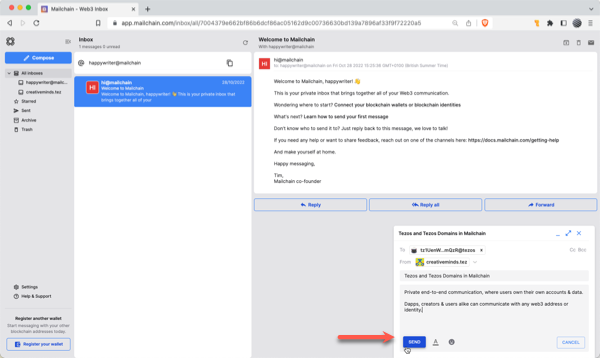

1. Your message should be successfully sent.

    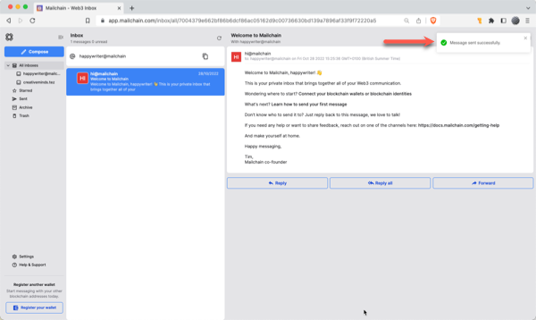

Done! Your recipient will receive your message from your .tez name.
