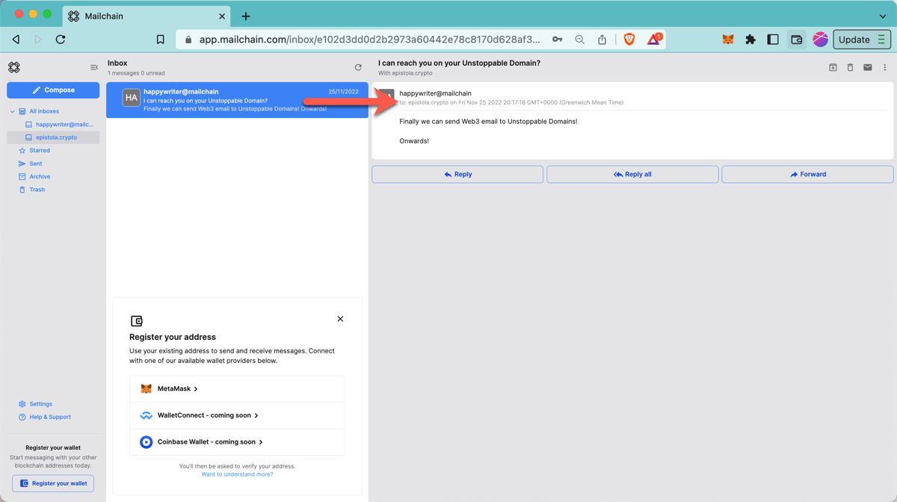
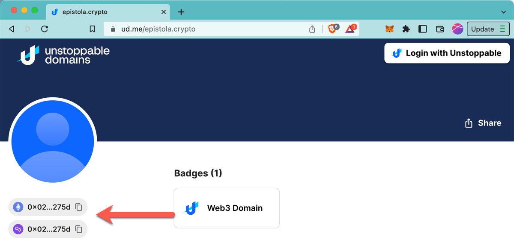

# Unstoppable Domains FAQs

Frequently asked questions for working with Unstoppable Domains (UD) and Mailchain.

### Can someone send me a Mailchain message to my UD name?

You can ask anyone to send messages to your UD name… it’s a Web3 identity afterall!

### What happens when someone sends a message to my UD name in Mailchain?

When someone sends a Mailchain message to a UD name, Mailchain resolves the UD name and delivers the message to the resolved owner address.

If you have already registered the wallet address, then the message will arrive in your inbox.

### What if I have not yet registered my wallet address with Mailchain?

If you have not yet registered the wallet address with Mailchain, the protocol will still accept the encrypted message and store it for up to 90 days. You can synchronize messages for this address when you register the wallet address. (See [How to add your Unstoppable Domain to Mailchain](/user/guides/wallets-and-identities/unstoppable-domains/unstoppable-domains-getting-started#how-to-add-your-unstoppable-domain-to-mailchain))

### What happens if I no longer own my UD name?

If your address is no longer the owner of the UD name, it will not resolve and Mailchain messages will no longer be sent to the address. If someone else registers the address that owns the name in Mailchain, they will be able to receive messages sent to the UD name. This will not have any impact on messages already in your inbox.

### My UD name was not found, what should I check?

1. Check you are registering the intended wallet address.
2. Check that the address appears in the https://ud.me profile.

    

### How does Mailchain resolve UD names?

Mailchain uses the Unstoppable Domains resolver API, so results will always reflect the Unstoppable Domains registry.

### Do I need to mint an Unstoppable Domain to use it with Mailchain?

Yes, you need to "mint" your Unstoppable Domain to be able to use it with Mailchain. The process of minting generates the NFT domain and sends it to the owner's address.

### Which Unstoppable Domains top level domains do you support?

Mailchain supports sending and receiving messages for any Unstoppable Domain top-level domain (TLD).

### Does Mailchain support shorthand addressing for Unstoppable Domains?

| TLD           | Fully qualified Mailchain address                            | Shorthand Mailchain address | Name service address                           |
| ------------- | ------------------------------------------------------------ | --------------------------- | ---------------------------------------------- |
| .888          | _yourname_.888@unstoppable.mailchain.com        | _yourname_.888              | _yourname_.888@unstoppable        |
| .bitcoin      | _yourname_.bitcoin@unstoppable.mailchain.com    |                             | _yourname_.bitcoin@unstoppable    |
| .blockchain   | _yourname_.blockchain@unstoppable.mailchain.com | _yourname_.blockchain       | _yourname_.blockchain@unstoppable |
| .crypto       | _yourname_.crypto@unstoppable.mailchain.com     | _yourname_.crypto           | _yourname_.crypto@unstoppable     |
| .dao          | _yourname_.dao@unstoppable.mailchain.com        | _yourname_.dao              | _yourname_.dao@unstoppable        |
| .hi           | _yourname_.hi@unstoppable.mailchain.com         |                             | _yourname_.hi@unstoppable         |
| .klever       | _yourname_.klever@unstoppable.mailchain.com     |                             | _yourname_.klever@unstoppable     |
| .nft          | _yourname_.nft@unstoppable.mailchain.com        | _yourname_.nft              | _yourname_.nft@unstoppable        |
| .wallet       | _yourname_.wallet@unstoppable.mailchain.com     | _yourname_.wallet           | _yourname_.wallet@unstoppable     |
| .x            | _yourname_.x@unstoppable.mailchain.com          | _yourname_.x                | _yourname_.x@unstoppable          |
| .zil          | _yourname_.zil@unstoppable.mailchain.com        |                             | _yourname_.zil@unstoppable        |
| _other names_ | _yourname_.othernames@unstoppable.mailchain.com |                             | _yourname_.othernames@unstoppable |
