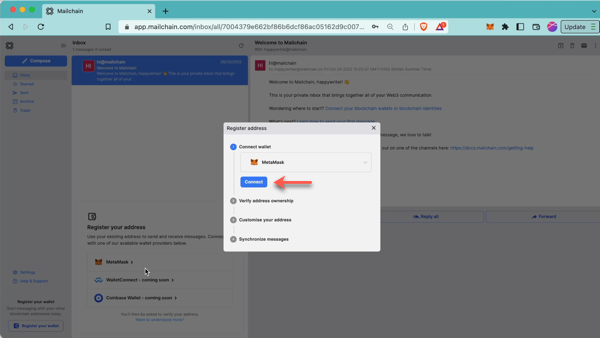
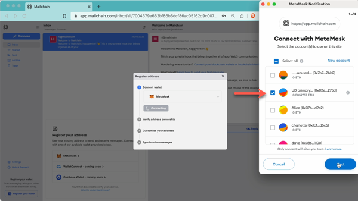
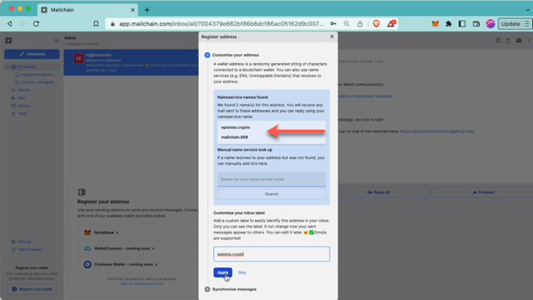
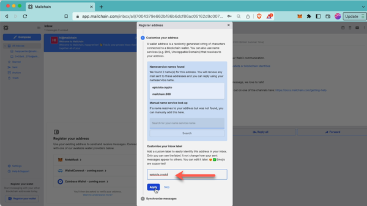
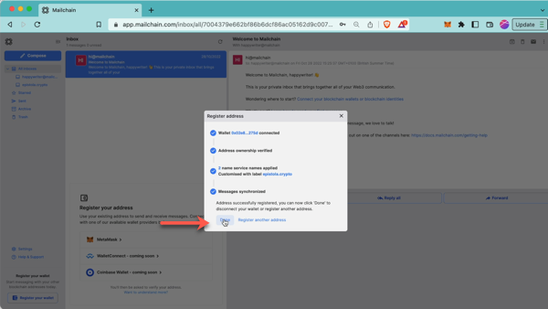
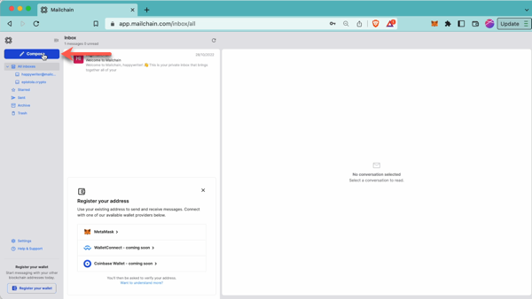
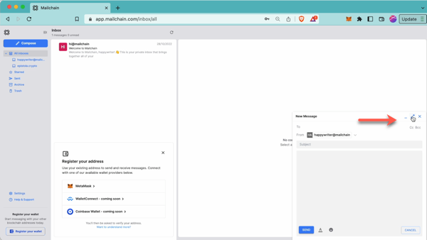
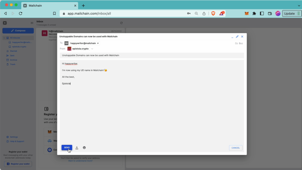

Mailchain users can use their Unstoppable Domains to send and receive messages. It’s simple to get started…


# Introduction

_[Unstoppable Domains](https://unstoppabledomains.com/) is an NFT domain name provider and digital identity platform working to onboard the world onto Web3. Unstoppable Domains offers NFT domains minted on the blockchain that give people full ownership and control of their digital identity, with no renewal fees. With Unstoppable Domains, people can replace lengthy alphanumeric crypto wallet addresses with a human-readable name and log into and transact with apps, wallets, exchanges and marketplaces._

---

## How To Add Your Unstoppable Domain (UD) Name To Mailchain

### Prerequisites:

-   [ ] You need to have a valid, minted Unstoppable Domain owned by your address (see [Unstoppable Domains docs](https://support.unstoppabledomains.com/) for more information on how to do this)
-   [ ] You have a Mailchain account (see [here](/user/guides/getting-started/create-a-mailchain-account))

### Add Your UD Name to Mailchain

1. Log in to your Mailchain Account.

2. Click “Register Your Wallet”.

    

3. A modal will open. Select a wallet provider (e.g. Metamask), then click 'Connect'

    

4. Choose the address to connect, then click Next.

    

5. Click 'Connect' to confirm Mailchain should be able to read your address.

    

6. The address is now connected, but we need to register it in Mailchain. To do this, click 'Verify Address'

    

7. A 'Signature Request' will appear in your wallet. It contains the following text:

    ```bash
    Message:
    Welcome to Mailchain!

    Please sign to start using this address with Mailchain. This will not trigger a blockchain transaction or cost any gas fees.

    What's happening?
    A messaging key will be registered with this address and used only for messaging. It will replace any existing registered messaging keys.

    Technical Details:
    Address: `your_address`
    Messaging key: `a_generated_messaging_key`
    Nonce: `a_number`
    ```

    

8. Review the request and click 'Sign' to complete verification.

    

9. The next step checks for connected name services, including UD names. This example found `epistola.crypto` & `mailchain.888`. If you do not see your UD name here, you can manually search for it using the search box. If it still cannot be found, please see Unstoppable Domains FAQs [here](/user/guides/wallets-and-identities/unstoppable-domains/unstoppable-domains-faqs#my-ud-name-was-not-found-what-should-i-check).
   

10. You can add a custom label for your address. By default, Mailchain will populate your UD name. Click Apply to save and continue.

    

11. Mailchain is able to receive messages for your wallet address before you sign up. Click 'Synchronize' to retrieve these messages, or click 'Skip' to synchronize later. Any synchronized messages will appear in your inbox.

    

12. You can now click 'Done' to disconnect your wallet and close the modal, or choose to register another address.

    

13. You will now see the newly added inbox on the left. This will be labelled with the label you provided when registering the address. Any messages sent to that address or the UD name will appear in this inbox.

    

## How To Send A Message Using Your UD Name

With Mailchain you can send Mailchain message from your Unstoppable Domain name to other Mailchain users.

### Prerequisites

-   [ ] You need to have a valid, minted Unstoppable Domain owned by your address (see [Unstoppable Domains docs](https://support.unstoppabledomains.com/) for more information on how to do this)
-   [ ] You have a Mailchain account (see [here](/user/guides/getting-started/create-a-mailchain-account))
-   [ ] You have added your Unstoppable Domain name to Mailchain (see [above](/user/guides/wallets-and-identities/unstoppable-domains/unstoppable-domains-getting-started#how-to-add-your-unstoppable-domain-ud-name-to-mailchain))

### Compose And Send A Message From Your UD Name

1. Log into your Mailchain account.

2. Click 'Compose' in the sidebar.

    

3. In the New Message window, click arrows to expand the compose message modal.

    

4. In the New Message window, click the “From” dropdown menu and select your UD name.

    

5. In the `To` field, add your recipient. The autocomplete will offer suggestions for common Web3 names.

    

6. Fill out the rest of the message, then click Send

    

7. Your message should be successfully sent.

    

Done! Your recipient will receive your message from your Unstoppable Domain name.
